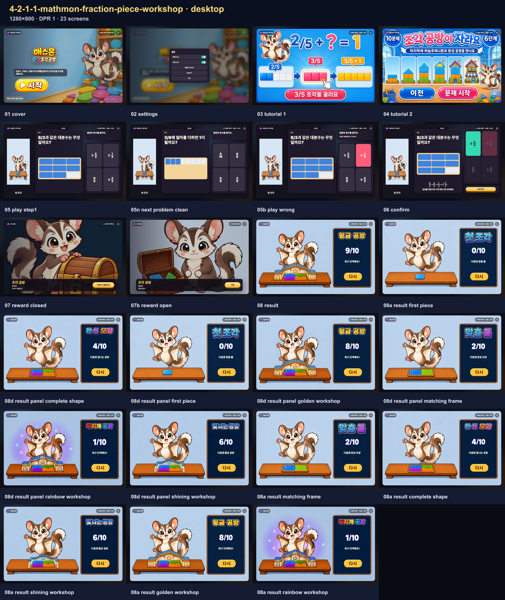
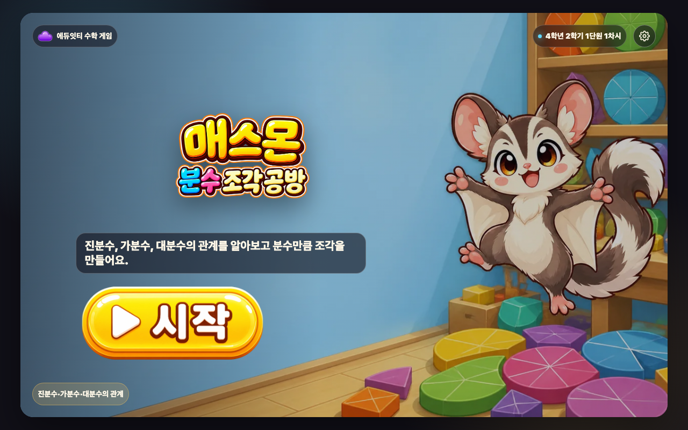
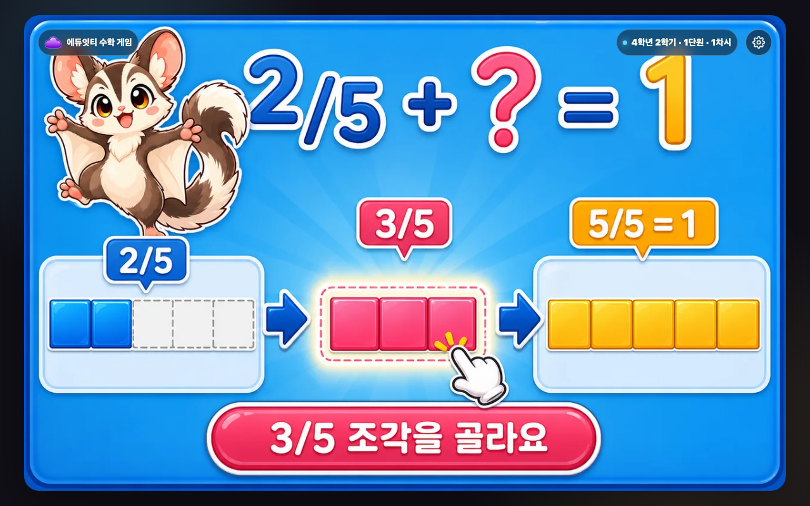
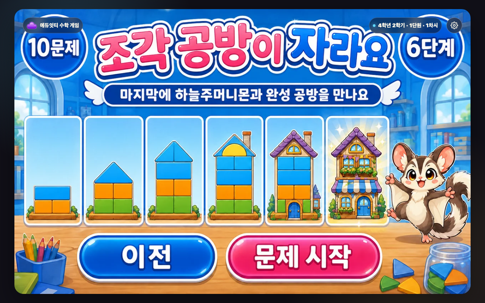
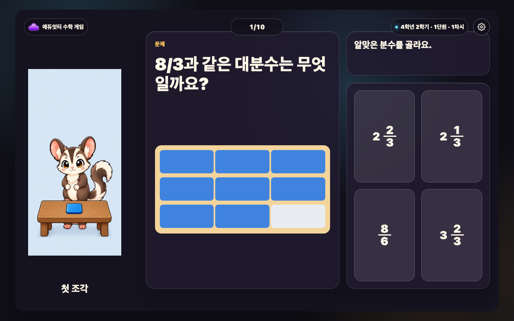
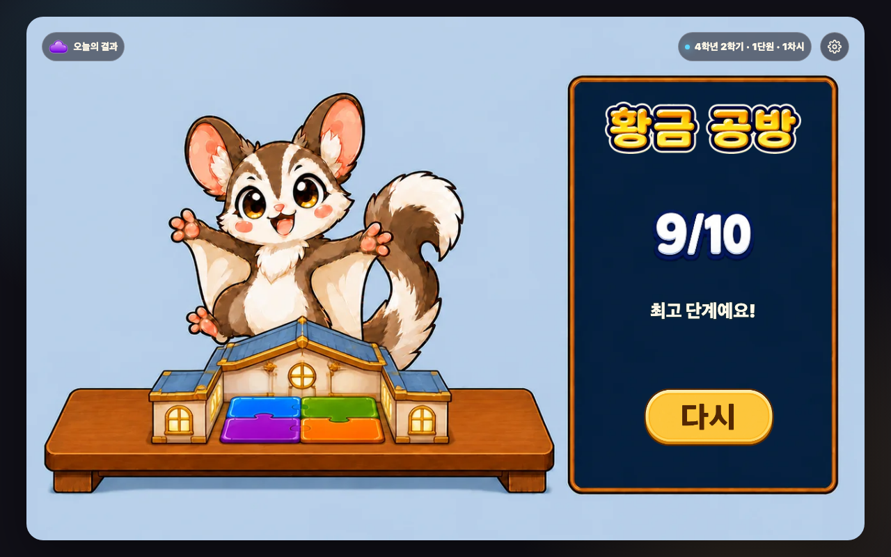
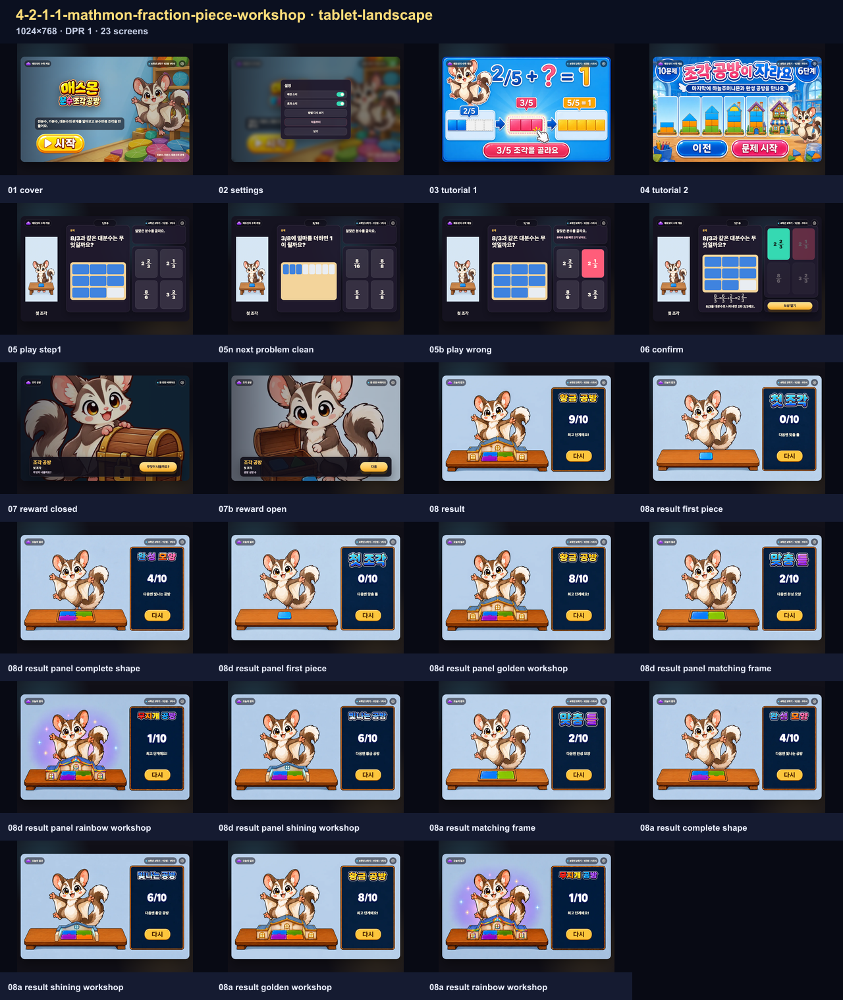
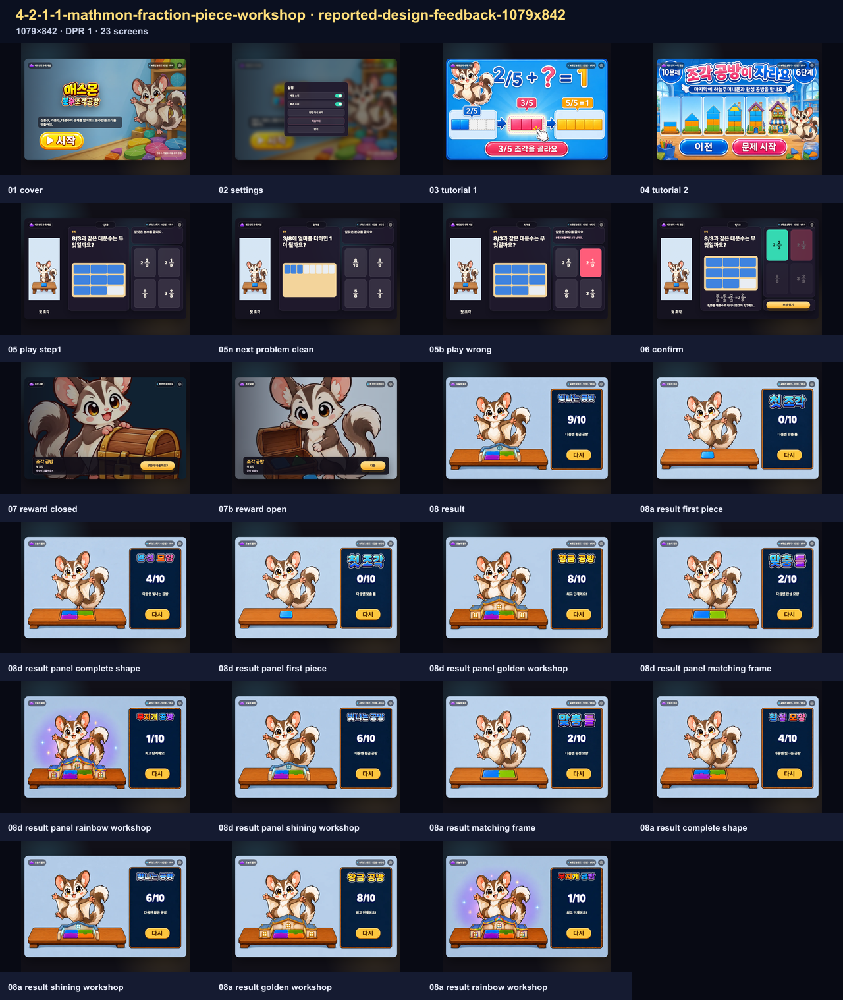

# 매스몬 분수 조각 공방 — 제작·검증 보고서

<!-- PUBLIC-EVIDENCE-RETENTION:ai-mart-github-evidence-selection-v1 -->
> 공개 보관본은 전체 브라우저 QA를 통과한 뒤 화면 크기별 접촉 시트와 데스크톱 핵심 장면만 남깁니다. 전체 상태의 해시와 검사 결과는 QA 영수증에 보존됩니다.

## 범위와 승인

- 공식 팩: `mathmon-grade4-official-pack-v1` · `4학년 2학기 공식 후보 매스몬팩`
- 승인: `approval:mathmon-grade4-official-pack-v1:20260829`
- 차시: `4-2-1-1` · 매스몬 분수 조각 공방
- 주인공: `mathmon-grade4-01-sugar-glider` · 하늘주머니몬
- 교과서 인쇄본 10–11쪽 / PDF 22–23쪽, 익힘 인쇄본 6–7쪽 / PDF 24–25쪽
- 성취기준: `[4수01-15]`
- 10문항 · `1280x800` · 16:10
- 네트워크 없음 · 순위 없음 · 다른 차시 캐릭터 없음

## 보상·결과

보상 정책은 `mathmon-unified-reward-v2`의 `stage-reveal`입니다. 오답 감점은 제한된 50% 정책 또는 유지이며, 힘 숫자는 숨깁니다. 결과 tier는 첫 조각, 맞춤 틀, 완성 모양, 빛나는 공방, 황금 공방, 무지개 공방의 6단계입니다. 닫힌 보상과 6개 사건은 기존 승인 래스터 배열로 확인했습니다.

## 시각 증거 배열

- 결과 6단계: `result-states-contact-sheet.png`
- 문제 진행 6상태: `play-progress-states-contact-sheet.png`
- 보상 닫힘+6사건: `reward-states-contact-sheet.png`
- 실행 결과 메타데이터의 결과 시트: `result-states-contact-sheet.png`

3 viewport(`desktop`, `tablet-landscape`, `reported-design-feedback-1079x842`)에서 cover부터 tutorial, play, reward, result까지 전체 흐름을 확인합니다. 상단 조작 기준은 `stage-top-controls-v2`이며 배지 14px, 문제 번호 16px 기준을 사용합니다.

### 화면 크기

`desktop` 1280×800, `tablet-landscape` 1024×768, `reported-design-feedback-1079x842` 1079×842의 세 실행 조건을 receipt와 전수 캡처에 기록했습니다.

## 벤치마크 요약

`3-2-4-1`, `3-2-4-2`, `3-2-4-3`의 기존 분수 차시를 구조 기준으로 비교했습니다. 대상은 `directInteraction`으로 선택지를 누르는 즉시 판정하고, 결과는 승인된 하늘주머니몬 한 종의 6단계 장면으로 고정했습니다. 문항당 수학 판단 1회(10문항 10회), 정답 경로 물리 탭 4회(10문항 40회)를 기록했습니다. 픽셀 수치는 실제 측정값만 정적 계약과 receipt에 남기며, 이 문서에는 임의 수치를 추가하지 않았습니다.

<!-- REPORT-EVIDENCE-ALL:START -->

## 2026-08-31 최신 원본 스크린샷 전수

- 실행본 SHA-256: `d0b96ea966de1bcbf3fb5fe43e461813b09fba324f76a13103b1269a11885307`
- 생성 시각: `2026-08-31T05:50:14.632Z`
- 등록 회귀 이름: `3개`
- 실제 실행 화면 조건: `3개`
- 동일 조건 별칭 통합: `0개`
- 아래에 직접 삽입한 원본 캡처: `69장`
- 같은 width×height×DPR과 같은 fixture 조건은 한 번만 실행하고, 과거 오류 이름은 별칭으로 보존했습니다.
- manifest에 기록된 실제 실행 원본 캡처를 한 장씩 연결했습니다.

### desktop · 1280×800 · DPR 1 · 23장

- 같은 실행으로 보존한 회귀 이름: 없음
- 캡처 범위: `full-flow`

#### 시작 화면 · `engine-flow-desktop-01-cover.png`

- 학생이 보는 것: 분수 조각 공방 제목과 한 줄 목표, 시작 버튼을 봅니다.
- 판단하거나 누르는 것: 게임을 시작할 준비가 되면 시작을 누릅니다.
- 화면에서 확인되는 수학 관계: 진분수·가분수·대분수의 관계을 배우는 차시임을 확인합니다.
- 다음 상태로 넘어가는 이유: 문제를 푸는 방법을 보는 설명 화면으로 이동합니다.

#### 설정 화면 · `engine-flow-desktop-02-settings.png`

- 학생이 보는 것: 배경 소리·효과 소리와 방법 다시 보기, 처음부터, 닫기를 봅니다.
- 판단하거나 누르는 것: 필요한 소리나 이동 행동 하나를 고릅니다.
- 화면에서 확인되는 수학 관계: 수학 문제는 바꾸지 않고 게임 조작만 설정합니다.
- 다음 상태로 넘어가는 이유: 설정을 마치면 열기 전 화면으로 돌아갑니다.

#### 설명 1 · 풀이 방법 · `engine-flow-desktop-03-tutorial-1.png`

- 학생이 보는 것: 진분수·가분수·대분수의 관계 문제를 푸는 방법과 게임 흐름을 그림으로 봅니다.
- 판단하거나 누르는 것: 그림 속 순서와 누를 곳을 확인한 뒤 다음 행동 버튼을 누릅니다.
- 화면에서 확인되는 수학 관계: 진분수·가분수·대분수의 관계에서 무엇을 비교하거나 계산하는지 확인합니다.
- 다음 상태로 넘어가는 이유: 다음 설명으로 이동합니다.

#### 설명 2 · 보상과 목표 · `engine-flow-desktop-04-tutorial-2.png`

- 학생이 보는 것: 진분수·가분수·대분수의 관계 문제를 푸는 방법과 게임 흐름을 그림으로 봅니다.
- 판단하거나 누르는 것: 그림 속 순서와 누를 곳을 확인한 뒤 다음 행동 버튼을 누릅니다.
- 화면에서 확인되는 수학 관계: 진분수·가분수·대분수의 관계에서 무엇을 비교하거나 계산하는지 확인합니다.
- 다음 상태로 넘어가는 이유: 첫 문제로 이동합니다.

#### 문제 상태 · 05-play-step1 · `engine-flow-desktop-05-play-step1.png`

- 학생이 보는 것: 현재 문제, 핵심 계산판이나 물건, 고를 수 있는 답을 봅니다.
- 판단하거나 누르는 것: 문제에서 묻는 값이나 관계에 맞는 답 하나를 고릅니다.
- 화면에서 확인되는 수학 관계: 진분수·가분수·대분수의 관계을 이용해 선택지를 판단합니다.
- 다음 상태로 넘어가는 이유: 고른 답에 따라 오답 또는 정답 확인 상태로 이동합니다.

#### 문제 상태 · 05n-next-problem-clean · `engine-flow-desktop-05n-next-problem-clean.png`

- 학생이 보는 것: 현재 문제, 핵심 계산판이나 물건, 고를 수 있는 답을 봅니다.
- 판단하거나 누르는 것: 문제에서 묻는 값이나 관계에 맞는 답 하나를 고릅니다.
- 화면에서 확인되는 수학 관계: 진분수·가분수·대분수의 관계을 이용해 선택지를 판단합니다.
- 다음 상태로 넘어가는 이유: 고른 답에 따라 오답 또는 정답 확인 상태로 이동합니다.

#### 오답 확인 · 05b-play-wrong · `engine-flow-desktop-05b-play-wrong.png`

- 학생이 보는 것: 고른 답이 계산판이나 물건에 들어간 모습과 짧은 오답 피드백을 봅니다.
- 판단하거나 누르는 것: 어디가 맞지 않는지 확인하고 같은 문제에서 다른 답을 고릅니다.
- 화면에서 확인되는 수학 관계: 진분수·가분수·대분수의 관계의 관계와 고른 답이 왜 맞지 않는지 확인합니다.
- 다음 상태로 넘어가는 이유: 같은 문제에서 다시 판단할 수 있는 상태로 돌아갑니다.

#### 마지막 확인 · 06-confirm · `engine-flow-desktop-06-confirm.png`

- 학생이 보는 것: 마지막으로 완성된 계산이나 값과 보상으로 가는 행동 버튼을 봅니다.
- 판단하거나 누르는 것: 완성된 관계를 읽은 뒤 보상 확인 버튼을 누릅니다.
- 화면에서 확인되는 수학 관계: 진분수·가분수·대분수의 관계의 완성값을 보상 화면 전에 다시 확인합니다.
- 다음 상태로 넘어가는 이유: 수학 관계를 확인한 뒤 보상 상태로 이동합니다.

#### 닫힌 보상 · `engine-flow-desktop-07-reward-closed.png`

- 학생이 보는 것: 결과가 아직 드러나지 않은 보상 그림과 열기 버튼을 봅니다.
- 판단하거나 누르는 것: 이번 공방 성장 변화를 확인하기 위해 열기를 누릅니다.
- 화면에서 확인되는 수학 관계: 뒤 문제 화면에는 방금 완성한 계산이나 관계가 그대로 남습니다.
- 다음 상태로 넘어가는 이유: 학생이 직접 연 뒤에만 이번 보상 사건이 공개됩니다.

#### 열린 보상 · `engine-flow-desktop-07b-reward-open.png`

- 학생이 보는 것: 보상 사건 그림과 이번 공방 성장 변화, 다음 행동 버튼을 봅니다.
- 판단하거나 누르는 것: 이번 변화를 확인하고 다음을 누릅니다.
- 화면에서 확인되는 수학 관계: 수학 정답과 무작위 보상 변화가 서로 분리되어 있음을 확인합니다.
- 다음 상태로 넘어가는 이유: 현재 진행 장면의 변화를 본 뒤 다음 문제나 결과로 이동합니다.

#### 실제 결과 · `engine-flow-desktop-08-result.png`

- 학생이 보는 것: 완성 장면과 결과 이름, 정답 수, 다음 목표, 다시 버튼을 봅니다.
- 판단하거나 누르는 것: 현재 결과와 다음 목표를 비교하고 다시 도전할지 결정합니다.
- 화면에서 확인되는 수학 관계: 한 판의 정답과 공방 성장 변화가 하나의 결과 단계로 정리됩니다.
- 다음 상태로 넘어가는 이유: 다시를 누르면 새 문제 순서와 새 보상 흐름으로 시작합니다.

#### 결과 단계 · first-piece · `engine-flow-desktop-08a-result-first-piece.png`

- 학생이 보는 것: 완성 장면과 결과 이름, 정답 수, 다음 목표, 다시 버튼을 봅니다.
- 판단하거나 누르는 것: 현재 결과와 다음 목표를 비교하고 다시 도전할지 결정합니다.
- 화면에서 확인되는 수학 관계: 한 판의 정답과 공방 성장 변화가 하나의 결과 단계로 정리됩니다.
- 다음 상태로 넘어가는 이유: 다시를 누르면 새 문제 순서와 새 보상 흐름으로 시작합니다.

#### 결과판 포함 · complete-shape · `engine-flow-desktop-08d-result-panel-complete-shape.png`

- 학생이 보는 것: 완성 장면과 결과 이름, 정답 수, 다음 목표, 다시 버튼을 봅니다.
- 판단하거나 누르는 것: 현재 결과와 다음 목표를 비교하고 다시 도전할지 결정합니다.
- 화면에서 확인되는 수학 관계: 한 판의 정답과 공방 성장 변화가 하나의 결과 단계로 정리됩니다.
- 다음 상태로 넘어가는 이유: 다시를 누르면 새 문제 순서와 새 보상 흐름으로 시작합니다.

#### 결과판 포함 · first-piece · `engine-flow-desktop-08d-result-panel-first-piece.png`

- 학생이 보는 것: 완성 장면과 결과 이름, 정답 수, 다음 목표, 다시 버튼을 봅니다.
- 판단하거나 누르는 것: 현재 결과와 다음 목표를 비교하고 다시 도전할지 결정합니다.
- 화면에서 확인되는 수학 관계: 한 판의 정답과 공방 성장 변화가 하나의 결과 단계로 정리됩니다.
- 다음 상태로 넘어가는 이유: 다시를 누르면 새 문제 순서와 새 보상 흐름으로 시작합니다.

#### 결과판 포함 · golden-workshop · `engine-flow-desktop-08d-result-panel-golden-workshop.png`

- 학생이 보는 것: 완성 장면과 결과 이름, 정답 수, 다음 목표, 다시 버튼을 봅니다.
- 판단하거나 누르는 것: 현재 결과와 다음 목표를 비교하고 다시 도전할지 결정합니다.
- 화면에서 확인되는 수학 관계: 한 판의 정답과 공방 성장 변화가 하나의 결과 단계로 정리됩니다.
- 다음 상태로 넘어가는 이유: 다시를 누르면 새 문제 순서와 새 보상 흐름으로 시작합니다.

#### 결과판 포함 · matching-frame · `engine-flow-desktop-08d-result-panel-matching-frame.png`

- 학생이 보는 것: 완성 장면과 결과 이름, 정답 수, 다음 목표, 다시 버튼을 봅니다.
- 판단하거나 누르는 것: 현재 결과와 다음 목표를 비교하고 다시 도전할지 결정합니다.
- 화면에서 확인되는 수학 관계: 한 판의 정답과 공방 성장 변화가 하나의 결과 단계로 정리됩니다.
- 다음 상태로 넘어가는 이유: 다시를 누르면 새 문제 순서와 새 보상 흐름으로 시작합니다.

#### 결과판 포함 · rainbow-workshop · `engine-flow-desktop-08d-result-panel-rainbow-workshop.png`

- 학생이 보는 것: 완성 장면과 결과 이름, 정답 수, 다음 목표, 다시 버튼을 봅니다.
- 판단하거나 누르는 것: 현재 결과와 다음 목표를 비교하고 다시 도전할지 결정합니다.
- 화면에서 확인되는 수학 관계: 한 판의 정답과 공방 성장 변화가 하나의 결과 단계로 정리됩니다.
- 다음 상태로 넘어가는 이유: 다시를 누르면 새 문제 순서와 새 보상 흐름으로 시작합니다.

#### 결과판 포함 · shining-workshop · `engine-flow-desktop-08d-result-panel-shining-workshop.png`

- 학생이 보는 것: 완성 장면과 결과 이름, 정답 수, 다음 목표, 다시 버튼을 봅니다.
- 판단하거나 누르는 것: 현재 결과와 다음 목표를 비교하고 다시 도전할지 결정합니다.
- 화면에서 확인되는 수학 관계: 한 판의 정답과 공방 성장 변화가 하나의 결과 단계로 정리됩니다.
- 다음 상태로 넘어가는 이유: 다시를 누르면 새 문제 순서와 새 보상 흐름으로 시작합니다.

#### 결과 단계 · matching-frame · `engine-flow-desktop-08a-result-matching-frame.png`

- 학생이 보는 것: 완성 장면과 결과 이름, 정답 수, 다음 목표, 다시 버튼을 봅니다.
- 판단하거나 누르는 것: 현재 결과와 다음 목표를 비교하고 다시 도전할지 결정합니다.
- 화면에서 확인되는 수학 관계: 한 판의 정답과 공방 성장 변화가 하나의 결과 단계로 정리됩니다.
- 다음 상태로 넘어가는 이유: 다시를 누르면 새 문제 순서와 새 보상 흐름으로 시작합니다.

#### 결과 단계 · complete-shape · `engine-flow-desktop-08a-result-complete-shape.png`

- 학생이 보는 것: 완성 장면과 결과 이름, 정답 수, 다음 목표, 다시 버튼을 봅니다.
- 판단하거나 누르는 것: 현재 결과와 다음 목표를 비교하고 다시 도전할지 결정합니다.
- 화면에서 확인되는 수학 관계: 한 판의 정답과 공방 성장 변화가 하나의 결과 단계로 정리됩니다.
- 다음 상태로 넘어가는 이유: 다시를 누르면 새 문제 순서와 새 보상 흐름으로 시작합니다.

#### 결과 단계 · shining-workshop · `engine-flow-desktop-08a-result-shining-workshop.png`

- 학생이 보는 것: 완성 장면과 결과 이름, 정답 수, 다음 목표, 다시 버튼을 봅니다.
- 판단하거나 누르는 것: 현재 결과와 다음 목표를 비교하고 다시 도전할지 결정합니다.
- 화면에서 확인되는 수학 관계: 한 판의 정답과 공방 성장 변화가 하나의 결과 단계로 정리됩니다.
- 다음 상태로 넘어가는 이유: 다시를 누르면 새 문제 순서와 새 보상 흐름으로 시작합니다.

#### 결과 단계 · golden-workshop · `engine-flow-desktop-08a-result-golden-workshop.png`

- 학생이 보는 것: 완성 장면과 결과 이름, 정답 수, 다음 목표, 다시 버튼을 봅니다.
- 판단하거나 누르는 것: 현재 결과와 다음 목표를 비교하고 다시 도전할지 결정합니다.
- 화면에서 확인되는 수학 관계: 한 판의 정답과 공방 성장 변화가 하나의 결과 단계로 정리됩니다.
- 다음 상태로 넘어가는 이유: 다시를 누르면 새 문제 순서와 새 보상 흐름으로 시작합니다.

#### 결과 단계 · rainbow-workshop · `engine-flow-desktop-08a-result-rainbow-workshop.png`

- 학생이 보는 것: 완성 장면과 결과 이름, 정답 수, 다음 목표, 다시 버튼을 봅니다.
- 판단하거나 누르는 것: 현재 결과와 다음 목표를 비교하고 다시 도전할지 결정합니다.
- 화면에서 확인되는 수학 관계: 한 판의 정답과 공방 성장 변화가 하나의 결과 단계로 정리됩니다.
- 다음 상태로 넘어가는 이유: 다시를 누르면 새 문제 순서와 새 보상 흐름으로 시작합니다.

### tablet-landscape · 1024×768 · DPR 1 · 23장

- 같은 실행으로 보존한 회귀 이름: 없음
- 캡처 범위: `full-flow`

#### 시작 화면 · `engine-flow-tablet-landscape-01-cover.png`

- 학생이 보는 것: 분수 조각 공방 제목과 한 줄 목표, 시작 버튼을 봅니다.
- 판단하거나 누르는 것: 게임을 시작할 준비가 되면 시작을 누릅니다.
- 화면에서 확인되는 수학 관계: 진분수·가분수·대분수의 관계을 배우는 차시임을 확인합니다.
- 다음 상태로 넘어가는 이유: 문제를 푸는 방법을 보는 설명 화면으로 이동합니다.

#### 설정 화면 · `engine-flow-tablet-landscape-02-settings.png`

- 학생이 보는 것: 배경 소리·효과 소리와 방법 다시 보기, 처음부터, 닫기를 봅니다.
- 판단하거나 누르는 것: 필요한 소리나 이동 행동 하나를 고릅니다.
- 화면에서 확인되는 수학 관계: 수학 문제는 바꾸지 않고 게임 조작만 설정합니다.
- 다음 상태로 넘어가는 이유: 설정을 마치면 열기 전 화면으로 돌아갑니다.

#### 설명 1 · 풀이 방법 · `engine-flow-tablet-landscape-03-tutorial-1.png`

- 학생이 보는 것: 진분수·가분수·대분수의 관계 문제를 푸는 방법과 게임 흐름을 그림으로 봅니다.
- 판단하거나 누르는 것: 그림 속 순서와 누를 곳을 확인한 뒤 다음 행동 버튼을 누릅니다.
- 화면에서 확인되는 수학 관계: 진분수·가분수·대분수의 관계에서 무엇을 비교하거나 계산하는지 확인합니다.
- 다음 상태로 넘어가는 이유: 다음 설명으로 이동합니다.

#### 설명 2 · 보상과 목표 · `engine-flow-tablet-landscape-04-tutorial-2.png`

- 학생이 보는 것: 진분수·가분수·대분수의 관계 문제를 푸는 방법과 게임 흐름을 그림으로 봅니다.
- 판단하거나 누르는 것: 그림 속 순서와 누를 곳을 확인한 뒤 다음 행동 버튼을 누릅니다.
- 화면에서 확인되는 수학 관계: 진분수·가분수·대분수의 관계에서 무엇을 비교하거나 계산하는지 확인합니다.
- 다음 상태로 넘어가는 이유: 첫 문제로 이동합니다.

#### 문제 상태 · 05-play-step1 · `engine-flow-tablet-landscape-05-play-step1.png`

- 학생이 보는 것: 현재 문제, 핵심 계산판이나 물건, 고를 수 있는 답을 봅니다.
- 판단하거나 누르는 것: 문제에서 묻는 값이나 관계에 맞는 답 하나를 고릅니다.
- 화면에서 확인되는 수학 관계: 진분수·가분수·대분수의 관계을 이용해 선택지를 판단합니다.
- 다음 상태로 넘어가는 이유: 고른 답에 따라 오답 또는 정답 확인 상태로 이동합니다.

#### 문제 상태 · 05n-next-problem-clean · `engine-flow-tablet-landscape-05n-next-problem-clean.png`

- 학생이 보는 것: 현재 문제, 핵심 계산판이나 물건, 고를 수 있는 답을 봅니다.
- 판단하거나 누르는 것: 문제에서 묻는 값이나 관계에 맞는 답 하나를 고릅니다.
- 화면에서 확인되는 수학 관계: 진분수·가분수·대분수의 관계을 이용해 선택지를 판단합니다.
- 다음 상태로 넘어가는 이유: 고른 답에 따라 오답 또는 정답 확인 상태로 이동합니다.

#### 오답 확인 · 05b-play-wrong · `engine-flow-tablet-landscape-05b-play-wrong.png`

- 학생이 보는 것: 고른 답이 계산판이나 물건에 들어간 모습과 짧은 오답 피드백을 봅니다.
- 판단하거나 누르는 것: 어디가 맞지 않는지 확인하고 같은 문제에서 다른 답을 고릅니다.
- 화면에서 확인되는 수학 관계: 진분수·가분수·대분수의 관계의 관계와 고른 답이 왜 맞지 않는지 확인합니다.
- 다음 상태로 넘어가는 이유: 같은 문제에서 다시 판단할 수 있는 상태로 돌아갑니다.

#### 마지막 확인 · 06-confirm · `engine-flow-tablet-landscape-06-confirm.png`

- 학생이 보는 것: 마지막으로 완성된 계산이나 값과 보상으로 가는 행동 버튼을 봅니다.
- 판단하거나 누르는 것: 완성된 관계를 읽은 뒤 보상 확인 버튼을 누릅니다.
- 화면에서 확인되는 수학 관계: 진분수·가분수·대분수의 관계의 완성값을 보상 화면 전에 다시 확인합니다.
- 다음 상태로 넘어가는 이유: 수학 관계를 확인한 뒤 보상 상태로 이동합니다.

#### 닫힌 보상 · `engine-flow-tablet-landscape-07-reward-closed.png`

- 학생이 보는 것: 결과가 아직 드러나지 않은 보상 그림과 열기 버튼을 봅니다.
- 판단하거나 누르는 것: 이번 공방 성장 변화를 확인하기 위해 열기를 누릅니다.
- 화면에서 확인되는 수학 관계: 뒤 문제 화면에는 방금 완성한 계산이나 관계가 그대로 남습니다.
- 다음 상태로 넘어가는 이유: 학생이 직접 연 뒤에만 이번 보상 사건이 공개됩니다.

#### 열린 보상 · `engine-flow-tablet-landscape-07b-reward-open.png`

- 학생이 보는 것: 보상 사건 그림과 이번 공방 성장 변화, 다음 행동 버튼을 봅니다.
- 판단하거나 누르는 것: 이번 변화를 확인하고 다음을 누릅니다.
- 화면에서 확인되는 수학 관계: 수학 정답과 무작위 보상 변화가 서로 분리되어 있음을 확인합니다.
- 다음 상태로 넘어가는 이유: 현재 진행 장면의 변화를 본 뒤 다음 문제나 결과로 이동합니다.

#### 실제 결과 · `engine-flow-tablet-landscape-08-result.png`

- 학생이 보는 것: 완성 장면과 결과 이름, 정답 수, 다음 목표, 다시 버튼을 봅니다.
- 판단하거나 누르는 것: 현재 결과와 다음 목표를 비교하고 다시 도전할지 결정합니다.
- 화면에서 확인되는 수학 관계: 한 판의 정답과 공방 성장 변화가 하나의 결과 단계로 정리됩니다.
- 다음 상태로 넘어가는 이유: 다시를 누르면 새 문제 순서와 새 보상 흐름으로 시작합니다.

#### 결과 단계 · first-piece · `engine-flow-tablet-landscape-08a-result-first-piece.png`

- 학생이 보는 것: 완성 장면과 결과 이름, 정답 수, 다음 목표, 다시 버튼을 봅니다.
- 판단하거나 누르는 것: 현재 결과와 다음 목표를 비교하고 다시 도전할지 결정합니다.
- 화면에서 확인되는 수학 관계: 한 판의 정답과 공방 성장 변화가 하나의 결과 단계로 정리됩니다.
- 다음 상태로 넘어가는 이유: 다시를 누르면 새 문제 순서와 새 보상 흐름으로 시작합니다.

#### 결과판 포함 · complete-shape · `engine-flow-tablet-landscape-08d-result-panel-complete-shape.png`

- 학생이 보는 것: 완성 장면과 결과 이름, 정답 수, 다음 목표, 다시 버튼을 봅니다.
- 판단하거나 누르는 것: 현재 결과와 다음 목표를 비교하고 다시 도전할지 결정합니다.
- 화면에서 확인되는 수학 관계: 한 판의 정답과 공방 성장 변화가 하나의 결과 단계로 정리됩니다.
- 다음 상태로 넘어가는 이유: 다시를 누르면 새 문제 순서와 새 보상 흐름으로 시작합니다.

#### 결과판 포함 · first-piece · `engine-flow-tablet-landscape-08d-result-panel-first-piece.png`

- 학생이 보는 것: 완성 장면과 결과 이름, 정답 수, 다음 목표, 다시 버튼을 봅니다.
- 판단하거나 누르는 것: 현재 결과와 다음 목표를 비교하고 다시 도전할지 결정합니다.
- 화면에서 확인되는 수학 관계: 한 판의 정답과 공방 성장 변화가 하나의 결과 단계로 정리됩니다.
- 다음 상태로 넘어가는 이유: 다시를 누르면 새 문제 순서와 새 보상 흐름으로 시작합니다.

#### 결과판 포함 · golden-workshop · `engine-flow-tablet-landscape-08d-result-panel-golden-workshop.png`

- 학생이 보는 것: 완성 장면과 결과 이름, 정답 수, 다음 목표, 다시 버튼을 봅니다.
- 판단하거나 누르는 것: 현재 결과와 다음 목표를 비교하고 다시 도전할지 결정합니다.
- 화면에서 확인되는 수학 관계: 한 판의 정답과 공방 성장 변화가 하나의 결과 단계로 정리됩니다.
- 다음 상태로 넘어가는 이유: 다시를 누르면 새 문제 순서와 새 보상 흐름으로 시작합니다.

#### 결과판 포함 · matching-frame · `engine-flow-tablet-landscape-08d-result-panel-matching-frame.png`

- 학생이 보는 것: 완성 장면과 결과 이름, 정답 수, 다음 목표, 다시 버튼을 봅니다.
- 판단하거나 누르는 것: 현재 결과와 다음 목표를 비교하고 다시 도전할지 결정합니다.
- 화면에서 확인되는 수학 관계: 한 판의 정답과 공방 성장 변화가 하나의 결과 단계로 정리됩니다.
- 다음 상태로 넘어가는 이유: 다시를 누르면 새 문제 순서와 새 보상 흐름으로 시작합니다.

#### 결과판 포함 · rainbow-workshop · `engine-flow-tablet-landscape-08d-result-panel-rainbow-workshop.png`

- 학생이 보는 것: 완성 장면과 결과 이름, 정답 수, 다음 목표, 다시 버튼을 봅니다.
- 판단하거나 누르는 것: 현재 결과와 다음 목표를 비교하고 다시 도전할지 결정합니다.
- 화면에서 확인되는 수학 관계: 한 판의 정답과 공방 성장 변화가 하나의 결과 단계로 정리됩니다.
- 다음 상태로 넘어가는 이유: 다시를 누르면 새 문제 순서와 새 보상 흐름으로 시작합니다.

#### 결과판 포함 · shining-workshop · `engine-flow-tablet-landscape-08d-result-panel-shining-workshop.png`

- 학생이 보는 것: 완성 장면과 결과 이름, 정답 수, 다음 목표, 다시 버튼을 봅니다.
- 판단하거나 누르는 것: 현재 결과와 다음 목표를 비교하고 다시 도전할지 결정합니다.
- 화면에서 확인되는 수학 관계: 한 판의 정답과 공방 성장 변화가 하나의 결과 단계로 정리됩니다.
- 다음 상태로 넘어가는 이유: 다시를 누르면 새 문제 순서와 새 보상 흐름으로 시작합니다.

#### 결과 단계 · matching-frame · `engine-flow-tablet-landscape-08a-result-matching-frame.png`

- 학생이 보는 것: 완성 장면과 결과 이름, 정답 수, 다음 목표, 다시 버튼을 봅니다.
- 판단하거나 누르는 것: 현재 결과와 다음 목표를 비교하고 다시 도전할지 결정합니다.
- 화면에서 확인되는 수학 관계: 한 판의 정답과 공방 성장 변화가 하나의 결과 단계로 정리됩니다.
- 다음 상태로 넘어가는 이유: 다시를 누르면 새 문제 순서와 새 보상 흐름으로 시작합니다.

#### 결과 단계 · complete-shape · `engine-flow-tablet-landscape-08a-result-complete-shape.png`

- 학생이 보는 것: 완성 장면과 결과 이름, 정답 수, 다음 목표, 다시 버튼을 봅니다.
- 판단하거나 누르는 것: 현재 결과와 다음 목표를 비교하고 다시 도전할지 결정합니다.
- 화면에서 확인되는 수학 관계: 한 판의 정답과 공방 성장 변화가 하나의 결과 단계로 정리됩니다.
- 다음 상태로 넘어가는 이유: 다시를 누르면 새 문제 순서와 새 보상 흐름으로 시작합니다.

#### 결과 단계 · shining-workshop · `engine-flow-tablet-landscape-08a-result-shining-workshop.png`

- 학생이 보는 것: 완성 장면과 결과 이름, 정답 수, 다음 목표, 다시 버튼을 봅니다.
- 판단하거나 누르는 것: 현재 결과와 다음 목표를 비교하고 다시 도전할지 결정합니다.
- 화면에서 확인되는 수학 관계: 한 판의 정답과 공방 성장 변화가 하나의 결과 단계로 정리됩니다.
- 다음 상태로 넘어가는 이유: 다시를 누르면 새 문제 순서와 새 보상 흐름으로 시작합니다.

#### 결과 단계 · golden-workshop · `engine-flow-tablet-landscape-08a-result-golden-workshop.png`

- 학생이 보는 것: 완성 장면과 결과 이름, 정답 수, 다음 목표, 다시 버튼을 봅니다.
- 판단하거나 누르는 것: 현재 결과와 다음 목표를 비교하고 다시 도전할지 결정합니다.
- 화면에서 확인되는 수학 관계: 한 판의 정답과 공방 성장 변화가 하나의 결과 단계로 정리됩니다.
- 다음 상태로 넘어가는 이유: 다시를 누르면 새 문제 순서와 새 보상 흐름으로 시작합니다.

#### 결과 단계 · rainbow-workshop · `engine-flow-tablet-landscape-08a-result-rainbow-workshop.png`

- 학생이 보는 것: 완성 장면과 결과 이름, 정답 수, 다음 목표, 다시 버튼을 봅니다.
- 판단하거나 누르는 것: 현재 결과와 다음 목표를 비교하고 다시 도전할지 결정합니다.
- 화면에서 확인되는 수학 관계: 한 판의 정답과 공방 성장 변화가 하나의 결과 단계로 정리됩니다.
- 다음 상태로 넘어가는 이유: 다시를 누르면 새 문제 순서와 새 보상 흐름으로 시작합니다.

### reported-design-feedback-1079x842 · 1079×842 · DPR 1 · 23장

- 같은 실행으로 보존한 회귀 이름: 없음
- 캡처 범위: `full-flow`

#### 시작 화면 · `engine-flow-reported-design-feedback-1079x842-01-cover.png`

- 학생이 보는 것: 분수 조각 공방 제목과 한 줄 목표, 시작 버튼을 봅니다.
- 판단하거나 누르는 것: 게임을 시작할 준비가 되면 시작을 누릅니다.
- 화면에서 확인되는 수학 관계: 진분수·가분수·대분수의 관계을 배우는 차시임을 확인합니다.
- 다음 상태로 넘어가는 이유: 문제를 푸는 방법을 보는 설명 화면으로 이동합니다.

#### 설정 화면 · `engine-flow-reported-design-feedback-1079x842-02-settings.png`

- 학생이 보는 것: 배경 소리·효과 소리와 방법 다시 보기, 처음부터, 닫기를 봅니다.
- 판단하거나 누르는 것: 필요한 소리나 이동 행동 하나를 고릅니다.
- 화면에서 확인되는 수학 관계: 수학 문제는 바꾸지 않고 게임 조작만 설정합니다.
- 다음 상태로 넘어가는 이유: 설정을 마치면 열기 전 화면으로 돌아갑니다.

#### 설명 1 · 풀이 방법 · `engine-flow-reported-design-feedback-1079x842-03-tutorial-1.png`

- 학생이 보는 것: 진분수·가분수·대분수의 관계 문제를 푸는 방법과 게임 흐름을 그림으로 봅니다.
- 판단하거나 누르는 것: 그림 속 순서와 누를 곳을 확인한 뒤 다음 행동 버튼을 누릅니다.
- 화면에서 확인되는 수학 관계: 진분수·가분수·대분수의 관계에서 무엇을 비교하거나 계산하는지 확인합니다.
- 다음 상태로 넘어가는 이유: 다음 설명으로 이동합니다.

#### 설명 2 · 보상과 목표 · `engine-flow-reported-design-feedback-1079x842-04-tutorial-2.png`

- 학생이 보는 것: 진분수·가분수·대분수의 관계 문제를 푸는 방법과 게임 흐름을 그림으로 봅니다.
- 판단하거나 누르는 것: 그림 속 순서와 누를 곳을 확인한 뒤 다음 행동 버튼을 누릅니다.
- 화면에서 확인되는 수학 관계: 진분수·가분수·대분수의 관계에서 무엇을 비교하거나 계산하는지 확인합니다.
- 다음 상태로 넘어가는 이유: 첫 문제로 이동합니다.

#### 문제 상태 · 05-play-step1 · `engine-flow-reported-design-feedback-1079x842-05-play-step1.png`

- 학생이 보는 것: 현재 문제, 핵심 계산판이나 물건, 고를 수 있는 답을 봅니다.
- 판단하거나 누르는 것: 문제에서 묻는 값이나 관계에 맞는 답 하나를 고릅니다.
- 화면에서 확인되는 수학 관계: 진분수·가분수·대분수의 관계을 이용해 선택지를 판단합니다.
- 다음 상태로 넘어가는 이유: 고른 답에 따라 오답 또는 정답 확인 상태로 이동합니다.

#### 문제 상태 · 05n-next-problem-clean · `engine-flow-reported-design-feedback-1079x842-05n-next-problem-clean.png`

- 학생이 보는 것: 현재 문제, 핵심 계산판이나 물건, 고를 수 있는 답을 봅니다.
- 판단하거나 누르는 것: 문제에서 묻는 값이나 관계에 맞는 답 하나를 고릅니다.
- 화면에서 확인되는 수학 관계: 진분수·가분수·대분수의 관계을 이용해 선택지를 판단합니다.
- 다음 상태로 넘어가는 이유: 고른 답에 따라 오답 또는 정답 확인 상태로 이동합니다.

#### 오답 확인 · 05b-play-wrong · `engine-flow-reported-design-feedback-1079x842-05b-play-wrong.png`

- 학생이 보는 것: 고른 답이 계산판이나 물건에 들어간 모습과 짧은 오답 피드백을 봅니다.
- 판단하거나 누르는 것: 어디가 맞지 않는지 확인하고 같은 문제에서 다른 답을 고릅니다.
- 화면에서 확인되는 수학 관계: 진분수·가분수·대분수의 관계의 관계와 고른 답이 왜 맞지 않는지 확인합니다.
- 다음 상태로 넘어가는 이유: 같은 문제에서 다시 판단할 수 있는 상태로 돌아갑니다.

#### 마지막 확인 · 06-confirm · `engine-flow-reported-design-feedback-1079x842-06-confirm.png`

- 학생이 보는 것: 마지막으로 완성된 계산이나 값과 보상으로 가는 행동 버튼을 봅니다.
- 판단하거나 누르는 것: 완성된 관계를 읽은 뒤 보상 확인 버튼을 누릅니다.
- 화면에서 확인되는 수학 관계: 진분수·가분수·대분수의 관계의 완성값을 보상 화면 전에 다시 확인합니다.
- 다음 상태로 넘어가는 이유: 수학 관계를 확인한 뒤 보상 상태로 이동합니다.

#### 닫힌 보상 · `engine-flow-reported-design-feedback-1079x842-07-reward-closed.png`

- 학생이 보는 것: 결과가 아직 드러나지 않은 보상 그림과 열기 버튼을 봅니다.
- 판단하거나 누르는 것: 이번 공방 성장 변화를 확인하기 위해 열기를 누릅니다.
- 화면에서 확인되는 수학 관계: 뒤 문제 화면에는 방금 완성한 계산이나 관계가 그대로 남습니다.
- 다음 상태로 넘어가는 이유: 학생이 직접 연 뒤에만 이번 보상 사건이 공개됩니다.

#### 열린 보상 · `engine-flow-reported-design-feedback-1079x842-07b-reward-open.png`

- 학생이 보는 것: 보상 사건 그림과 이번 공방 성장 변화, 다음 행동 버튼을 봅니다.
- 판단하거나 누르는 것: 이번 변화를 확인하고 다음을 누릅니다.
- 화면에서 확인되는 수학 관계: 수학 정답과 무작위 보상 변화가 서로 분리되어 있음을 확인합니다.
- 다음 상태로 넘어가는 이유: 현재 진행 장면의 변화를 본 뒤 다음 문제나 결과로 이동합니다.

#### 실제 결과 · `engine-flow-reported-design-feedback-1079x842-08-result.png`

- 학생이 보는 것: 완성 장면과 결과 이름, 정답 수, 다음 목표, 다시 버튼을 봅니다.
- 판단하거나 누르는 것: 현재 결과와 다음 목표를 비교하고 다시 도전할지 결정합니다.
- 화면에서 확인되는 수학 관계: 한 판의 정답과 공방 성장 변화가 하나의 결과 단계로 정리됩니다.
- 다음 상태로 넘어가는 이유: 다시를 누르면 새 문제 순서와 새 보상 흐름으로 시작합니다.

#### 결과 단계 · first-piece · `engine-flow-reported-design-feedback-1079x842-08a-result-first-piece.png`

- 학생이 보는 것: 완성 장면과 결과 이름, 정답 수, 다음 목표, 다시 버튼을 봅니다.
- 판단하거나 누르는 것: 현재 결과와 다음 목표를 비교하고 다시 도전할지 결정합니다.
- 화면에서 확인되는 수학 관계: 한 판의 정답과 공방 성장 변화가 하나의 결과 단계로 정리됩니다.
- 다음 상태로 넘어가는 이유: 다시를 누르면 새 문제 순서와 새 보상 흐름으로 시작합니다.

#### 결과판 포함 · complete-shape · `engine-flow-reported-design-feedback-1079x842-08d-result-panel-complete-shape.png`

- 학생이 보는 것: 완성 장면과 결과 이름, 정답 수, 다음 목표, 다시 버튼을 봅니다.
- 판단하거나 누르는 것: 현재 결과와 다음 목표를 비교하고 다시 도전할지 결정합니다.
- 화면에서 확인되는 수학 관계: 한 판의 정답과 공방 성장 변화가 하나의 결과 단계로 정리됩니다.
- 다음 상태로 넘어가는 이유: 다시를 누르면 새 문제 순서와 새 보상 흐름으로 시작합니다.

#### 결과판 포함 · first-piece · `engine-flow-reported-design-feedback-1079x842-08d-result-panel-first-piece.png`

- 학생이 보는 것: 완성 장면과 결과 이름, 정답 수, 다음 목표, 다시 버튼을 봅니다.
- 판단하거나 누르는 것: 현재 결과와 다음 목표를 비교하고 다시 도전할지 결정합니다.
- 화면에서 확인되는 수학 관계: 한 판의 정답과 공방 성장 변화가 하나의 결과 단계로 정리됩니다.
- 다음 상태로 넘어가는 이유: 다시를 누르면 새 문제 순서와 새 보상 흐름으로 시작합니다.

#### 결과판 포함 · golden-workshop · `engine-flow-reported-design-feedback-1079x842-08d-result-panel-golden-workshop.png`

- 학생이 보는 것: 완성 장면과 결과 이름, 정답 수, 다음 목표, 다시 버튼을 봅니다.
- 판단하거나 누르는 것: 현재 결과와 다음 목표를 비교하고 다시 도전할지 결정합니다.
- 화면에서 확인되는 수학 관계: 한 판의 정답과 공방 성장 변화가 하나의 결과 단계로 정리됩니다.
- 다음 상태로 넘어가는 이유: 다시를 누르면 새 문제 순서와 새 보상 흐름으로 시작합니다.

#### 결과판 포함 · matching-frame · `engine-flow-reported-design-feedback-1079x842-08d-result-panel-matching-frame.png`

- 학생이 보는 것: 완성 장면과 결과 이름, 정답 수, 다음 목표, 다시 버튼을 봅니다.
- 판단하거나 누르는 것: 현재 결과와 다음 목표를 비교하고 다시 도전할지 결정합니다.
- 화면에서 확인되는 수학 관계: 한 판의 정답과 공방 성장 변화가 하나의 결과 단계로 정리됩니다.
- 다음 상태로 넘어가는 이유: 다시를 누르면 새 문제 순서와 새 보상 흐름으로 시작합니다.

#### 결과판 포함 · rainbow-workshop · `engine-flow-reported-design-feedback-1079x842-08d-result-panel-rainbow-workshop.png`

- 학생이 보는 것: 완성 장면과 결과 이름, 정답 수, 다음 목표, 다시 버튼을 봅니다.
- 판단하거나 누르는 것: 현재 결과와 다음 목표를 비교하고 다시 도전할지 결정합니다.
- 화면에서 확인되는 수학 관계: 한 판의 정답과 공방 성장 변화가 하나의 결과 단계로 정리됩니다.
- 다음 상태로 넘어가는 이유: 다시를 누르면 새 문제 순서와 새 보상 흐름으로 시작합니다.

#### 결과판 포함 · shining-workshop · `engine-flow-reported-design-feedback-1079x842-08d-result-panel-shining-workshop.png`

- 학생이 보는 것: 완성 장면과 결과 이름, 정답 수, 다음 목표, 다시 버튼을 봅니다.
- 판단하거나 누르는 것: 현재 결과와 다음 목표를 비교하고 다시 도전할지 결정합니다.
- 화면에서 확인되는 수학 관계: 한 판의 정답과 공방 성장 변화가 하나의 결과 단계로 정리됩니다.
- 다음 상태로 넘어가는 이유: 다시를 누르면 새 문제 순서와 새 보상 흐름으로 시작합니다.

#### 결과 단계 · matching-frame · `engine-flow-reported-design-feedback-1079x842-08a-result-matching-frame.png`

- 학생이 보는 것: 완성 장면과 결과 이름, 정답 수, 다음 목표, 다시 버튼을 봅니다.
- 판단하거나 누르는 것: 현재 결과와 다음 목표를 비교하고 다시 도전할지 결정합니다.
- 화면에서 확인되는 수학 관계: 한 판의 정답과 공방 성장 변화가 하나의 결과 단계로 정리됩니다.
- 다음 상태로 넘어가는 이유: 다시를 누르면 새 문제 순서와 새 보상 흐름으로 시작합니다.

#### 결과 단계 · complete-shape · `engine-flow-reported-design-feedback-1079x842-08a-result-complete-shape.png`

- 학생이 보는 것: 완성 장면과 결과 이름, 정답 수, 다음 목표, 다시 버튼을 봅니다.
- 판단하거나 누르는 것: 현재 결과와 다음 목표를 비교하고 다시 도전할지 결정합니다.
- 화면에서 확인되는 수학 관계: 한 판의 정답과 공방 성장 변화가 하나의 결과 단계로 정리됩니다.
- 다음 상태로 넘어가는 이유: 다시를 누르면 새 문제 순서와 새 보상 흐름으로 시작합니다.

#### 결과 단계 · shining-workshop · `engine-flow-reported-design-feedback-1079x842-08a-result-shining-workshop.png`

- 학생이 보는 것: 완성 장면과 결과 이름, 정답 수, 다음 목표, 다시 버튼을 봅니다.
- 판단하거나 누르는 것: 현재 결과와 다음 목표를 비교하고 다시 도전할지 결정합니다.
- 화면에서 확인되는 수학 관계: 한 판의 정답과 공방 성장 변화가 하나의 결과 단계로 정리됩니다.
- 다음 상태로 넘어가는 이유: 다시를 누르면 새 문제 순서와 새 보상 흐름으로 시작합니다.

#### 결과 단계 · golden-workshop · `engine-flow-reported-design-feedback-1079x842-08a-result-golden-workshop.png`

- 학생이 보는 것: 완성 장면과 결과 이름, 정답 수, 다음 목표, 다시 버튼을 봅니다.
- 판단하거나 누르는 것: 현재 결과와 다음 목표를 비교하고 다시 도전할지 결정합니다.
- 화면에서 확인되는 수학 관계: 한 판의 정답과 공방 성장 변화가 하나의 결과 단계로 정리됩니다.
- 다음 상태로 넘어가는 이유: 다시를 누르면 새 문제 순서와 새 보상 흐름으로 시작합니다.

#### 결과 단계 · rainbow-workshop · `engine-flow-reported-design-feedback-1079x842-08a-result-rainbow-workshop.png`

- 학생이 보는 것: 완성 장면과 결과 이름, 정답 수, 다음 목표, 다시 버튼을 봅니다.
- 판단하거나 누르는 것: 현재 결과와 다음 목표를 비교하고 다시 도전할지 결정합니다.
- 화면에서 확인되는 수학 관계: 한 판의 정답과 공방 성장 변화가 하나의 결과 단계로 정리됩니다.
- 다음 상태로 넘어가는 이유: 다시를 누르면 새 문제 순서와 새 보상 흐름으로 시작합니다.

<!-- REPORT-EVIDENCE-ALL:END -->
