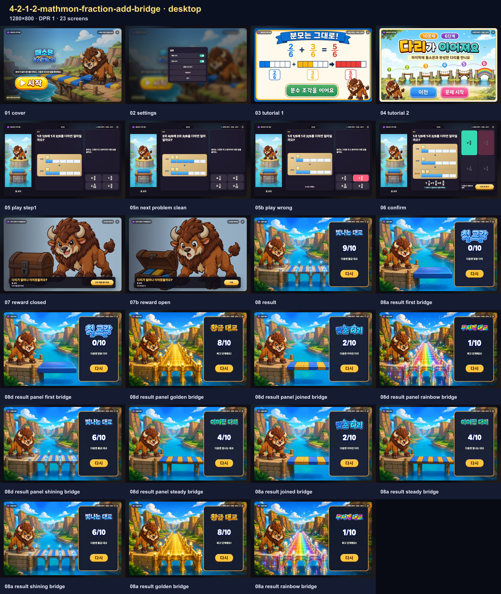
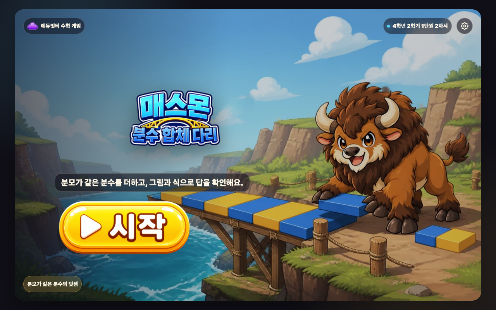
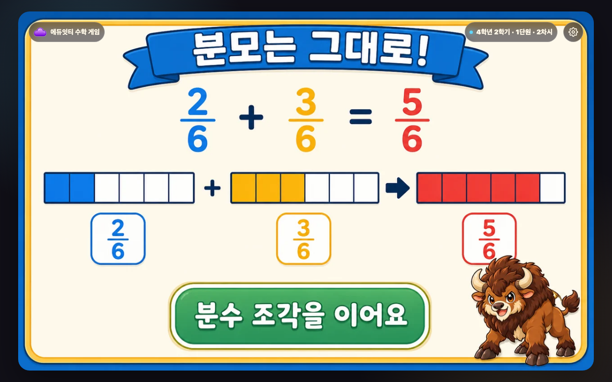
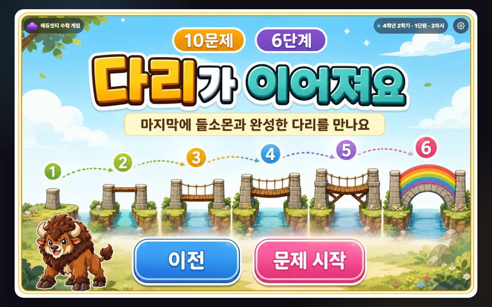
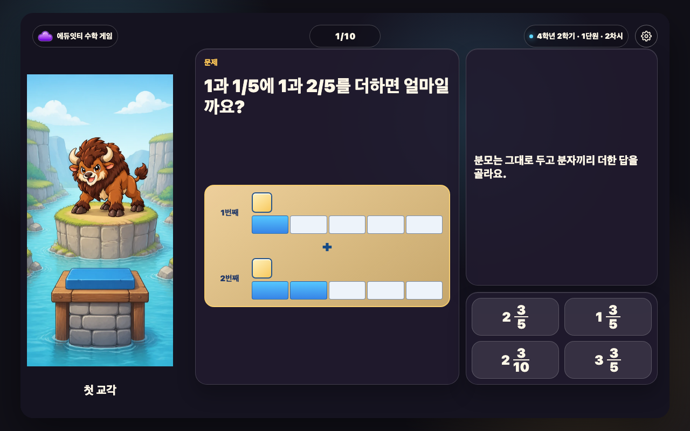
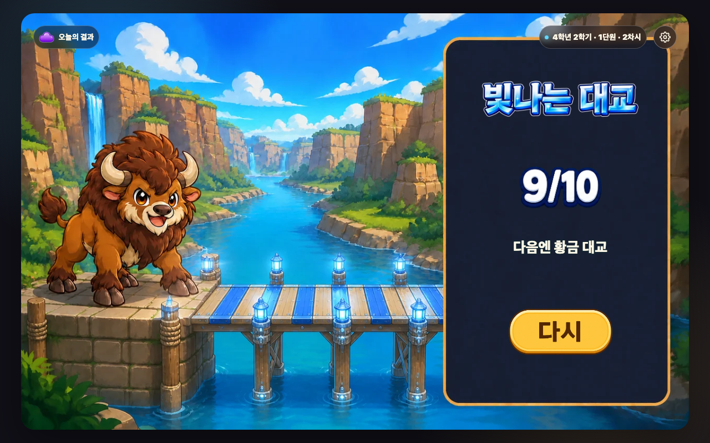
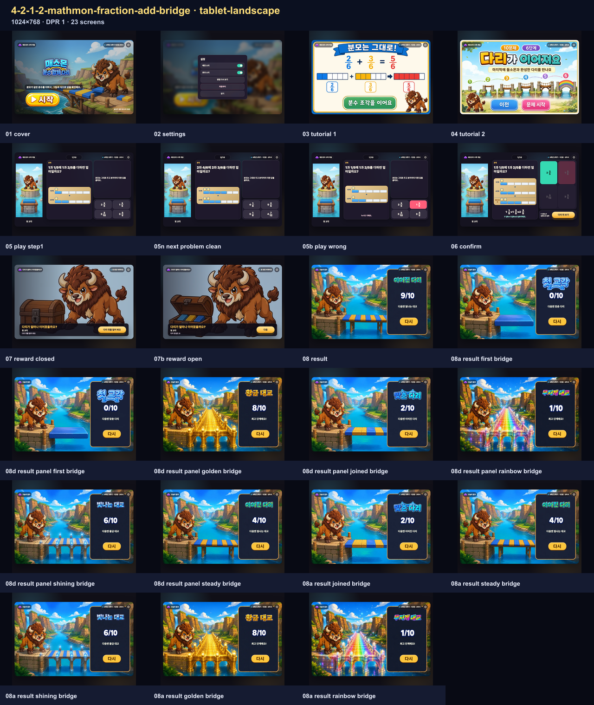
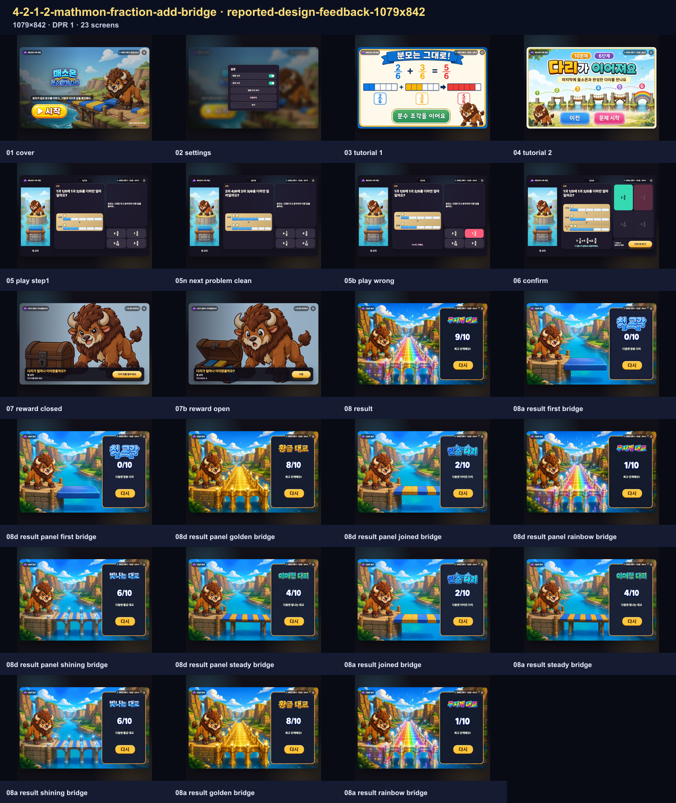

# 매스몬 분수 합체 다리 — 제작·검증 보고서

<!-- PUBLIC-EVIDENCE-RETENTION:ai-mart-github-evidence-selection-v1 -->
> 공개 보관본은 전체 브라우저 QA를 통과한 뒤 화면 크기별 접촉 시트와 데스크톱 핵심 장면만 남깁니다. 전체 상태의 해시와 검사 결과는 QA 영수증에 보존됩니다.

## 범위와 승인

- 차시: `4-2-1-2` · 매스몬 분수 합체 다리
- 공식 팩: `mathmon-grade4-official-pack-v1`
- 승인: `approval:mathmon-grade4-official-pack-v1:20260829`
- 주인공: `mathmon-grade4-02-bison` · 들소몬
- 성취기준: `[4수01-15]`
- 교과서: 인쇄 12–13쪽 / PDF 26–27쪽, 인쇄 16–17쪽 / PDF 34–35쪽
- 익힘: 인쇄 8–9쪽 / PDF 28–29쪽, 인쇄 12–13쪽 / PDF 36–37쪽
- 10문항 · `directInteraction` · 1280×800 · 16:10
- 네트워크 없음 · 순위 없음 · 다른 차시 캐릭터·로봇 없음

## 수학 흐름

같은 분모의 분수는 분모를 그대로 두고 분자를 더합니다. 가분수가 되면 대분수로 바꿉니다. 학생은 문제당 한 번 수학적으로 판단하고, 정답을 고르면 분수판·완성식·짧은 확인문으로 답을 확인합니다. 오답은 짧은 피드백 뒤 같은 문제에서 다시 고를 수 있습니다.

## 보상과 결과

보상 정책은 `mathmon-unified-reward-v2`의 `stage-reveal`입니다. 정답 경로는 `선택지(즉시 판정) → 다리 뒤 보기 → 다리 뒤를 열어 봐요 → 다음`의 4탭이며, 총 40탭입니다. 결과 단계는 첫 교각, 맞춘 다리, 이어진 다리, 빛나는 대교, 황금 대교, 무지개 대교입니다.

## 자산과 시각 증거

- 결과 6상태: `result-states-contact-sheet.png`
- 문제 진행 6상태: `play-progress-states-contact-sheet.png`
- 보상 닫힘+6사건: `reward-states-contact-sheet.png`
- 결과 제목 6상태: `result-title-states-contact-sheet.png`

브라우저 전수 확인은 desktop 1280×800, tablet-landscape 1024×768, reported-design-feedback-1079x842 1079×842에서 진행하며, viewport당 23개 상태로 총 69장입니다. 실행본·정책·하네스 지문은 최신 receipt와 manifest에 기록합니다.

상단 조작은 `stage-top-controls-v2` 실제 측정 기준을 사용하며 배지 글자 14px, 문제 번호 16px을 유지합니다.

## 화면 크기

desktop 1280×800, tablet-landscape 1024×768, reported-design-feedback-1079x842 1079×842에서 같은 흐름을 확인했습니다. 각 viewport의 상태 수와 실행본 지문은 아래 자동 증거와 최신 receipt를 기준으로 합니다.

<!-- REPORT-EVIDENCE-ALL:START -->

## 2026-08-31 최신 원본 스크린샷 전수

- 실행본 SHA-256: `8a3e0f69e1fb4b4c5fec9f2975937fdeb12878d245525e234073f9e5e690fcb1`
- 생성 시각: `2026-08-31T05:50:38.065Z`
- 등록 회귀 이름: `3개`
- 실제 실행 화면 조건: `3개`
- 동일 조건 별칭 통합: `0개`
- 아래에 직접 삽입한 원본 캡처: `69장`
- 같은 width×height×DPR과 같은 fixture 조건은 한 번만 실행하고, 과거 오류 이름은 별칭으로 보존했습니다.
- manifest에 기록된 실제 실행 원본 캡처를 한 장씩 연결했습니다.

### desktop · 1280×800 · DPR 1 · 23장

- 같은 실행으로 보존한 회귀 이름: 없음
- 캡처 범위: `full-flow`

#### 시작 화면 · `engine-flow-desktop-01-cover.png`

- 학생이 보는 것: 분수 합체 다리 제목과 한 줄 목표, 시작 버튼을 봅니다.
- 판단하거나 누르는 것: 게임을 시작할 준비가 되면 시작을 누릅니다.
- 화면에서 확인되는 수학 관계: 분모가 같은 분수의 덧셈을 배우는 차시임을 확인합니다.
- 다음 상태로 넘어가는 이유: 문제를 푸는 방법을 보는 설명 화면으로 이동합니다.

#### 설정 화면 · `engine-flow-desktop-02-settings.png`

- 학생이 보는 것: 배경 소리·효과 소리와 방법 다시 보기, 처음부터, 닫기를 봅니다.
- 판단하거나 누르는 것: 필요한 소리나 이동 행동 하나를 고릅니다.
- 화면에서 확인되는 수학 관계: 수학 문제는 바꾸지 않고 게임 조작만 설정합니다.
- 다음 상태로 넘어가는 이유: 설정을 마치면 열기 전 화면으로 돌아갑니다.

#### 설명 1 · 풀이 방법 · `engine-flow-desktop-03-tutorial-1.png`

- 학생이 보는 것: 분모가 같은 분수의 덧셈 문제를 푸는 방법과 게임 흐름을 그림으로 봅니다.
- 판단하거나 누르는 것: 그림 속 순서와 누를 곳을 확인한 뒤 다음 행동 버튼을 누릅니다.
- 화면에서 확인되는 수학 관계: 분모가 같은 분수의 덧셈에서 무엇을 비교하거나 계산하는지 확인합니다.
- 다음 상태로 넘어가는 이유: 다음 설명으로 이동합니다.

#### 설명 2 · 보상과 목표 · `engine-flow-desktop-04-tutorial-2.png`

- 학생이 보는 것: 분모가 같은 분수의 덧셈 문제를 푸는 방법과 게임 흐름을 그림으로 봅니다.
- 판단하거나 누르는 것: 그림 속 순서와 누를 곳을 확인한 뒤 다음 행동 버튼을 누릅니다.
- 화면에서 확인되는 수학 관계: 분모가 같은 분수의 덧셈에서 무엇을 비교하거나 계산하는지 확인합니다.
- 다음 상태로 넘어가는 이유: 첫 문제로 이동합니다.

#### 문제 상태 · 05-play-step1 · `engine-flow-desktop-05-play-step1.png`

- 학생이 보는 것: 현재 문제, 핵심 계산판이나 물건, 고를 수 있는 답을 봅니다.
- 판단하거나 누르는 것: 문제에서 묻는 값이나 관계에 맞는 답 하나를 고릅니다.
- 화면에서 확인되는 수학 관계: 분모가 같은 분수의 덧셈을 이용해 선택지를 판단합니다.
- 다음 상태로 넘어가는 이유: 고른 답에 따라 오답 또는 정답 확인 상태로 이동합니다.

#### 문제 상태 · 05n-next-problem-clean · `engine-flow-desktop-05n-next-problem-clean.png`

- 학생이 보는 것: 현재 문제, 핵심 계산판이나 물건, 고를 수 있는 답을 봅니다.
- 판단하거나 누르는 것: 문제에서 묻는 값이나 관계에 맞는 답 하나를 고릅니다.
- 화면에서 확인되는 수학 관계: 분모가 같은 분수의 덧셈을 이용해 선택지를 판단합니다.
- 다음 상태로 넘어가는 이유: 고른 답에 따라 오답 또는 정답 확인 상태로 이동합니다.

#### 오답 확인 · 05b-play-wrong · `engine-flow-desktop-05b-play-wrong.png`

- 학생이 보는 것: 고른 답이 계산판이나 물건에 들어간 모습과 짧은 오답 피드백을 봅니다.
- 판단하거나 누르는 것: 어디가 맞지 않는지 확인하고 같은 문제에서 다른 답을 고릅니다.
- 화면에서 확인되는 수학 관계: 분모가 같은 분수의 덧셈의 관계와 고른 답이 왜 맞지 않는지 확인합니다.
- 다음 상태로 넘어가는 이유: 같은 문제에서 다시 판단할 수 있는 상태로 돌아갑니다.

#### 마지막 확인 · 06-confirm · `engine-flow-desktop-06-confirm.png`

- 학생이 보는 것: 마지막으로 완성된 계산이나 값과 보상으로 가는 행동 버튼을 봅니다.
- 판단하거나 누르는 것: 완성된 관계를 읽은 뒤 보상 확인 버튼을 누릅니다.
- 화면에서 확인되는 수학 관계: 분모가 같은 분수의 덧셈의 완성값을 보상 화면 전에 다시 확인합니다.
- 다음 상태로 넘어가는 이유: 수학 관계를 확인한 뒤 보상 상태로 이동합니다.

#### 닫힌 보상 · `engine-flow-desktop-07-reward-closed.png`

- 학생이 보는 것: 결과가 아직 드러나지 않은 보상 그림과 열기 버튼을 봅니다.
- 판단하거나 누르는 것: 이번 이어진 다리 변화를 확인하기 위해 열기를 누릅니다.
- 화면에서 확인되는 수학 관계: 뒤 문제 화면에는 방금 완성한 계산이나 관계가 그대로 남습니다.
- 다음 상태로 넘어가는 이유: 학생이 직접 연 뒤에만 이번 보상 사건이 공개됩니다.

#### 열린 보상 · `engine-flow-desktop-07b-reward-open.png`

- 학생이 보는 것: 보상 사건 그림과 이번 이어진 다리 변화, 다음 행동 버튼을 봅니다.
- 판단하거나 누르는 것: 이번 변화를 확인하고 다음을 누릅니다.
- 화면에서 확인되는 수학 관계: 수학 정답과 무작위 보상 변화가 서로 분리되어 있음을 확인합니다.
- 다음 상태로 넘어가는 이유: 현재 진행 장면의 변화를 본 뒤 다음 문제나 결과로 이동합니다.

#### 실제 결과 · `engine-flow-desktop-08-result.png`

- 학생이 보는 것: 완성 장면과 결과 이름, 정답 수, 다음 목표, 다시 버튼을 봅니다.
- 판단하거나 누르는 것: 현재 결과와 다음 목표를 비교하고 다시 도전할지 결정합니다.
- 화면에서 확인되는 수학 관계: 한 판의 정답과 이어진 다리 변화가 하나의 결과 단계로 정리됩니다.
- 다음 상태로 넘어가는 이유: 다시를 누르면 새 문제 순서와 새 보상 흐름으로 시작합니다.

#### 결과 단계 · first-bridge · `engine-flow-desktop-08a-result-first-bridge.png`

- 학생이 보는 것: 완성 장면과 결과 이름, 정답 수, 다음 목표, 다시 버튼을 봅니다.
- 판단하거나 누르는 것: 현재 결과와 다음 목표를 비교하고 다시 도전할지 결정합니다.
- 화면에서 확인되는 수학 관계: 한 판의 정답과 이어진 다리 변화가 하나의 결과 단계로 정리됩니다.
- 다음 상태로 넘어가는 이유: 다시를 누르면 새 문제 순서와 새 보상 흐름으로 시작합니다.

#### 결과판 포함 · first-bridge · `engine-flow-desktop-08d-result-panel-first-bridge.png`

- 학생이 보는 것: 완성 장면과 결과 이름, 정답 수, 다음 목표, 다시 버튼을 봅니다.
- 판단하거나 누르는 것: 현재 결과와 다음 목표를 비교하고 다시 도전할지 결정합니다.
- 화면에서 확인되는 수학 관계: 한 판의 정답과 이어진 다리 변화가 하나의 결과 단계로 정리됩니다.
- 다음 상태로 넘어가는 이유: 다시를 누르면 새 문제 순서와 새 보상 흐름으로 시작합니다.

#### 결과판 포함 · golden-bridge · `engine-flow-desktop-08d-result-panel-golden-bridge.png`

- 학생이 보는 것: 완성 장면과 결과 이름, 정답 수, 다음 목표, 다시 버튼을 봅니다.
- 판단하거나 누르는 것: 현재 결과와 다음 목표를 비교하고 다시 도전할지 결정합니다.
- 화면에서 확인되는 수학 관계: 한 판의 정답과 이어진 다리 변화가 하나의 결과 단계로 정리됩니다.
- 다음 상태로 넘어가는 이유: 다시를 누르면 새 문제 순서와 새 보상 흐름으로 시작합니다.

#### 결과판 포함 · joined-bridge · `engine-flow-desktop-08d-result-panel-joined-bridge.png`

- 학생이 보는 것: 완성 장면과 결과 이름, 정답 수, 다음 목표, 다시 버튼을 봅니다.
- 판단하거나 누르는 것: 현재 결과와 다음 목표를 비교하고 다시 도전할지 결정합니다.
- 화면에서 확인되는 수학 관계: 한 판의 정답과 이어진 다리 변화가 하나의 결과 단계로 정리됩니다.
- 다음 상태로 넘어가는 이유: 다시를 누르면 새 문제 순서와 새 보상 흐름으로 시작합니다.

#### 결과판 포함 · rainbow-bridge · `engine-flow-desktop-08d-result-panel-rainbow-bridge.png`

- 학생이 보는 것: 완성 장면과 결과 이름, 정답 수, 다음 목표, 다시 버튼을 봅니다.
- 판단하거나 누르는 것: 현재 결과와 다음 목표를 비교하고 다시 도전할지 결정합니다.
- 화면에서 확인되는 수학 관계: 한 판의 정답과 이어진 다리 변화가 하나의 결과 단계로 정리됩니다.
- 다음 상태로 넘어가는 이유: 다시를 누르면 새 문제 순서와 새 보상 흐름으로 시작합니다.

#### 결과판 포함 · shining-bridge · `engine-flow-desktop-08d-result-panel-shining-bridge.png`

- 학생이 보는 것: 완성 장면과 결과 이름, 정답 수, 다음 목표, 다시 버튼을 봅니다.
- 판단하거나 누르는 것: 현재 결과와 다음 목표를 비교하고 다시 도전할지 결정합니다.
- 화면에서 확인되는 수학 관계: 한 판의 정답과 이어진 다리 변화가 하나의 결과 단계로 정리됩니다.
- 다음 상태로 넘어가는 이유: 다시를 누르면 새 문제 순서와 새 보상 흐름으로 시작합니다.

#### 결과판 포함 · steady-bridge · `engine-flow-desktop-08d-result-panel-steady-bridge.png`

- 학생이 보는 것: 완성 장면과 결과 이름, 정답 수, 다음 목표, 다시 버튼을 봅니다.
- 판단하거나 누르는 것: 현재 결과와 다음 목표를 비교하고 다시 도전할지 결정합니다.
- 화면에서 확인되는 수학 관계: 한 판의 정답과 이어진 다리 변화가 하나의 결과 단계로 정리됩니다.
- 다음 상태로 넘어가는 이유: 다시를 누르면 새 문제 순서와 새 보상 흐름으로 시작합니다.

#### 결과 단계 · joined-bridge · `engine-flow-desktop-08a-result-joined-bridge.png`

- 학생이 보는 것: 완성 장면과 결과 이름, 정답 수, 다음 목표, 다시 버튼을 봅니다.
- 판단하거나 누르는 것: 현재 결과와 다음 목표를 비교하고 다시 도전할지 결정합니다.
- 화면에서 확인되는 수학 관계: 한 판의 정답과 이어진 다리 변화가 하나의 결과 단계로 정리됩니다.
- 다음 상태로 넘어가는 이유: 다시를 누르면 새 문제 순서와 새 보상 흐름으로 시작합니다.

#### 결과 단계 · steady-bridge · `engine-flow-desktop-08a-result-steady-bridge.png`

- 학생이 보는 것: 완성 장면과 결과 이름, 정답 수, 다음 목표, 다시 버튼을 봅니다.
- 판단하거나 누르는 것: 현재 결과와 다음 목표를 비교하고 다시 도전할지 결정합니다.
- 화면에서 확인되는 수학 관계: 한 판의 정답과 이어진 다리 변화가 하나의 결과 단계로 정리됩니다.
- 다음 상태로 넘어가는 이유: 다시를 누르면 새 문제 순서와 새 보상 흐름으로 시작합니다.

#### 결과 단계 · shining-bridge · `engine-flow-desktop-08a-result-shining-bridge.png`

- 학생이 보는 것: 완성 장면과 결과 이름, 정답 수, 다음 목표, 다시 버튼을 봅니다.
- 판단하거나 누르는 것: 현재 결과와 다음 목표를 비교하고 다시 도전할지 결정합니다.
- 화면에서 확인되는 수학 관계: 한 판의 정답과 이어진 다리 변화가 하나의 결과 단계로 정리됩니다.
- 다음 상태로 넘어가는 이유: 다시를 누르면 새 문제 순서와 새 보상 흐름으로 시작합니다.

#### 결과 단계 · golden-bridge · `engine-flow-desktop-08a-result-golden-bridge.png`

- 학생이 보는 것: 완성 장면과 결과 이름, 정답 수, 다음 목표, 다시 버튼을 봅니다.
- 판단하거나 누르는 것: 현재 결과와 다음 목표를 비교하고 다시 도전할지 결정합니다.
- 화면에서 확인되는 수학 관계: 한 판의 정답과 이어진 다리 변화가 하나의 결과 단계로 정리됩니다.
- 다음 상태로 넘어가는 이유: 다시를 누르면 새 문제 순서와 새 보상 흐름으로 시작합니다.

#### 결과 단계 · rainbow-bridge · `engine-flow-desktop-08a-result-rainbow-bridge.png`

- 학생이 보는 것: 완성 장면과 결과 이름, 정답 수, 다음 목표, 다시 버튼을 봅니다.
- 판단하거나 누르는 것: 현재 결과와 다음 목표를 비교하고 다시 도전할지 결정합니다.
- 화면에서 확인되는 수학 관계: 한 판의 정답과 이어진 다리 변화가 하나의 결과 단계로 정리됩니다.
- 다음 상태로 넘어가는 이유: 다시를 누르면 새 문제 순서와 새 보상 흐름으로 시작합니다.

### tablet-landscape · 1024×768 · DPR 1 · 23장

- 같은 실행으로 보존한 회귀 이름: 없음
- 캡처 범위: `full-flow`

#### 시작 화면 · `engine-flow-tablet-landscape-01-cover.png`

- 학생이 보는 것: 분수 합체 다리 제목과 한 줄 목표, 시작 버튼을 봅니다.
- 판단하거나 누르는 것: 게임을 시작할 준비가 되면 시작을 누릅니다.
- 화면에서 확인되는 수학 관계: 분모가 같은 분수의 덧셈을 배우는 차시임을 확인합니다.
- 다음 상태로 넘어가는 이유: 문제를 푸는 방법을 보는 설명 화면으로 이동합니다.

#### 설정 화면 · `engine-flow-tablet-landscape-02-settings.png`

- 학생이 보는 것: 배경 소리·효과 소리와 방법 다시 보기, 처음부터, 닫기를 봅니다.
- 판단하거나 누르는 것: 필요한 소리나 이동 행동 하나를 고릅니다.
- 화면에서 확인되는 수학 관계: 수학 문제는 바꾸지 않고 게임 조작만 설정합니다.
- 다음 상태로 넘어가는 이유: 설정을 마치면 열기 전 화면으로 돌아갑니다.

#### 설명 1 · 풀이 방법 · `engine-flow-tablet-landscape-03-tutorial-1.png`

- 학생이 보는 것: 분모가 같은 분수의 덧셈 문제를 푸는 방법과 게임 흐름을 그림으로 봅니다.
- 판단하거나 누르는 것: 그림 속 순서와 누를 곳을 확인한 뒤 다음 행동 버튼을 누릅니다.
- 화면에서 확인되는 수학 관계: 분모가 같은 분수의 덧셈에서 무엇을 비교하거나 계산하는지 확인합니다.
- 다음 상태로 넘어가는 이유: 다음 설명으로 이동합니다.

#### 설명 2 · 보상과 목표 · `engine-flow-tablet-landscape-04-tutorial-2.png`

- 학생이 보는 것: 분모가 같은 분수의 덧셈 문제를 푸는 방법과 게임 흐름을 그림으로 봅니다.
- 판단하거나 누르는 것: 그림 속 순서와 누를 곳을 확인한 뒤 다음 행동 버튼을 누릅니다.
- 화면에서 확인되는 수학 관계: 분모가 같은 분수의 덧셈에서 무엇을 비교하거나 계산하는지 확인합니다.
- 다음 상태로 넘어가는 이유: 첫 문제로 이동합니다.

#### 문제 상태 · 05-play-step1 · `engine-flow-tablet-landscape-05-play-step1.png`

- 학생이 보는 것: 현재 문제, 핵심 계산판이나 물건, 고를 수 있는 답을 봅니다.
- 판단하거나 누르는 것: 문제에서 묻는 값이나 관계에 맞는 답 하나를 고릅니다.
- 화면에서 확인되는 수학 관계: 분모가 같은 분수의 덧셈을 이용해 선택지를 판단합니다.
- 다음 상태로 넘어가는 이유: 고른 답에 따라 오답 또는 정답 확인 상태로 이동합니다.

#### 문제 상태 · 05n-next-problem-clean · `engine-flow-tablet-landscape-05n-next-problem-clean.png`

- 학생이 보는 것: 현재 문제, 핵심 계산판이나 물건, 고를 수 있는 답을 봅니다.
- 판단하거나 누르는 것: 문제에서 묻는 값이나 관계에 맞는 답 하나를 고릅니다.
- 화면에서 확인되는 수학 관계: 분모가 같은 분수의 덧셈을 이용해 선택지를 판단합니다.
- 다음 상태로 넘어가는 이유: 고른 답에 따라 오답 또는 정답 확인 상태로 이동합니다.

#### 오답 확인 · 05b-play-wrong · `engine-flow-tablet-landscape-05b-play-wrong.png`

- 학생이 보는 것: 고른 답이 계산판이나 물건에 들어간 모습과 짧은 오답 피드백을 봅니다.
- 판단하거나 누르는 것: 어디가 맞지 않는지 확인하고 같은 문제에서 다른 답을 고릅니다.
- 화면에서 확인되는 수학 관계: 분모가 같은 분수의 덧셈의 관계와 고른 답이 왜 맞지 않는지 확인합니다.
- 다음 상태로 넘어가는 이유: 같은 문제에서 다시 판단할 수 있는 상태로 돌아갑니다.

#### 마지막 확인 · 06-confirm · `engine-flow-tablet-landscape-06-confirm.png`

- 학생이 보는 것: 마지막으로 완성된 계산이나 값과 보상으로 가는 행동 버튼을 봅니다.
- 판단하거나 누르는 것: 완성된 관계를 읽은 뒤 보상 확인 버튼을 누릅니다.
- 화면에서 확인되는 수학 관계: 분모가 같은 분수의 덧셈의 완성값을 보상 화면 전에 다시 확인합니다.
- 다음 상태로 넘어가는 이유: 수학 관계를 확인한 뒤 보상 상태로 이동합니다.

#### 닫힌 보상 · `engine-flow-tablet-landscape-07-reward-closed.png`

- 학생이 보는 것: 결과가 아직 드러나지 않은 보상 그림과 열기 버튼을 봅니다.
- 판단하거나 누르는 것: 이번 이어진 다리 변화를 확인하기 위해 열기를 누릅니다.
- 화면에서 확인되는 수학 관계: 뒤 문제 화면에는 방금 완성한 계산이나 관계가 그대로 남습니다.
- 다음 상태로 넘어가는 이유: 학생이 직접 연 뒤에만 이번 보상 사건이 공개됩니다.

#### 열린 보상 · `engine-flow-tablet-landscape-07b-reward-open.png`

- 학생이 보는 것: 보상 사건 그림과 이번 이어진 다리 변화, 다음 행동 버튼을 봅니다.
- 판단하거나 누르는 것: 이번 변화를 확인하고 다음을 누릅니다.
- 화면에서 확인되는 수학 관계: 수학 정답과 무작위 보상 변화가 서로 분리되어 있음을 확인합니다.
- 다음 상태로 넘어가는 이유: 현재 진행 장면의 변화를 본 뒤 다음 문제나 결과로 이동합니다.

#### 실제 결과 · `engine-flow-tablet-landscape-08-result.png`

- 학생이 보는 것: 완성 장면과 결과 이름, 정답 수, 다음 목표, 다시 버튼을 봅니다.
- 판단하거나 누르는 것: 현재 결과와 다음 목표를 비교하고 다시 도전할지 결정합니다.
- 화면에서 확인되는 수학 관계: 한 판의 정답과 이어진 다리 변화가 하나의 결과 단계로 정리됩니다.
- 다음 상태로 넘어가는 이유: 다시를 누르면 새 문제 순서와 새 보상 흐름으로 시작합니다.

#### 결과 단계 · first-bridge · `engine-flow-tablet-landscape-08a-result-first-bridge.png`

- 학생이 보는 것: 완성 장면과 결과 이름, 정답 수, 다음 목표, 다시 버튼을 봅니다.
- 판단하거나 누르는 것: 현재 결과와 다음 목표를 비교하고 다시 도전할지 결정합니다.
- 화면에서 확인되는 수학 관계: 한 판의 정답과 이어진 다리 변화가 하나의 결과 단계로 정리됩니다.
- 다음 상태로 넘어가는 이유: 다시를 누르면 새 문제 순서와 새 보상 흐름으로 시작합니다.

#### 결과판 포함 · first-bridge · `engine-flow-tablet-landscape-08d-result-panel-first-bridge.png`

- 학생이 보는 것: 완성 장면과 결과 이름, 정답 수, 다음 목표, 다시 버튼을 봅니다.
- 판단하거나 누르는 것: 현재 결과와 다음 목표를 비교하고 다시 도전할지 결정합니다.
- 화면에서 확인되는 수학 관계: 한 판의 정답과 이어진 다리 변화가 하나의 결과 단계로 정리됩니다.
- 다음 상태로 넘어가는 이유: 다시를 누르면 새 문제 순서와 새 보상 흐름으로 시작합니다.

#### 결과판 포함 · golden-bridge · `engine-flow-tablet-landscape-08d-result-panel-golden-bridge.png`

- 학생이 보는 것: 완성 장면과 결과 이름, 정답 수, 다음 목표, 다시 버튼을 봅니다.
- 판단하거나 누르는 것: 현재 결과와 다음 목표를 비교하고 다시 도전할지 결정합니다.
- 화면에서 확인되는 수학 관계: 한 판의 정답과 이어진 다리 변화가 하나의 결과 단계로 정리됩니다.
- 다음 상태로 넘어가는 이유: 다시를 누르면 새 문제 순서와 새 보상 흐름으로 시작합니다.

#### 결과판 포함 · joined-bridge · `engine-flow-tablet-landscape-08d-result-panel-joined-bridge.png`

- 학생이 보는 것: 완성 장면과 결과 이름, 정답 수, 다음 목표, 다시 버튼을 봅니다.
- 판단하거나 누르는 것: 현재 결과와 다음 목표를 비교하고 다시 도전할지 결정합니다.
- 화면에서 확인되는 수학 관계: 한 판의 정답과 이어진 다리 변화가 하나의 결과 단계로 정리됩니다.
- 다음 상태로 넘어가는 이유: 다시를 누르면 새 문제 순서와 새 보상 흐름으로 시작합니다.

#### 결과판 포함 · rainbow-bridge · `engine-flow-tablet-landscape-08d-result-panel-rainbow-bridge.png`

- 학생이 보는 것: 완성 장면과 결과 이름, 정답 수, 다음 목표, 다시 버튼을 봅니다.
- 판단하거나 누르는 것: 현재 결과와 다음 목표를 비교하고 다시 도전할지 결정합니다.
- 화면에서 확인되는 수학 관계: 한 판의 정답과 이어진 다리 변화가 하나의 결과 단계로 정리됩니다.
- 다음 상태로 넘어가는 이유: 다시를 누르면 새 문제 순서와 새 보상 흐름으로 시작합니다.

#### 결과판 포함 · shining-bridge · `engine-flow-tablet-landscape-08d-result-panel-shining-bridge.png`

- 학생이 보는 것: 완성 장면과 결과 이름, 정답 수, 다음 목표, 다시 버튼을 봅니다.
- 판단하거나 누르는 것: 현재 결과와 다음 목표를 비교하고 다시 도전할지 결정합니다.
- 화면에서 확인되는 수학 관계: 한 판의 정답과 이어진 다리 변화가 하나의 결과 단계로 정리됩니다.
- 다음 상태로 넘어가는 이유: 다시를 누르면 새 문제 순서와 새 보상 흐름으로 시작합니다.

#### 결과판 포함 · steady-bridge · `engine-flow-tablet-landscape-08d-result-panel-steady-bridge.png`

- 학생이 보는 것: 완성 장면과 결과 이름, 정답 수, 다음 목표, 다시 버튼을 봅니다.
- 판단하거나 누르는 것: 현재 결과와 다음 목표를 비교하고 다시 도전할지 결정합니다.
- 화면에서 확인되는 수학 관계: 한 판의 정답과 이어진 다리 변화가 하나의 결과 단계로 정리됩니다.
- 다음 상태로 넘어가는 이유: 다시를 누르면 새 문제 순서와 새 보상 흐름으로 시작합니다.

#### 결과 단계 · joined-bridge · `engine-flow-tablet-landscape-08a-result-joined-bridge.png`

- 학생이 보는 것: 완성 장면과 결과 이름, 정답 수, 다음 목표, 다시 버튼을 봅니다.
- 판단하거나 누르는 것: 현재 결과와 다음 목표를 비교하고 다시 도전할지 결정합니다.
- 화면에서 확인되는 수학 관계: 한 판의 정답과 이어진 다리 변화가 하나의 결과 단계로 정리됩니다.
- 다음 상태로 넘어가는 이유: 다시를 누르면 새 문제 순서와 새 보상 흐름으로 시작합니다.

#### 결과 단계 · steady-bridge · `engine-flow-tablet-landscape-08a-result-steady-bridge.png`

- 학생이 보는 것: 완성 장면과 결과 이름, 정답 수, 다음 목표, 다시 버튼을 봅니다.
- 판단하거나 누르는 것: 현재 결과와 다음 목표를 비교하고 다시 도전할지 결정합니다.
- 화면에서 확인되는 수학 관계: 한 판의 정답과 이어진 다리 변화가 하나의 결과 단계로 정리됩니다.
- 다음 상태로 넘어가는 이유: 다시를 누르면 새 문제 순서와 새 보상 흐름으로 시작합니다.

#### 결과 단계 · shining-bridge · `engine-flow-tablet-landscape-08a-result-shining-bridge.png`

- 학생이 보는 것: 완성 장면과 결과 이름, 정답 수, 다음 목표, 다시 버튼을 봅니다.
- 판단하거나 누르는 것: 현재 결과와 다음 목표를 비교하고 다시 도전할지 결정합니다.
- 화면에서 확인되는 수학 관계: 한 판의 정답과 이어진 다리 변화가 하나의 결과 단계로 정리됩니다.
- 다음 상태로 넘어가는 이유: 다시를 누르면 새 문제 순서와 새 보상 흐름으로 시작합니다.

#### 결과 단계 · golden-bridge · `engine-flow-tablet-landscape-08a-result-golden-bridge.png`

- 학생이 보는 것: 완성 장면과 결과 이름, 정답 수, 다음 목표, 다시 버튼을 봅니다.
- 판단하거나 누르는 것: 현재 결과와 다음 목표를 비교하고 다시 도전할지 결정합니다.
- 화면에서 확인되는 수학 관계: 한 판의 정답과 이어진 다리 변화가 하나의 결과 단계로 정리됩니다.
- 다음 상태로 넘어가는 이유: 다시를 누르면 새 문제 순서와 새 보상 흐름으로 시작합니다.

#### 결과 단계 · rainbow-bridge · `engine-flow-tablet-landscape-08a-result-rainbow-bridge.png`

- 학생이 보는 것: 완성 장면과 결과 이름, 정답 수, 다음 목표, 다시 버튼을 봅니다.
- 판단하거나 누르는 것: 현재 결과와 다음 목표를 비교하고 다시 도전할지 결정합니다.
- 화면에서 확인되는 수학 관계: 한 판의 정답과 이어진 다리 변화가 하나의 결과 단계로 정리됩니다.
- 다음 상태로 넘어가는 이유: 다시를 누르면 새 문제 순서와 새 보상 흐름으로 시작합니다.

### reported-design-feedback-1079x842 · 1079×842 · DPR 1 · 23장

- 같은 실행으로 보존한 회귀 이름: 없음
- 캡처 범위: `full-flow`

#### 시작 화면 · `engine-flow-reported-design-feedback-1079x842-01-cover.png`

- 학생이 보는 것: 분수 합체 다리 제목과 한 줄 목표, 시작 버튼을 봅니다.
- 판단하거나 누르는 것: 게임을 시작할 준비가 되면 시작을 누릅니다.
- 화면에서 확인되는 수학 관계: 분모가 같은 분수의 덧셈을 배우는 차시임을 확인합니다.
- 다음 상태로 넘어가는 이유: 문제를 푸는 방법을 보는 설명 화면으로 이동합니다.

#### 설정 화면 · `engine-flow-reported-design-feedback-1079x842-02-settings.png`

- 학생이 보는 것: 배경 소리·효과 소리와 방법 다시 보기, 처음부터, 닫기를 봅니다.
- 판단하거나 누르는 것: 필요한 소리나 이동 행동 하나를 고릅니다.
- 화면에서 확인되는 수학 관계: 수학 문제는 바꾸지 않고 게임 조작만 설정합니다.
- 다음 상태로 넘어가는 이유: 설정을 마치면 열기 전 화면으로 돌아갑니다.

#### 설명 1 · 풀이 방법 · `engine-flow-reported-design-feedback-1079x842-03-tutorial-1.png`

- 학생이 보는 것: 분모가 같은 분수의 덧셈 문제를 푸는 방법과 게임 흐름을 그림으로 봅니다.
- 판단하거나 누르는 것: 그림 속 순서와 누를 곳을 확인한 뒤 다음 행동 버튼을 누릅니다.
- 화면에서 확인되는 수학 관계: 분모가 같은 분수의 덧셈에서 무엇을 비교하거나 계산하는지 확인합니다.
- 다음 상태로 넘어가는 이유: 다음 설명으로 이동합니다.

#### 설명 2 · 보상과 목표 · `engine-flow-reported-design-feedback-1079x842-04-tutorial-2.png`

- 학생이 보는 것: 분모가 같은 분수의 덧셈 문제를 푸는 방법과 게임 흐름을 그림으로 봅니다.
- 판단하거나 누르는 것: 그림 속 순서와 누를 곳을 확인한 뒤 다음 행동 버튼을 누릅니다.
- 화면에서 확인되는 수학 관계: 분모가 같은 분수의 덧셈에서 무엇을 비교하거나 계산하는지 확인합니다.
- 다음 상태로 넘어가는 이유: 첫 문제로 이동합니다.

#### 문제 상태 · 05-play-step1 · `engine-flow-reported-design-feedback-1079x842-05-play-step1.png`

- 학생이 보는 것: 현재 문제, 핵심 계산판이나 물건, 고를 수 있는 답을 봅니다.
- 판단하거나 누르는 것: 문제에서 묻는 값이나 관계에 맞는 답 하나를 고릅니다.
- 화면에서 확인되는 수학 관계: 분모가 같은 분수의 덧셈을 이용해 선택지를 판단합니다.
- 다음 상태로 넘어가는 이유: 고른 답에 따라 오답 또는 정답 확인 상태로 이동합니다.

#### 문제 상태 · 05n-next-problem-clean · `engine-flow-reported-design-feedback-1079x842-05n-next-problem-clean.png`

- 학생이 보는 것: 현재 문제, 핵심 계산판이나 물건, 고를 수 있는 답을 봅니다.
- 판단하거나 누르는 것: 문제에서 묻는 값이나 관계에 맞는 답 하나를 고릅니다.
- 화면에서 확인되는 수학 관계: 분모가 같은 분수의 덧셈을 이용해 선택지를 판단합니다.
- 다음 상태로 넘어가는 이유: 고른 답에 따라 오답 또는 정답 확인 상태로 이동합니다.

#### 오답 확인 · 05b-play-wrong · `engine-flow-reported-design-feedback-1079x842-05b-play-wrong.png`

- 학생이 보는 것: 고른 답이 계산판이나 물건에 들어간 모습과 짧은 오답 피드백을 봅니다.
- 판단하거나 누르는 것: 어디가 맞지 않는지 확인하고 같은 문제에서 다른 답을 고릅니다.
- 화면에서 확인되는 수학 관계: 분모가 같은 분수의 덧셈의 관계와 고른 답이 왜 맞지 않는지 확인합니다.
- 다음 상태로 넘어가는 이유: 같은 문제에서 다시 판단할 수 있는 상태로 돌아갑니다.

#### 마지막 확인 · 06-confirm · `engine-flow-reported-design-feedback-1079x842-06-confirm.png`

- 학생이 보는 것: 마지막으로 완성된 계산이나 값과 보상으로 가는 행동 버튼을 봅니다.
- 판단하거나 누르는 것: 완성된 관계를 읽은 뒤 보상 확인 버튼을 누릅니다.
- 화면에서 확인되는 수학 관계: 분모가 같은 분수의 덧셈의 완성값을 보상 화면 전에 다시 확인합니다.
- 다음 상태로 넘어가는 이유: 수학 관계를 확인한 뒤 보상 상태로 이동합니다.

#### 닫힌 보상 · `engine-flow-reported-design-feedback-1079x842-07-reward-closed.png`

- 학생이 보는 것: 결과가 아직 드러나지 않은 보상 그림과 열기 버튼을 봅니다.
- 판단하거나 누르는 것: 이번 이어진 다리 변화를 확인하기 위해 열기를 누릅니다.
- 화면에서 확인되는 수학 관계: 뒤 문제 화면에는 방금 완성한 계산이나 관계가 그대로 남습니다.
- 다음 상태로 넘어가는 이유: 학생이 직접 연 뒤에만 이번 보상 사건이 공개됩니다.

#### 열린 보상 · `engine-flow-reported-design-feedback-1079x842-07b-reward-open.png`

- 학생이 보는 것: 보상 사건 그림과 이번 이어진 다리 변화, 다음 행동 버튼을 봅니다.
- 판단하거나 누르는 것: 이번 변화를 확인하고 다음을 누릅니다.
- 화면에서 확인되는 수학 관계: 수학 정답과 무작위 보상 변화가 서로 분리되어 있음을 확인합니다.
- 다음 상태로 넘어가는 이유: 현재 진행 장면의 변화를 본 뒤 다음 문제나 결과로 이동합니다.

#### 실제 결과 · `engine-flow-reported-design-feedback-1079x842-08-result.png`

- 학생이 보는 것: 완성 장면과 결과 이름, 정답 수, 다음 목표, 다시 버튼을 봅니다.
- 판단하거나 누르는 것: 현재 결과와 다음 목표를 비교하고 다시 도전할지 결정합니다.
- 화면에서 확인되는 수학 관계: 한 판의 정답과 이어진 다리 변화가 하나의 결과 단계로 정리됩니다.
- 다음 상태로 넘어가는 이유: 다시를 누르면 새 문제 순서와 새 보상 흐름으로 시작합니다.

#### 결과 단계 · first-bridge · `engine-flow-reported-design-feedback-1079x842-08a-result-first-bridge.png`

- 학생이 보는 것: 완성 장면과 결과 이름, 정답 수, 다음 목표, 다시 버튼을 봅니다.
- 판단하거나 누르는 것: 현재 결과와 다음 목표를 비교하고 다시 도전할지 결정합니다.
- 화면에서 확인되는 수학 관계: 한 판의 정답과 이어진 다리 변화가 하나의 결과 단계로 정리됩니다.
- 다음 상태로 넘어가는 이유: 다시를 누르면 새 문제 순서와 새 보상 흐름으로 시작합니다.

#### 결과판 포함 · first-bridge · `engine-flow-reported-design-feedback-1079x842-08d-result-panel-first-bridge.png`

- 학생이 보는 것: 완성 장면과 결과 이름, 정답 수, 다음 목표, 다시 버튼을 봅니다.
- 판단하거나 누르는 것: 현재 결과와 다음 목표를 비교하고 다시 도전할지 결정합니다.
- 화면에서 확인되는 수학 관계: 한 판의 정답과 이어진 다리 변화가 하나의 결과 단계로 정리됩니다.
- 다음 상태로 넘어가는 이유: 다시를 누르면 새 문제 순서와 새 보상 흐름으로 시작합니다.

#### 결과판 포함 · golden-bridge · `engine-flow-reported-design-feedback-1079x842-08d-result-panel-golden-bridge.png`

- 학생이 보는 것: 완성 장면과 결과 이름, 정답 수, 다음 목표, 다시 버튼을 봅니다.
- 판단하거나 누르는 것: 현재 결과와 다음 목표를 비교하고 다시 도전할지 결정합니다.
- 화면에서 확인되는 수학 관계: 한 판의 정답과 이어진 다리 변화가 하나의 결과 단계로 정리됩니다.
- 다음 상태로 넘어가는 이유: 다시를 누르면 새 문제 순서와 새 보상 흐름으로 시작합니다.

#### 결과판 포함 · joined-bridge · `engine-flow-reported-design-feedback-1079x842-08d-result-panel-joined-bridge.png`

- 학생이 보는 것: 완성 장면과 결과 이름, 정답 수, 다음 목표, 다시 버튼을 봅니다.
- 판단하거나 누르는 것: 현재 결과와 다음 목표를 비교하고 다시 도전할지 결정합니다.
- 화면에서 확인되는 수학 관계: 한 판의 정답과 이어진 다리 변화가 하나의 결과 단계로 정리됩니다.
- 다음 상태로 넘어가는 이유: 다시를 누르면 새 문제 순서와 새 보상 흐름으로 시작합니다.

#### 결과판 포함 · rainbow-bridge · `engine-flow-reported-design-feedback-1079x842-08d-result-panel-rainbow-bridge.png`

- 학생이 보는 것: 완성 장면과 결과 이름, 정답 수, 다음 목표, 다시 버튼을 봅니다.
- 판단하거나 누르는 것: 현재 결과와 다음 목표를 비교하고 다시 도전할지 결정합니다.
- 화면에서 확인되는 수학 관계: 한 판의 정답과 이어진 다리 변화가 하나의 결과 단계로 정리됩니다.
- 다음 상태로 넘어가는 이유: 다시를 누르면 새 문제 순서와 새 보상 흐름으로 시작합니다.

#### 결과판 포함 · shining-bridge · `engine-flow-reported-design-feedback-1079x842-08d-result-panel-shining-bridge.png`

- 학생이 보는 것: 완성 장면과 결과 이름, 정답 수, 다음 목표, 다시 버튼을 봅니다.
- 판단하거나 누르는 것: 현재 결과와 다음 목표를 비교하고 다시 도전할지 결정합니다.
- 화면에서 확인되는 수학 관계: 한 판의 정답과 이어진 다리 변화가 하나의 결과 단계로 정리됩니다.
- 다음 상태로 넘어가는 이유: 다시를 누르면 새 문제 순서와 새 보상 흐름으로 시작합니다.

#### 결과판 포함 · steady-bridge · `engine-flow-reported-design-feedback-1079x842-08d-result-panel-steady-bridge.png`

- 학생이 보는 것: 완성 장면과 결과 이름, 정답 수, 다음 목표, 다시 버튼을 봅니다.
- 판단하거나 누르는 것: 현재 결과와 다음 목표를 비교하고 다시 도전할지 결정합니다.
- 화면에서 확인되는 수학 관계: 한 판의 정답과 이어진 다리 변화가 하나의 결과 단계로 정리됩니다.
- 다음 상태로 넘어가는 이유: 다시를 누르면 새 문제 순서와 새 보상 흐름으로 시작합니다.

#### 결과 단계 · joined-bridge · `engine-flow-reported-design-feedback-1079x842-08a-result-joined-bridge.png`

- 학생이 보는 것: 완성 장면과 결과 이름, 정답 수, 다음 목표, 다시 버튼을 봅니다.
- 판단하거나 누르는 것: 현재 결과와 다음 목표를 비교하고 다시 도전할지 결정합니다.
- 화면에서 확인되는 수학 관계: 한 판의 정답과 이어진 다리 변화가 하나의 결과 단계로 정리됩니다.
- 다음 상태로 넘어가는 이유: 다시를 누르면 새 문제 순서와 새 보상 흐름으로 시작합니다.

#### 결과 단계 · steady-bridge · `engine-flow-reported-design-feedback-1079x842-08a-result-steady-bridge.png`

- 학생이 보는 것: 완성 장면과 결과 이름, 정답 수, 다음 목표, 다시 버튼을 봅니다.
- 판단하거나 누르는 것: 현재 결과와 다음 목표를 비교하고 다시 도전할지 결정합니다.
- 화면에서 확인되는 수학 관계: 한 판의 정답과 이어진 다리 변화가 하나의 결과 단계로 정리됩니다.
- 다음 상태로 넘어가는 이유: 다시를 누르면 새 문제 순서와 새 보상 흐름으로 시작합니다.

#### 결과 단계 · shining-bridge · `engine-flow-reported-design-feedback-1079x842-08a-result-shining-bridge.png`

- 학생이 보는 것: 완성 장면과 결과 이름, 정답 수, 다음 목표, 다시 버튼을 봅니다.
- 판단하거나 누르는 것: 현재 결과와 다음 목표를 비교하고 다시 도전할지 결정합니다.
- 화면에서 확인되는 수학 관계: 한 판의 정답과 이어진 다리 변화가 하나의 결과 단계로 정리됩니다.
- 다음 상태로 넘어가는 이유: 다시를 누르면 새 문제 순서와 새 보상 흐름으로 시작합니다.

#### 결과 단계 · golden-bridge · `engine-flow-reported-design-feedback-1079x842-08a-result-golden-bridge.png`

- 학생이 보는 것: 완성 장면과 결과 이름, 정답 수, 다음 목표, 다시 버튼을 봅니다.
- 판단하거나 누르는 것: 현재 결과와 다음 목표를 비교하고 다시 도전할지 결정합니다.
- 화면에서 확인되는 수학 관계: 한 판의 정답과 이어진 다리 변화가 하나의 결과 단계로 정리됩니다.
- 다음 상태로 넘어가는 이유: 다시를 누르면 새 문제 순서와 새 보상 흐름으로 시작합니다.

#### 결과 단계 · rainbow-bridge · `engine-flow-reported-design-feedback-1079x842-08a-result-rainbow-bridge.png`

- 학생이 보는 것: 완성 장면과 결과 이름, 정답 수, 다음 목표, 다시 버튼을 봅니다.
- 판단하거나 누르는 것: 현재 결과와 다음 목표를 비교하고 다시 도전할지 결정합니다.
- 화면에서 확인되는 수학 관계: 한 판의 정답과 이어진 다리 변화가 하나의 결과 단계로 정리됩니다.
- 다음 상태로 넘어가는 이유: 다시를 누르면 새 문제 순서와 새 보상 흐름으로 시작합니다.

<!-- REPORT-EVIDENCE-ALL:END -->
