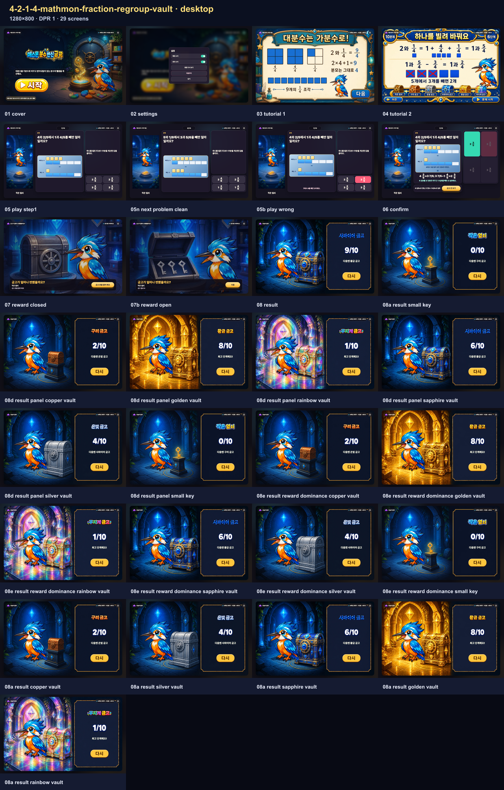
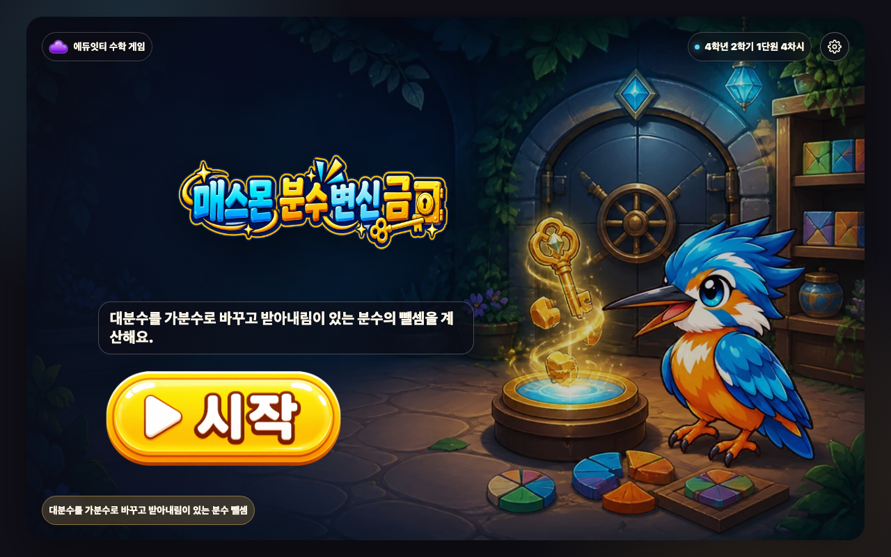
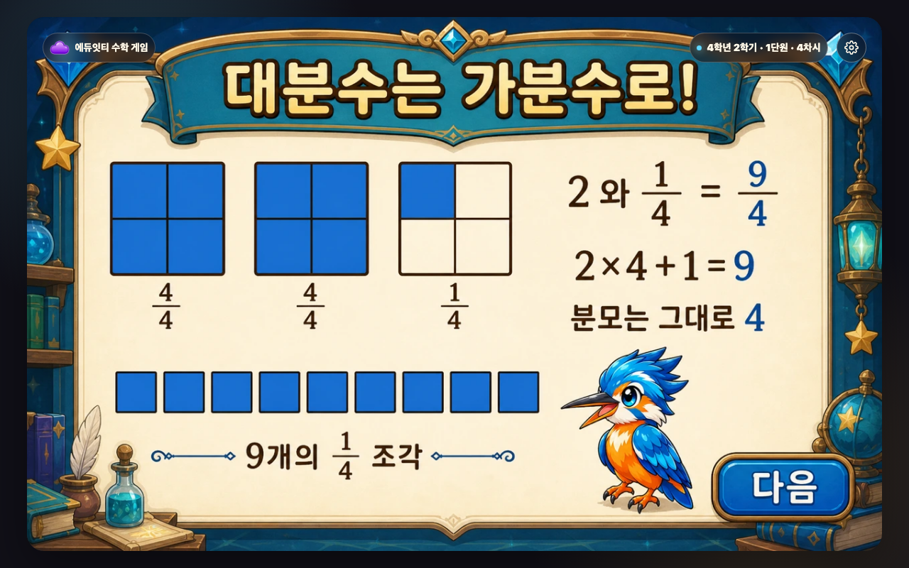
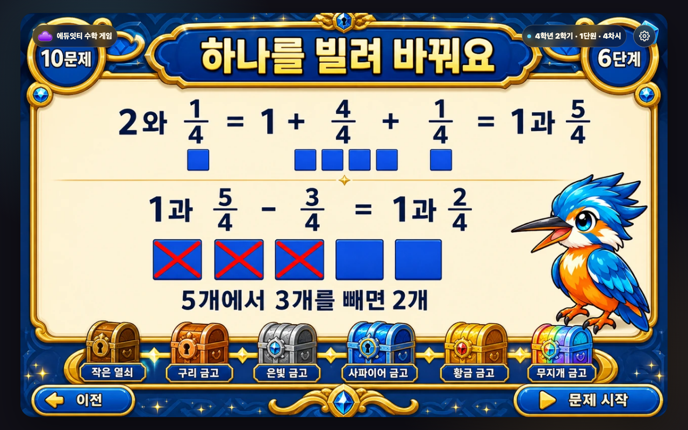
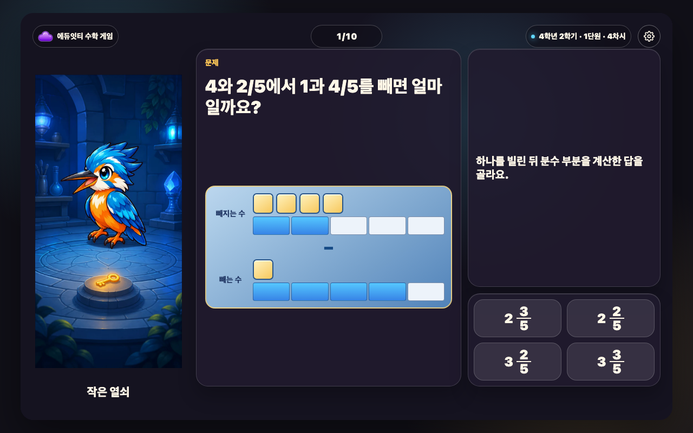
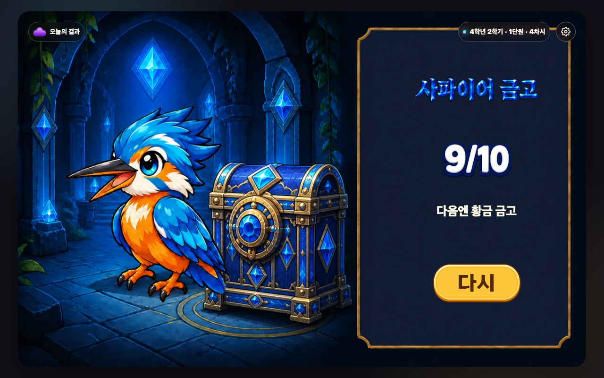
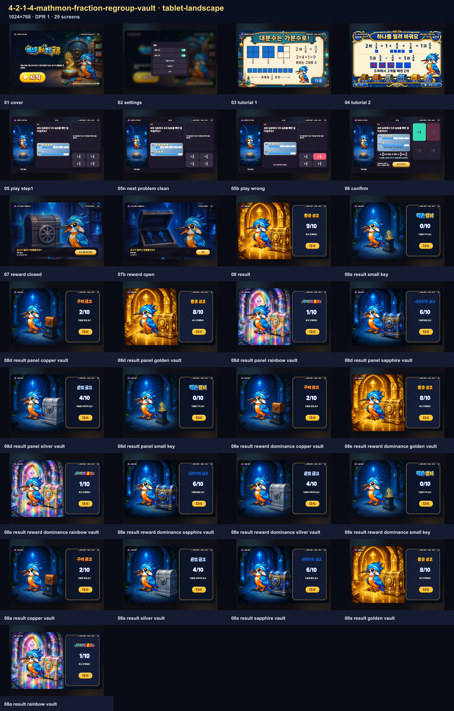
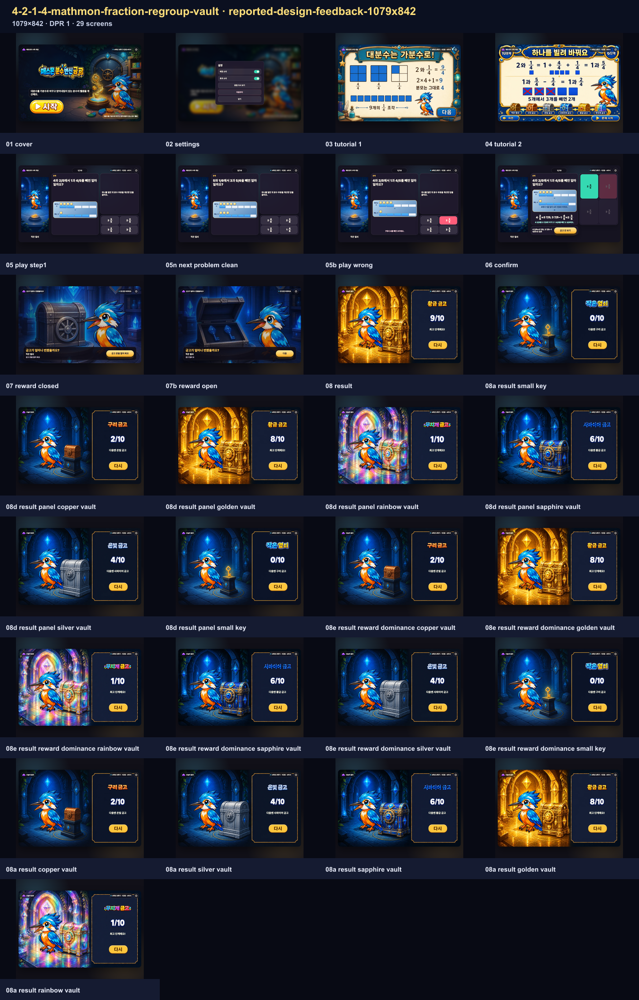

# 매스몬 분수 변신 금고 — 정적 통합 보고서

<!-- PUBLIC-EVIDENCE-RETENTION:ai-mart-github-evidence-selection-v1 -->
> 공개 보관본은 전체 브라우저 QA를 통과한 뒤 화면 크기별 접촉 시트와 데스크톱 핵심 장면만 남깁니다. 전체 상태의 해시와 검사 결과는 QA 영수증에 보존됩니다.

## 범위와 승인

- 차시: `4-2-1-4` · 매스몬 분수 변신 금고
- 공식 팩: `mathmon-grade4-official-pack-v1`
- 캐릭터: `mathmon-grade4-04-kingfisher` · 물총새몬
- 승인 ID: `approval:mathmon-grade4-official-pack-v1:20260829`
- 10문항 · 4지선다 · `directInteraction` · 16:10 · `1280x800`
- 네트워크 없음 · 순위 없음 · 내부 힘/점수 비공개
- 교과서 printed 20–23 / PDF 42–45, 익힘책 printed 16–17 / PDF 46–47: evidence-only

## 수학·학생 흐름

대분수는 자연수×분모+분자로 가분수로 바꾸고, 필요한 뺄셈에서는 자연수 하나를 빌립니다. 한 문제에서 수학 판단은 한 번이며 오답 뒤에는 같은 문제를 다시 선택합니다. 정답 뒤 증명만 공개됩니다.

정답 경로: `선택지 (즉시 판정) → 금고 안 보기 → 금고 문을 열어 봐요 → 다음`.

## 자산 증거

- 문제 진행 6상태: `play-progress-states-contact-sheet.png`
- 문제 진행 source/anchor audit: `play-progress-states-contact-sheet.png`
- 보상 7상태: `reward-states-contact-sheet.png`
- 결과 6상태: `result-states-contact-sheet.png`
- 결과 제목 6상태: `result-title-states-contact-sheet.png`
- 결과 장면 주 보상 경계 audit: `assets/result-states-contact-sheet.audit.json`
- 생성 계보 및 source/runtime SHA: `../_lessons/4-2-1-4-mathmon-fraction-regroup-vault/assets/generation-lineage.json`

승인된 `mathmon-grade4-04-kingfisher` 한 종만 사용합니다. 문제 진행은 동일 카메라의 6상태, 결과는 `generated-result-fullscene-v3` 6상태, 보상은 `closed`, `normal`, `loss`, `mega`, `jackpot`, `keep`, `special` 7상태입니다.

## 결과판 계약

결과 패널 detector search ROI는 `{x:839,y:90,width:390,height:640}`이며 dynamic axis는 `1034`입니다. 여섯 결과 모두 native full-scene이고, 내부 metric/track은 숨겨진 슬롯입니다. 허용 동적 오버레이는 정답 수와 다음 목표뿐이며, 효과 오버레이·blend mode·tier CSS filter는 사용하지 않습니다.

주 보상 경계는 여섯 native `1280x800` 장면에서 결과 패널이 시작하는 실측 x=839 직전까지의 좌측 완료 world pane으로 정의했습니다: 모든 tier `{x:0,y:0,width:839,height:800}`. 결과 보드 스캔은 선언된 inner empty ROI `{x:839,y:90,width:390,height:640}`만 대상으로 하며 장식 외곽 프레임은 제외합니다. 접촉 시트 SHA와 각 tier의 source/runtime 파일 매핑은 `assets/result-states-contact-sheet.audit.json`에 기록되어 있습니다. 이는 전체 Stage를 통과시키기 위한 임의 사각형이 아니라, generation lineage의 panelRect와 동일한 패널 경계에서 도출한 영역입니다.

## 정적 검증 상태

U1-4 Phase-A/model/view, `QA_LESSON_MODEL`, lesson contract, effect containment, stage ratio 및 자산·lineage 검사를 통과했습니다. 상단 조작 표준은 `stage-top-controls-v2`이며 배지 글씨 14px, 문제 번호 16px 기준을 사용합니다.

## 브라우저 QA — PASS

화면 크기: desktop `1280×800`, tablet-landscape `1024×768`, reported-design-feedback `1079×842`의 3개 선언 viewport에서 현재 실행본을 검증했습니다.

최신 실행은 `node scripts/build-lesson.mjs 4-2-1-4-mathmon-fraction-regroup-vault` 뒤 `node scripts/qa-lesson-flow.mjs 4-2-1-4-mathmon-fraction-regroup-vault`이며 `QA_LESSON_FLOW: PASS`였습니다. desktop·tablet-landscape·reported-design-feedback-1079x842 3개 viewport에서 87개 캡처를 생성했고, 정확한 10문항 정답 4탭 흐름, 오답 재시도, reward closed/open 및 전환, 6개 result tier, settings/retry를 검증했습니다. 영수증은 `screenshots/mathmon-browser-qa-receipt.json`, 상세 결과는 `.tmp-qa/mathmon/4-2-1-4-mathmon-fraction-regroup-vault/last-flow-results.json`입니다. 결과 dominance도 각 viewport·6 tier에서 PASS했습니다. strict provenance와 최종 delivery gate는 별도 승인/검증 전까지 PASS로 주장하지 않습니다.

## generated-runtime provenance 보류

`assets/generation-lineage.json`의 실제 generation ID·prompt SHA·source/runtime SHA는 확인했습니다. 그러나 새 strict 계약이 요구하는 contemporaneous call receipt의 동일 호출 task/turn/tool-event와 authoritative provider registry의 독립 승격 record가 없습니다. 원본 worktree의 registry는 `records: []`, `registrySeal: null`인 fail-closed 상태입니다. 따라서 부분 필드나 추정 ID를 넣은 `GENERATED_RUNTIME_PROVENANCE.json`은 만들지 않았고, strict provenance PASS로 보고하지 않습니다. 외부 registry가 독립 검토·봉인된 뒤에만 해당 manifest와 strict checker를 재검토해야 합니다.

<!-- REPORT-EVIDENCE-ALL:START -->

## 2026-08-31 최신 원본 스크린샷 전수

- 실행본 SHA-256: `2116c5e869fafa786bb533910f46e4654763fa6a764e6bba0f18c7e0d5721977`
- 생성 시각: `2026-08-31T05:51:28.502Z`
- 등록 회귀 이름: `3개`
- 실제 실행 화면 조건: `3개`
- 동일 조건 별칭 통합: `0개`
- 아래에 직접 삽입한 원본 캡처: `87장`
- 같은 width×height×DPR과 같은 fixture 조건은 한 번만 실행하고, 과거 오류 이름은 별칭으로 보존했습니다.
- manifest에 기록된 실제 실행 원본 캡처를 한 장씩 연결했습니다.

### desktop · 1280×800 · DPR 1 · 29장

- 같은 실행으로 보존한 회귀 이름: 없음
- 캡처 범위: `full-flow`

#### 시작 화면 · `engine-flow-desktop-01-cover.png`

- 학생이 보는 것: 분수 변신 금고 제목과 한 줄 목표, 시작 버튼을 봅니다.
- 판단하거나 누르는 것: 게임을 시작할 준비가 되면 시작을 누릅니다.
- 화면에서 확인되는 수학 관계: 대분수를 가분수로 바꾸고 받아내림이 있는 분수 뺄셈을 배우는 차시임을 확인합니다.
- 다음 상태로 넘어가는 이유: 문제를 푸는 방법을 보는 설명 화면으로 이동합니다.

#### 설정 화면 · `engine-flow-desktop-02-settings.png`

- 학생이 보는 것: 배경 소리·효과 소리와 방법 다시 보기, 처음부터, 닫기를 봅니다.
- 판단하거나 누르는 것: 필요한 소리나 이동 행동 하나를 고릅니다.
- 화면에서 확인되는 수학 관계: 수학 문제는 바꾸지 않고 게임 조작만 설정합니다.
- 다음 상태로 넘어가는 이유: 설정을 마치면 열기 전 화면으로 돌아갑니다.

#### 설명 1 · 풀이 방법 · `engine-flow-desktop-03-tutorial-1.png`

- 학생이 보는 것: 대분수를 가분수로 바꾸고 받아내림이 있는 분수 뺄셈 문제를 푸는 방법과 게임 흐름을 그림으로 봅니다.
- 판단하거나 누르는 것: 그림 속 순서와 누를 곳을 확인한 뒤 다음 행동 버튼을 누릅니다.
- 화면에서 확인되는 수학 관계: 대분수를 가분수로 바꾸고 받아내림이 있는 분수 뺄셈에서 무엇을 비교하거나 계산하는지 확인합니다.
- 다음 상태로 넘어가는 이유: 다음 설명으로 이동합니다.

#### 설명 2 · 보상과 목표 · `engine-flow-desktop-04-tutorial-2.png`

- 학생이 보는 것: 대분수를 가분수로 바꾸고 받아내림이 있는 분수 뺄셈 문제를 푸는 방법과 게임 흐름을 그림으로 봅니다.
- 판단하거나 누르는 것: 그림 속 순서와 누를 곳을 확인한 뒤 다음 행동 버튼을 누릅니다.
- 화면에서 확인되는 수학 관계: 대분수를 가분수로 바꾸고 받아내림이 있는 분수 뺄셈에서 무엇을 비교하거나 계산하는지 확인합니다.
- 다음 상태로 넘어가는 이유: 첫 문제로 이동합니다.

#### 문제 상태 · 05-play-step1 · `engine-flow-desktop-05-play-step1.png`

- 학생이 보는 것: 현재 문제, 핵심 계산판이나 물건, 고를 수 있는 답을 봅니다.
- 판단하거나 누르는 것: 문제에서 묻는 값이나 관계에 맞는 답 하나를 고릅니다.
- 화면에서 확인되는 수학 관계: 대분수를 가분수로 바꾸고 받아내림이 있는 분수 뺄셈을 이용해 선택지를 판단합니다.
- 다음 상태로 넘어가는 이유: 고른 답에 따라 오답 또는 정답 확인 상태로 이동합니다.

#### 문제 상태 · 05n-next-problem-clean · `engine-flow-desktop-05n-next-problem-clean.png`

- 학생이 보는 것: 현재 문제, 핵심 계산판이나 물건, 고를 수 있는 답을 봅니다.
- 판단하거나 누르는 것: 문제에서 묻는 값이나 관계에 맞는 답 하나를 고릅니다.
- 화면에서 확인되는 수학 관계: 대분수를 가분수로 바꾸고 받아내림이 있는 분수 뺄셈을 이용해 선택지를 판단합니다.
- 다음 상태로 넘어가는 이유: 고른 답에 따라 오답 또는 정답 확인 상태로 이동합니다.

#### 오답 확인 · 05b-play-wrong · `engine-flow-desktop-05b-play-wrong.png`

- 학생이 보는 것: 고른 답이 계산판이나 물건에 들어간 모습과 짧은 오답 피드백을 봅니다.
- 판단하거나 누르는 것: 어디가 맞지 않는지 확인하고 같은 문제에서 다른 답을 고릅니다.
- 화면에서 확인되는 수학 관계: 대분수를 가분수로 바꾸고 받아내림이 있는 분수 뺄셈의 관계와 고른 답이 왜 맞지 않는지 확인합니다.
- 다음 상태로 넘어가는 이유: 같은 문제에서 다시 판단할 수 있는 상태로 돌아갑니다.

#### 마지막 확인 · 06-confirm · `engine-flow-desktop-06-confirm.png`

- 학생이 보는 것: 마지막으로 완성된 계산이나 값과 보상으로 가는 행동 버튼을 봅니다.
- 판단하거나 누르는 것: 완성된 관계를 읽은 뒤 보상 확인 버튼을 누릅니다.
- 화면에서 확인되는 수학 관계: 대분수를 가분수로 바꾸고 받아내림이 있는 분수 뺄셈의 완성값을 보상 화면 전에 다시 확인합니다.
- 다음 상태로 넘어가는 이유: 수학 관계를 확인한 뒤 보상 상태로 이동합니다.

#### 닫힌 보상 · `engine-flow-desktop-07-reward-closed.png`

- 학생이 보는 것: 결과가 아직 드러나지 않은 보상 그림과 열기 버튼을 봅니다.
- 판단하거나 누르는 것: 이번 현재 금고 변화를 확인하기 위해 열기를 누릅니다.
- 화면에서 확인되는 수학 관계: 뒤 문제 화면에는 방금 완성한 계산이나 관계가 그대로 남습니다.
- 다음 상태로 넘어가는 이유: 학생이 직접 연 뒤에만 이번 보상 사건이 공개됩니다.

#### 열린 보상 · `engine-flow-desktop-07b-reward-open.png`

- 학생이 보는 것: 보상 사건 그림과 이번 현재 금고 변화, 다음 행동 버튼을 봅니다.
- 판단하거나 누르는 것: 이번 변화를 확인하고 다음을 누릅니다.
- 화면에서 확인되는 수학 관계: 수학 정답과 무작위 보상 변화가 서로 분리되어 있음을 확인합니다.
- 다음 상태로 넘어가는 이유: 현재 진행 장면의 변화를 본 뒤 다음 문제나 결과로 이동합니다.

#### 실제 결과 · `engine-flow-desktop-08-result.png`

- 학생이 보는 것: 완성 장면과 결과 이름, 정답 수, 다음 목표, 다시 버튼을 봅니다.
- 판단하거나 누르는 것: 현재 결과와 다음 목표를 비교하고 다시 도전할지 결정합니다.
- 화면에서 확인되는 수학 관계: 한 판의 정답과 현재 금고 변화가 하나의 결과 단계로 정리됩니다.
- 다음 상태로 넘어가는 이유: 다시를 누르면 새 문제 순서와 새 보상 흐름으로 시작합니다.

#### 결과 단계 · small-key · `engine-flow-desktop-08a-result-small-key.png`

- 학생이 보는 것: 완성 장면과 결과 이름, 정답 수, 다음 목표, 다시 버튼을 봅니다.
- 판단하거나 누르는 것: 현재 결과와 다음 목표를 비교하고 다시 도전할지 결정합니다.
- 화면에서 확인되는 수학 관계: 한 판의 정답과 현재 금고 변화가 하나의 결과 단계로 정리됩니다.
- 다음 상태로 넘어가는 이유: 다시를 누르면 새 문제 순서와 새 보상 흐름으로 시작합니다.

#### 결과판 포함 · copper-vault · `engine-flow-desktop-08d-result-panel-copper-vault.png`

- 학생이 보는 것: 완성 장면과 결과 이름, 정답 수, 다음 목표, 다시 버튼을 봅니다.
- 판단하거나 누르는 것: 현재 결과와 다음 목표를 비교하고 다시 도전할지 결정합니다.
- 화면에서 확인되는 수학 관계: 한 판의 정답과 현재 금고 변화가 하나의 결과 단계로 정리됩니다.
- 다음 상태로 넘어가는 이유: 다시를 누르면 새 문제 순서와 새 보상 흐름으로 시작합니다.

#### 결과판 포함 · golden-vault · `engine-flow-desktop-08d-result-panel-golden-vault.png`

- 학생이 보는 것: 완성 장면과 결과 이름, 정답 수, 다음 목표, 다시 버튼을 봅니다.
- 판단하거나 누르는 것: 현재 결과와 다음 목표를 비교하고 다시 도전할지 결정합니다.
- 화면에서 확인되는 수학 관계: 한 판의 정답과 현재 금고 변화가 하나의 결과 단계로 정리됩니다.
- 다음 상태로 넘어가는 이유: 다시를 누르면 새 문제 순서와 새 보상 흐름으로 시작합니다.

#### 결과판 포함 · rainbow-vault · `engine-flow-desktop-08d-result-panel-rainbow-vault.png`

- 학생이 보는 것: 완성 장면과 결과 이름, 정답 수, 다음 목표, 다시 버튼을 봅니다.
- 판단하거나 누르는 것: 현재 결과와 다음 목표를 비교하고 다시 도전할지 결정합니다.
- 화면에서 확인되는 수학 관계: 한 판의 정답과 현재 금고 변화가 하나의 결과 단계로 정리됩니다.
- 다음 상태로 넘어가는 이유: 다시를 누르면 새 문제 순서와 새 보상 흐름으로 시작합니다.

#### 결과판 포함 · sapphire-vault · `engine-flow-desktop-08d-result-panel-sapphire-vault.png`

- 학생이 보는 것: 완성 장면과 결과 이름, 정답 수, 다음 목표, 다시 버튼을 봅니다.
- 판단하거나 누르는 것: 현재 결과와 다음 목표를 비교하고 다시 도전할지 결정합니다.
- 화면에서 확인되는 수학 관계: 한 판의 정답과 현재 금고 변화가 하나의 결과 단계로 정리됩니다.
- 다음 상태로 넘어가는 이유: 다시를 누르면 새 문제 순서와 새 보상 흐름으로 시작합니다.

#### 결과판 포함 · silver-vault · `engine-flow-desktop-08d-result-panel-silver-vault.png`

- 학생이 보는 것: 완성 장면과 결과 이름, 정답 수, 다음 목표, 다시 버튼을 봅니다.
- 판단하거나 누르는 것: 현재 결과와 다음 목표를 비교하고 다시 도전할지 결정합니다.
- 화면에서 확인되는 수학 관계: 한 판의 정답과 현재 금고 변화가 하나의 결과 단계로 정리됩니다.
- 다음 상태로 넘어가는 이유: 다시를 누르면 새 문제 순서와 새 보상 흐름으로 시작합니다.

#### 결과판 포함 · small-key · `engine-flow-desktop-08d-result-panel-small-key.png`

- 학생이 보는 것: 완성 장면과 결과 이름, 정답 수, 다음 목표, 다시 버튼을 봅니다.
- 판단하거나 누르는 것: 현재 결과와 다음 목표를 비교하고 다시 도전할지 결정합니다.
- 화면에서 확인되는 수학 관계: 한 판의 정답과 현재 금고 변화가 하나의 결과 단계로 정리됩니다.
- 다음 상태로 넘어가는 이유: 다시를 누르면 새 문제 순서와 새 보상 흐름으로 시작합니다.

#### 중심 보상 우선 · copper-vault · `engine-flow-desktop-08e-result-reward-dominance-copper-vault.png`

- 학생이 보는 것: 완성 장면과 결과 이름, 정답 수, 다음 목표, 다시 버튼을 봅니다.
- 판단하거나 누르는 것: 현재 결과와 다음 목표를 비교하고 다시 도전할지 결정합니다.
- 화면에서 확인되는 수학 관계: 한 판의 정답과 현재 금고 변화가 하나의 결과 단계로 정리됩니다.
- 다음 상태로 넘어가는 이유: 다시를 누르면 새 문제 순서와 새 보상 흐름으로 시작합니다.

#### 중심 보상 우선 · golden-vault · `engine-flow-desktop-08e-result-reward-dominance-golden-vault.png`

- 학생이 보는 것: 완성 장면과 결과 이름, 정답 수, 다음 목표, 다시 버튼을 봅니다.
- 판단하거나 누르는 것: 현재 결과와 다음 목표를 비교하고 다시 도전할지 결정합니다.
- 화면에서 확인되는 수학 관계: 한 판의 정답과 현재 금고 변화가 하나의 결과 단계로 정리됩니다.
- 다음 상태로 넘어가는 이유: 다시를 누르면 새 문제 순서와 새 보상 흐름으로 시작합니다.

#### 중심 보상 우선 · rainbow-vault · `engine-flow-desktop-08e-result-reward-dominance-rainbow-vault.png`

- 학생이 보는 것: 완성 장면과 결과 이름, 정답 수, 다음 목표, 다시 버튼을 봅니다.
- 판단하거나 누르는 것: 현재 결과와 다음 목표를 비교하고 다시 도전할지 결정합니다.
- 화면에서 확인되는 수학 관계: 한 판의 정답과 현재 금고 변화가 하나의 결과 단계로 정리됩니다.
- 다음 상태로 넘어가는 이유: 다시를 누르면 새 문제 순서와 새 보상 흐름으로 시작합니다.

#### 중심 보상 우선 · sapphire-vault · `engine-flow-desktop-08e-result-reward-dominance-sapphire-vault.png`

- 학생이 보는 것: 완성 장면과 결과 이름, 정답 수, 다음 목표, 다시 버튼을 봅니다.
- 판단하거나 누르는 것: 현재 결과와 다음 목표를 비교하고 다시 도전할지 결정합니다.
- 화면에서 확인되는 수학 관계: 한 판의 정답과 현재 금고 변화가 하나의 결과 단계로 정리됩니다.
- 다음 상태로 넘어가는 이유: 다시를 누르면 새 문제 순서와 새 보상 흐름으로 시작합니다.

#### 중심 보상 우선 · silver-vault · `engine-flow-desktop-08e-result-reward-dominance-silver-vault.png`

- 학생이 보는 것: 완성 장면과 결과 이름, 정답 수, 다음 목표, 다시 버튼을 봅니다.
- 판단하거나 누르는 것: 현재 결과와 다음 목표를 비교하고 다시 도전할지 결정합니다.
- 화면에서 확인되는 수학 관계: 한 판의 정답과 현재 금고 변화가 하나의 결과 단계로 정리됩니다.
- 다음 상태로 넘어가는 이유: 다시를 누르면 새 문제 순서와 새 보상 흐름으로 시작합니다.

#### 중심 보상 우선 · small-key · `engine-flow-desktop-08e-result-reward-dominance-small-key.png`

- 학생이 보는 것: 완성 장면과 결과 이름, 정답 수, 다음 목표, 다시 버튼을 봅니다.
- 판단하거나 누르는 것: 현재 결과와 다음 목표를 비교하고 다시 도전할지 결정합니다.
- 화면에서 확인되는 수학 관계: 한 판의 정답과 현재 금고 변화가 하나의 결과 단계로 정리됩니다.
- 다음 상태로 넘어가는 이유: 다시를 누르면 새 문제 순서와 새 보상 흐름으로 시작합니다.

#### 결과 단계 · copper-vault · `engine-flow-desktop-08a-result-copper-vault.png`

- 학생이 보는 것: 완성 장면과 결과 이름, 정답 수, 다음 목표, 다시 버튼을 봅니다.
- 판단하거나 누르는 것: 현재 결과와 다음 목표를 비교하고 다시 도전할지 결정합니다.
- 화면에서 확인되는 수학 관계: 한 판의 정답과 현재 금고 변화가 하나의 결과 단계로 정리됩니다.
- 다음 상태로 넘어가는 이유: 다시를 누르면 새 문제 순서와 새 보상 흐름으로 시작합니다.

#### 결과 단계 · silver-vault · `engine-flow-desktop-08a-result-silver-vault.png`

- 학생이 보는 것: 완성 장면과 결과 이름, 정답 수, 다음 목표, 다시 버튼을 봅니다.
- 판단하거나 누르는 것: 현재 결과와 다음 목표를 비교하고 다시 도전할지 결정합니다.
- 화면에서 확인되는 수학 관계: 한 판의 정답과 현재 금고 변화가 하나의 결과 단계로 정리됩니다.
- 다음 상태로 넘어가는 이유: 다시를 누르면 새 문제 순서와 새 보상 흐름으로 시작합니다.

#### 결과 단계 · sapphire-vault · `engine-flow-desktop-08a-result-sapphire-vault.png`

- 학생이 보는 것: 완성 장면과 결과 이름, 정답 수, 다음 목표, 다시 버튼을 봅니다.
- 판단하거나 누르는 것: 현재 결과와 다음 목표를 비교하고 다시 도전할지 결정합니다.
- 화면에서 확인되는 수학 관계: 한 판의 정답과 현재 금고 변화가 하나의 결과 단계로 정리됩니다.
- 다음 상태로 넘어가는 이유: 다시를 누르면 새 문제 순서와 새 보상 흐름으로 시작합니다.

#### 결과 단계 · golden-vault · `engine-flow-desktop-08a-result-golden-vault.png`

- 학생이 보는 것: 완성 장면과 결과 이름, 정답 수, 다음 목표, 다시 버튼을 봅니다.
- 판단하거나 누르는 것: 현재 결과와 다음 목표를 비교하고 다시 도전할지 결정합니다.
- 화면에서 확인되는 수학 관계: 한 판의 정답과 현재 금고 변화가 하나의 결과 단계로 정리됩니다.
- 다음 상태로 넘어가는 이유: 다시를 누르면 새 문제 순서와 새 보상 흐름으로 시작합니다.

#### 결과 단계 · rainbow-vault · `engine-flow-desktop-08a-result-rainbow-vault.png`

- 학생이 보는 것: 완성 장면과 결과 이름, 정답 수, 다음 목표, 다시 버튼을 봅니다.
- 판단하거나 누르는 것: 현재 결과와 다음 목표를 비교하고 다시 도전할지 결정합니다.
- 화면에서 확인되는 수학 관계: 한 판의 정답과 현재 금고 변화가 하나의 결과 단계로 정리됩니다.
- 다음 상태로 넘어가는 이유: 다시를 누르면 새 문제 순서와 새 보상 흐름으로 시작합니다.

### tablet-landscape · 1024×768 · DPR 1 · 29장

- 같은 실행으로 보존한 회귀 이름: 없음
- 캡처 범위: `full-flow`

#### 시작 화면 · `engine-flow-tablet-landscape-01-cover.png`

- 학생이 보는 것: 분수 변신 금고 제목과 한 줄 목표, 시작 버튼을 봅니다.
- 판단하거나 누르는 것: 게임을 시작할 준비가 되면 시작을 누릅니다.
- 화면에서 확인되는 수학 관계: 대분수를 가분수로 바꾸고 받아내림이 있는 분수 뺄셈을 배우는 차시임을 확인합니다.
- 다음 상태로 넘어가는 이유: 문제를 푸는 방법을 보는 설명 화면으로 이동합니다.

#### 설정 화면 · `engine-flow-tablet-landscape-02-settings.png`

- 학생이 보는 것: 배경 소리·효과 소리와 방법 다시 보기, 처음부터, 닫기를 봅니다.
- 판단하거나 누르는 것: 필요한 소리나 이동 행동 하나를 고릅니다.
- 화면에서 확인되는 수학 관계: 수학 문제는 바꾸지 않고 게임 조작만 설정합니다.
- 다음 상태로 넘어가는 이유: 설정을 마치면 열기 전 화면으로 돌아갑니다.

#### 설명 1 · 풀이 방법 · `engine-flow-tablet-landscape-03-tutorial-1.png`

- 학생이 보는 것: 대분수를 가분수로 바꾸고 받아내림이 있는 분수 뺄셈 문제를 푸는 방법과 게임 흐름을 그림으로 봅니다.
- 판단하거나 누르는 것: 그림 속 순서와 누를 곳을 확인한 뒤 다음 행동 버튼을 누릅니다.
- 화면에서 확인되는 수학 관계: 대분수를 가분수로 바꾸고 받아내림이 있는 분수 뺄셈에서 무엇을 비교하거나 계산하는지 확인합니다.
- 다음 상태로 넘어가는 이유: 다음 설명으로 이동합니다.

#### 설명 2 · 보상과 목표 · `engine-flow-tablet-landscape-04-tutorial-2.png`

- 학생이 보는 것: 대분수를 가분수로 바꾸고 받아내림이 있는 분수 뺄셈 문제를 푸는 방법과 게임 흐름을 그림으로 봅니다.
- 판단하거나 누르는 것: 그림 속 순서와 누를 곳을 확인한 뒤 다음 행동 버튼을 누릅니다.
- 화면에서 확인되는 수학 관계: 대분수를 가분수로 바꾸고 받아내림이 있는 분수 뺄셈에서 무엇을 비교하거나 계산하는지 확인합니다.
- 다음 상태로 넘어가는 이유: 첫 문제로 이동합니다.

#### 문제 상태 · 05-play-step1 · `engine-flow-tablet-landscape-05-play-step1.png`

- 학생이 보는 것: 현재 문제, 핵심 계산판이나 물건, 고를 수 있는 답을 봅니다.
- 판단하거나 누르는 것: 문제에서 묻는 값이나 관계에 맞는 답 하나를 고릅니다.
- 화면에서 확인되는 수학 관계: 대분수를 가분수로 바꾸고 받아내림이 있는 분수 뺄셈을 이용해 선택지를 판단합니다.
- 다음 상태로 넘어가는 이유: 고른 답에 따라 오답 또는 정답 확인 상태로 이동합니다.

#### 문제 상태 · 05n-next-problem-clean · `engine-flow-tablet-landscape-05n-next-problem-clean.png`

- 학생이 보는 것: 현재 문제, 핵심 계산판이나 물건, 고를 수 있는 답을 봅니다.
- 판단하거나 누르는 것: 문제에서 묻는 값이나 관계에 맞는 답 하나를 고릅니다.
- 화면에서 확인되는 수학 관계: 대분수를 가분수로 바꾸고 받아내림이 있는 분수 뺄셈을 이용해 선택지를 판단합니다.
- 다음 상태로 넘어가는 이유: 고른 답에 따라 오답 또는 정답 확인 상태로 이동합니다.

#### 오답 확인 · 05b-play-wrong · `engine-flow-tablet-landscape-05b-play-wrong.png`

- 학생이 보는 것: 고른 답이 계산판이나 물건에 들어간 모습과 짧은 오답 피드백을 봅니다.
- 판단하거나 누르는 것: 어디가 맞지 않는지 확인하고 같은 문제에서 다른 답을 고릅니다.
- 화면에서 확인되는 수학 관계: 대분수를 가분수로 바꾸고 받아내림이 있는 분수 뺄셈의 관계와 고른 답이 왜 맞지 않는지 확인합니다.
- 다음 상태로 넘어가는 이유: 같은 문제에서 다시 판단할 수 있는 상태로 돌아갑니다.

#### 마지막 확인 · 06-confirm · `engine-flow-tablet-landscape-06-confirm.png`

- 학생이 보는 것: 마지막으로 완성된 계산이나 값과 보상으로 가는 행동 버튼을 봅니다.
- 판단하거나 누르는 것: 완성된 관계를 읽은 뒤 보상 확인 버튼을 누릅니다.
- 화면에서 확인되는 수학 관계: 대분수를 가분수로 바꾸고 받아내림이 있는 분수 뺄셈의 완성값을 보상 화면 전에 다시 확인합니다.
- 다음 상태로 넘어가는 이유: 수학 관계를 확인한 뒤 보상 상태로 이동합니다.

#### 닫힌 보상 · `engine-flow-tablet-landscape-07-reward-closed.png`

- 학생이 보는 것: 결과가 아직 드러나지 않은 보상 그림과 열기 버튼을 봅니다.
- 판단하거나 누르는 것: 이번 현재 금고 변화를 확인하기 위해 열기를 누릅니다.
- 화면에서 확인되는 수학 관계: 뒤 문제 화면에는 방금 완성한 계산이나 관계가 그대로 남습니다.
- 다음 상태로 넘어가는 이유: 학생이 직접 연 뒤에만 이번 보상 사건이 공개됩니다.

#### 열린 보상 · `engine-flow-tablet-landscape-07b-reward-open.png`

- 학생이 보는 것: 보상 사건 그림과 이번 현재 금고 변화, 다음 행동 버튼을 봅니다.
- 판단하거나 누르는 것: 이번 변화를 확인하고 다음을 누릅니다.
- 화면에서 확인되는 수학 관계: 수학 정답과 무작위 보상 변화가 서로 분리되어 있음을 확인합니다.
- 다음 상태로 넘어가는 이유: 현재 진행 장면의 변화를 본 뒤 다음 문제나 결과로 이동합니다.

#### 실제 결과 · `engine-flow-tablet-landscape-08-result.png`

- 학생이 보는 것: 완성 장면과 결과 이름, 정답 수, 다음 목표, 다시 버튼을 봅니다.
- 판단하거나 누르는 것: 현재 결과와 다음 목표를 비교하고 다시 도전할지 결정합니다.
- 화면에서 확인되는 수학 관계: 한 판의 정답과 현재 금고 변화가 하나의 결과 단계로 정리됩니다.
- 다음 상태로 넘어가는 이유: 다시를 누르면 새 문제 순서와 새 보상 흐름으로 시작합니다.

#### 결과 단계 · small-key · `engine-flow-tablet-landscape-08a-result-small-key.png`

- 학생이 보는 것: 완성 장면과 결과 이름, 정답 수, 다음 목표, 다시 버튼을 봅니다.
- 판단하거나 누르는 것: 현재 결과와 다음 목표를 비교하고 다시 도전할지 결정합니다.
- 화면에서 확인되는 수학 관계: 한 판의 정답과 현재 금고 변화가 하나의 결과 단계로 정리됩니다.
- 다음 상태로 넘어가는 이유: 다시를 누르면 새 문제 순서와 새 보상 흐름으로 시작합니다.

#### 결과판 포함 · copper-vault · `engine-flow-tablet-landscape-08d-result-panel-copper-vault.png`

- 학생이 보는 것: 완성 장면과 결과 이름, 정답 수, 다음 목표, 다시 버튼을 봅니다.
- 판단하거나 누르는 것: 현재 결과와 다음 목표를 비교하고 다시 도전할지 결정합니다.
- 화면에서 확인되는 수학 관계: 한 판의 정답과 현재 금고 변화가 하나의 결과 단계로 정리됩니다.
- 다음 상태로 넘어가는 이유: 다시를 누르면 새 문제 순서와 새 보상 흐름으로 시작합니다.

#### 결과판 포함 · golden-vault · `engine-flow-tablet-landscape-08d-result-panel-golden-vault.png`

- 학생이 보는 것: 완성 장면과 결과 이름, 정답 수, 다음 목표, 다시 버튼을 봅니다.
- 판단하거나 누르는 것: 현재 결과와 다음 목표를 비교하고 다시 도전할지 결정합니다.
- 화면에서 확인되는 수학 관계: 한 판의 정답과 현재 금고 변화가 하나의 결과 단계로 정리됩니다.
- 다음 상태로 넘어가는 이유: 다시를 누르면 새 문제 순서와 새 보상 흐름으로 시작합니다.

#### 결과판 포함 · rainbow-vault · `engine-flow-tablet-landscape-08d-result-panel-rainbow-vault.png`

- 학생이 보는 것: 완성 장면과 결과 이름, 정답 수, 다음 목표, 다시 버튼을 봅니다.
- 판단하거나 누르는 것: 현재 결과와 다음 목표를 비교하고 다시 도전할지 결정합니다.
- 화면에서 확인되는 수학 관계: 한 판의 정답과 현재 금고 변화가 하나의 결과 단계로 정리됩니다.
- 다음 상태로 넘어가는 이유: 다시를 누르면 새 문제 순서와 새 보상 흐름으로 시작합니다.

#### 결과판 포함 · sapphire-vault · `engine-flow-tablet-landscape-08d-result-panel-sapphire-vault.png`

- 학생이 보는 것: 완성 장면과 결과 이름, 정답 수, 다음 목표, 다시 버튼을 봅니다.
- 판단하거나 누르는 것: 현재 결과와 다음 목표를 비교하고 다시 도전할지 결정합니다.
- 화면에서 확인되는 수학 관계: 한 판의 정답과 현재 금고 변화가 하나의 결과 단계로 정리됩니다.
- 다음 상태로 넘어가는 이유: 다시를 누르면 새 문제 순서와 새 보상 흐름으로 시작합니다.

#### 결과판 포함 · silver-vault · `engine-flow-tablet-landscape-08d-result-panel-silver-vault.png`

- 학생이 보는 것: 완성 장면과 결과 이름, 정답 수, 다음 목표, 다시 버튼을 봅니다.
- 판단하거나 누르는 것: 현재 결과와 다음 목표를 비교하고 다시 도전할지 결정합니다.
- 화면에서 확인되는 수학 관계: 한 판의 정답과 현재 금고 변화가 하나의 결과 단계로 정리됩니다.
- 다음 상태로 넘어가는 이유: 다시를 누르면 새 문제 순서와 새 보상 흐름으로 시작합니다.

#### 결과판 포함 · small-key · `engine-flow-tablet-landscape-08d-result-panel-small-key.png`

- 학생이 보는 것: 완성 장면과 결과 이름, 정답 수, 다음 목표, 다시 버튼을 봅니다.
- 판단하거나 누르는 것: 현재 결과와 다음 목표를 비교하고 다시 도전할지 결정합니다.
- 화면에서 확인되는 수학 관계: 한 판의 정답과 현재 금고 변화가 하나의 결과 단계로 정리됩니다.
- 다음 상태로 넘어가는 이유: 다시를 누르면 새 문제 순서와 새 보상 흐름으로 시작합니다.

#### 중심 보상 우선 · copper-vault · `engine-flow-tablet-landscape-08e-result-reward-dominance-copper-vault.png`

- 학생이 보는 것: 완성 장면과 결과 이름, 정답 수, 다음 목표, 다시 버튼을 봅니다.
- 판단하거나 누르는 것: 현재 결과와 다음 목표를 비교하고 다시 도전할지 결정합니다.
- 화면에서 확인되는 수학 관계: 한 판의 정답과 현재 금고 변화가 하나의 결과 단계로 정리됩니다.
- 다음 상태로 넘어가는 이유: 다시를 누르면 새 문제 순서와 새 보상 흐름으로 시작합니다.

#### 중심 보상 우선 · golden-vault · `engine-flow-tablet-landscape-08e-result-reward-dominance-golden-vault.png`

- 학생이 보는 것: 완성 장면과 결과 이름, 정답 수, 다음 목표, 다시 버튼을 봅니다.
- 판단하거나 누르는 것: 현재 결과와 다음 목표를 비교하고 다시 도전할지 결정합니다.
- 화면에서 확인되는 수학 관계: 한 판의 정답과 현재 금고 변화가 하나의 결과 단계로 정리됩니다.
- 다음 상태로 넘어가는 이유: 다시를 누르면 새 문제 순서와 새 보상 흐름으로 시작합니다.

#### 중심 보상 우선 · rainbow-vault · `engine-flow-tablet-landscape-08e-result-reward-dominance-rainbow-vault.png`

- 학생이 보는 것: 완성 장면과 결과 이름, 정답 수, 다음 목표, 다시 버튼을 봅니다.
- 판단하거나 누르는 것: 현재 결과와 다음 목표를 비교하고 다시 도전할지 결정합니다.
- 화면에서 확인되는 수학 관계: 한 판의 정답과 현재 금고 변화가 하나의 결과 단계로 정리됩니다.
- 다음 상태로 넘어가는 이유: 다시를 누르면 새 문제 순서와 새 보상 흐름으로 시작합니다.

#### 중심 보상 우선 · sapphire-vault · `engine-flow-tablet-landscape-08e-result-reward-dominance-sapphire-vault.png`

- 학생이 보는 것: 완성 장면과 결과 이름, 정답 수, 다음 목표, 다시 버튼을 봅니다.
- 판단하거나 누르는 것: 현재 결과와 다음 목표를 비교하고 다시 도전할지 결정합니다.
- 화면에서 확인되는 수학 관계: 한 판의 정답과 현재 금고 변화가 하나의 결과 단계로 정리됩니다.
- 다음 상태로 넘어가는 이유: 다시를 누르면 새 문제 순서와 새 보상 흐름으로 시작합니다.

#### 중심 보상 우선 · silver-vault · `engine-flow-tablet-landscape-08e-result-reward-dominance-silver-vault.png`

- 학생이 보는 것: 완성 장면과 결과 이름, 정답 수, 다음 목표, 다시 버튼을 봅니다.
- 판단하거나 누르는 것: 현재 결과와 다음 목표를 비교하고 다시 도전할지 결정합니다.
- 화면에서 확인되는 수학 관계: 한 판의 정답과 현재 금고 변화가 하나의 결과 단계로 정리됩니다.
- 다음 상태로 넘어가는 이유: 다시를 누르면 새 문제 순서와 새 보상 흐름으로 시작합니다.

#### 중심 보상 우선 · small-key · `engine-flow-tablet-landscape-08e-result-reward-dominance-small-key.png`

- 학생이 보는 것: 완성 장면과 결과 이름, 정답 수, 다음 목표, 다시 버튼을 봅니다.
- 판단하거나 누르는 것: 현재 결과와 다음 목표를 비교하고 다시 도전할지 결정합니다.
- 화면에서 확인되는 수학 관계: 한 판의 정답과 현재 금고 변화가 하나의 결과 단계로 정리됩니다.
- 다음 상태로 넘어가는 이유: 다시를 누르면 새 문제 순서와 새 보상 흐름으로 시작합니다.

#### 결과 단계 · copper-vault · `engine-flow-tablet-landscape-08a-result-copper-vault.png`

- 학생이 보는 것: 완성 장면과 결과 이름, 정답 수, 다음 목표, 다시 버튼을 봅니다.
- 판단하거나 누르는 것: 현재 결과와 다음 목표를 비교하고 다시 도전할지 결정합니다.
- 화면에서 확인되는 수학 관계: 한 판의 정답과 현재 금고 변화가 하나의 결과 단계로 정리됩니다.
- 다음 상태로 넘어가는 이유: 다시를 누르면 새 문제 순서와 새 보상 흐름으로 시작합니다.

#### 결과 단계 · silver-vault · `engine-flow-tablet-landscape-08a-result-silver-vault.png`

- 학생이 보는 것: 완성 장면과 결과 이름, 정답 수, 다음 목표, 다시 버튼을 봅니다.
- 판단하거나 누르는 것: 현재 결과와 다음 목표를 비교하고 다시 도전할지 결정합니다.
- 화면에서 확인되는 수학 관계: 한 판의 정답과 현재 금고 변화가 하나의 결과 단계로 정리됩니다.
- 다음 상태로 넘어가는 이유: 다시를 누르면 새 문제 순서와 새 보상 흐름으로 시작합니다.

#### 결과 단계 · sapphire-vault · `engine-flow-tablet-landscape-08a-result-sapphire-vault.png`

- 학생이 보는 것: 완성 장면과 결과 이름, 정답 수, 다음 목표, 다시 버튼을 봅니다.
- 판단하거나 누르는 것: 현재 결과와 다음 목표를 비교하고 다시 도전할지 결정합니다.
- 화면에서 확인되는 수학 관계: 한 판의 정답과 현재 금고 변화가 하나의 결과 단계로 정리됩니다.
- 다음 상태로 넘어가는 이유: 다시를 누르면 새 문제 순서와 새 보상 흐름으로 시작합니다.

#### 결과 단계 · golden-vault · `engine-flow-tablet-landscape-08a-result-golden-vault.png`

- 학생이 보는 것: 완성 장면과 결과 이름, 정답 수, 다음 목표, 다시 버튼을 봅니다.
- 판단하거나 누르는 것: 현재 결과와 다음 목표를 비교하고 다시 도전할지 결정합니다.
- 화면에서 확인되는 수학 관계: 한 판의 정답과 현재 금고 변화가 하나의 결과 단계로 정리됩니다.
- 다음 상태로 넘어가는 이유: 다시를 누르면 새 문제 순서와 새 보상 흐름으로 시작합니다.

#### 결과 단계 · rainbow-vault · `engine-flow-tablet-landscape-08a-result-rainbow-vault.png`

- 학생이 보는 것: 완성 장면과 결과 이름, 정답 수, 다음 목표, 다시 버튼을 봅니다.
- 판단하거나 누르는 것: 현재 결과와 다음 목표를 비교하고 다시 도전할지 결정합니다.
- 화면에서 확인되는 수학 관계: 한 판의 정답과 현재 금고 변화가 하나의 결과 단계로 정리됩니다.
- 다음 상태로 넘어가는 이유: 다시를 누르면 새 문제 순서와 새 보상 흐름으로 시작합니다.

### reported-design-feedback-1079x842 · 1079×842 · DPR 1 · 29장

- 같은 실행으로 보존한 회귀 이름: 없음
- 캡처 범위: `full-flow`

#### 시작 화면 · `engine-flow-reported-design-feedback-1079x842-01-cover.png`

- 학생이 보는 것: 분수 변신 금고 제목과 한 줄 목표, 시작 버튼을 봅니다.
- 판단하거나 누르는 것: 게임을 시작할 준비가 되면 시작을 누릅니다.
- 화면에서 확인되는 수학 관계: 대분수를 가분수로 바꾸고 받아내림이 있는 분수 뺄셈을 배우는 차시임을 확인합니다.
- 다음 상태로 넘어가는 이유: 문제를 푸는 방법을 보는 설명 화면으로 이동합니다.

#### 설정 화면 · `engine-flow-reported-design-feedback-1079x842-02-settings.png`

- 학생이 보는 것: 배경 소리·효과 소리와 방법 다시 보기, 처음부터, 닫기를 봅니다.
- 판단하거나 누르는 것: 필요한 소리나 이동 행동 하나를 고릅니다.
- 화면에서 확인되는 수학 관계: 수학 문제는 바꾸지 않고 게임 조작만 설정합니다.
- 다음 상태로 넘어가는 이유: 설정을 마치면 열기 전 화면으로 돌아갑니다.

#### 설명 1 · 풀이 방법 · `engine-flow-reported-design-feedback-1079x842-03-tutorial-1.png`

- 학생이 보는 것: 대분수를 가분수로 바꾸고 받아내림이 있는 분수 뺄셈 문제를 푸는 방법과 게임 흐름을 그림으로 봅니다.
- 판단하거나 누르는 것: 그림 속 순서와 누를 곳을 확인한 뒤 다음 행동 버튼을 누릅니다.
- 화면에서 확인되는 수학 관계: 대분수를 가분수로 바꾸고 받아내림이 있는 분수 뺄셈에서 무엇을 비교하거나 계산하는지 확인합니다.
- 다음 상태로 넘어가는 이유: 다음 설명으로 이동합니다.

#### 설명 2 · 보상과 목표 · `engine-flow-reported-design-feedback-1079x842-04-tutorial-2.png`

- 학생이 보는 것: 대분수를 가분수로 바꾸고 받아내림이 있는 분수 뺄셈 문제를 푸는 방법과 게임 흐름을 그림으로 봅니다.
- 판단하거나 누르는 것: 그림 속 순서와 누를 곳을 확인한 뒤 다음 행동 버튼을 누릅니다.
- 화면에서 확인되는 수학 관계: 대분수를 가분수로 바꾸고 받아내림이 있는 분수 뺄셈에서 무엇을 비교하거나 계산하는지 확인합니다.
- 다음 상태로 넘어가는 이유: 첫 문제로 이동합니다.

#### 문제 상태 · 05-play-step1 · `engine-flow-reported-design-feedback-1079x842-05-play-step1.png`

- 학생이 보는 것: 현재 문제, 핵심 계산판이나 물건, 고를 수 있는 답을 봅니다.
- 판단하거나 누르는 것: 문제에서 묻는 값이나 관계에 맞는 답 하나를 고릅니다.
- 화면에서 확인되는 수학 관계: 대분수를 가분수로 바꾸고 받아내림이 있는 분수 뺄셈을 이용해 선택지를 판단합니다.
- 다음 상태로 넘어가는 이유: 고른 답에 따라 오답 또는 정답 확인 상태로 이동합니다.

#### 문제 상태 · 05n-next-problem-clean · `engine-flow-reported-design-feedback-1079x842-05n-next-problem-clean.png`

- 학생이 보는 것: 현재 문제, 핵심 계산판이나 물건, 고를 수 있는 답을 봅니다.
- 판단하거나 누르는 것: 문제에서 묻는 값이나 관계에 맞는 답 하나를 고릅니다.
- 화면에서 확인되는 수학 관계: 대분수를 가분수로 바꾸고 받아내림이 있는 분수 뺄셈을 이용해 선택지를 판단합니다.
- 다음 상태로 넘어가는 이유: 고른 답에 따라 오답 또는 정답 확인 상태로 이동합니다.

#### 오답 확인 · 05b-play-wrong · `engine-flow-reported-design-feedback-1079x842-05b-play-wrong.png`

- 학생이 보는 것: 고른 답이 계산판이나 물건에 들어간 모습과 짧은 오답 피드백을 봅니다.
- 판단하거나 누르는 것: 어디가 맞지 않는지 확인하고 같은 문제에서 다른 답을 고릅니다.
- 화면에서 확인되는 수학 관계: 대분수를 가분수로 바꾸고 받아내림이 있는 분수 뺄셈의 관계와 고른 답이 왜 맞지 않는지 확인합니다.
- 다음 상태로 넘어가는 이유: 같은 문제에서 다시 판단할 수 있는 상태로 돌아갑니다.

#### 마지막 확인 · 06-confirm · `engine-flow-reported-design-feedback-1079x842-06-confirm.png`

- 학생이 보는 것: 마지막으로 완성된 계산이나 값과 보상으로 가는 행동 버튼을 봅니다.
- 판단하거나 누르는 것: 완성된 관계를 읽은 뒤 보상 확인 버튼을 누릅니다.
- 화면에서 확인되는 수학 관계: 대분수를 가분수로 바꾸고 받아내림이 있는 분수 뺄셈의 완성값을 보상 화면 전에 다시 확인합니다.
- 다음 상태로 넘어가는 이유: 수학 관계를 확인한 뒤 보상 상태로 이동합니다.

#### 닫힌 보상 · `engine-flow-reported-design-feedback-1079x842-07-reward-closed.png`

- 학생이 보는 것: 결과가 아직 드러나지 않은 보상 그림과 열기 버튼을 봅니다.
- 판단하거나 누르는 것: 이번 현재 금고 변화를 확인하기 위해 열기를 누릅니다.
- 화면에서 확인되는 수학 관계: 뒤 문제 화면에는 방금 완성한 계산이나 관계가 그대로 남습니다.
- 다음 상태로 넘어가는 이유: 학생이 직접 연 뒤에만 이번 보상 사건이 공개됩니다.

#### 열린 보상 · `engine-flow-reported-design-feedback-1079x842-07b-reward-open.png`

- 학생이 보는 것: 보상 사건 그림과 이번 현재 금고 변화, 다음 행동 버튼을 봅니다.
- 판단하거나 누르는 것: 이번 변화를 확인하고 다음을 누릅니다.
- 화면에서 확인되는 수학 관계: 수학 정답과 무작위 보상 변화가 서로 분리되어 있음을 확인합니다.
- 다음 상태로 넘어가는 이유: 현재 진행 장면의 변화를 본 뒤 다음 문제나 결과로 이동합니다.

#### 실제 결과 · `engine-flow-reported-design-feedback-1079x842-08-result.png`

- 학생이 보는 것: 완성 장면과 결과 이름, 정답 수, 다음 목표, 다시 버튼을 봅니다.
- 판단하거나 누르는 것: 현재 결과와 다음 목표를 비교하고 다시 도전할지 결정합니다.
- 화면에서 확인되는 수학 관계: 한 판의 정답과 현재 금고 변화가 하나의 결과 단계로 정리됩니다.
- 다음 상태로 넘어가는 이유: 다시를 누르면 새 문제 순서와 새 보상 흐름으로 시작합니다.

#### 결과 단계 · small-key · `engine-flow-reported-design-feedback-1079x842-08a-result-small-key.png`

- 학생이 보는 것: 완성 장면과 결과 이름, 정답 수, 다음 목표, 다시 버튼을 봅니다.
- 판단하거나 누르는 것: 현재 결과와 다음 목표를 비교하고 다시 도전할지 결정합니다.
- 화면에서 확인되는 수학 관계: 한 판의 정답과 현재 금고 변화가 하나의 결과 단계로 정리됩니다.
- 다음 상태로 넘어가는 이유: 다시를 누르면 새 문제 순서와 새 보상 흐름으로 시작합니다.

#### 결과판 포함 · copper-vault · `engine-flow-reported-design-feedback-1079x842-08d-result-panel-copper-vault.png`

- 학생이 보는 것: 완성 장면과 결과 이름, 정답 수, 다음 목표, 다시 버튼을 봅니다.
- 판단하거나 누르는 것: 현재 결과와 다음 목표를 비교하고 다시 도전할지 결정합니다.
- 화면에서 확인되는 수학 관계: 한 판의 정답과 현재 금고 변화가 하나의 결과 단계로 정리됩니다.
- 다음 상태로 넘어가는 이유: 다시를 누르면 새 문제 순서와 새 보상 흐름으로 시작합니다.

#### 결과판 포함 · golden-vault · `engine-flow-reported-design-feedback-1079x842-08d-result-panel-golden-vault.png`

- 학생이 보는 것: 완성 장면과 결과 이름, 정답 수, 다음 목표, 다시 버튼을 봅니다.
- 판단하거나 누르는 것: 현재 결과와 다음 목표를 비교하고 다시 도전할지 결정합니다.
- 화면에서 확인되는 수학 관계: 한 판의 정답과 현재 금고 변화가 하나의 결과 단계로 정리됩니다.
- 다음 상태로 넘어가는 이유: 다시를 누르면 새 문제 순서와 새 보상 흐름으로 시작합니다.

#### 결과판 포함 · rainbow-vault · `engine-flow-reported-design-feedback-1079x842-08d-result-panel-rainbow-vault.png`

- 학생이 보는 것: 완성 장면과 결과 이름, 정답 수, 다음 목표, 다시 버튼을 봅니다.
- 판단하거나 누르는 것: 현재 결과와 다음 목표를 비교하고 다시 도전할지 결정합니다.
- 화면에서 확인되는 수학 관계: 한 판의 정답과 현재 금고 변화가 하나의 결과 단계로 정리됩니다.
- 다음 상태로 넘어가는 이유: 다시를 누르면 새 문제 순서와 새 보상 흐름으로 시작합니다.

#### 결과판 포함 · sapphire-vault · `engine-flow-reported-design-feedback-1079x842-08d-result-panel-sapphire-vault.png`

- 학생이 보는 것: 완성 장면과 결과 이름, 정답 수, 다음 목표, 다시 버튼을 봅니다.
- 판단하거나 누르는 것: 현재 결과와 다음 목표를 비교하고 다시 도전할지 결정합니다.
- 화면에서 확인되는 수학 관계: 한 판의 정답과 현재 금고 변화가 하나의 결과 단계로 정리됩니다.
- 다음 상태로 넘어가는 이유: 다시를 누르면 새 문제 순서와 새 보상 흐름으로 시작합니다.

#### 결과판 포함 · silver-vault · `engine-flow-reported-design-feedback-1079x842-08d-result-panel-silver-vault.png`

- 학생이 보는 것: 완성 장면과 결과 이름, 정답 수, 다음 목표, 다시 버튼을 봅니다.
- 판단하거나 누르는 것: 현재 결과와 다음 목표를 비교하고 다시 도전할지 결정합니다.
- 화면에서 확인되는 수학 관계: 한 판의 정답과 현재 금고 변화가 하나의 결과 단계로 정리됩니다.
- 다음 상태로 넘어가는 이유: 다시를 누르면 새 문제 순서와 새 보상 흐름으로 시작합니다.

#### 결과판 포함 · small-key · `engine-flow-reported-design-feedback-1079x842-08d-result-panel-small-key.png`

- 학생이 보는 것: 완성 장면과 결과 이름, 정답 수, 다음 목표, 다시 버튼을 봅니다.
- 판단하거나 누르는 것: 현재 결과와 다음 목표를 비교하고 다시 도전할지 결정합니다.
- 화면에서 확인되는 수학 관계: 한 판의 정답과 현재 금고 변화가 하나의 결과 단계로 정리됩니다.
- 다음 상태로 넘어가는 이유: 다시를 누르면 새 문제 순서와 새 보상 흐름으로 시작합니다.

#### 중심 보상 우선 · copper-vault · `engine-flow-reported-design-feedback-1079x842-08e-result-reward-dominance-copper-vault.png`

- 학생이 보는 것: 완성 장면과 결과 이름, 정답 수, 다음 목표, 다시 버튼을 봅니다.
- 판단하거나 누르는 것: 현재 결과와 다음 목표를 비교하고 다시 도전할지 결정합니다.
- 화면에서 확인되는 수학 관계: 한 판의 정답과 현재 금고 변화가 하나의 결과 단계로 정리됩니다.
- 다음 상태로 넘어가는 이유: 다시를 누르면 새 문제 순서와 새 보상 흐름으로 시작합니다.

#### 중심 보상 우선 · golden-vault · `engine-flow-reported-design-feedback-1079x842-08e-result-reward-dominance-golden-vault.png`

- 학생이 보는 것: 완성 장면과 결과 이름, 정답 수, 다음 목표, 다시 버튼을 봅니다.
- 판단하거나 누르는 것: 현재 결과와 다음 목표를 비교하고 다시 도전할지 결정합니다.
- 화면에서 확인되는 수학 관계: 한 판의 정답과 현재 금고 변화가 하나의 결과 단계로 정리됩니다.
- 다음 상태로 넘어가는 이유: 다시를 누르면 새 문제 순서와 새 보상 흐름으로 시작합니다.

#### 중심 보상 우선 · rainbow-vault · `engine-flow-reported-design-feedback-1079x842-08e-result-reward-dominance-rainbow-vault.png`

- 학생이 보는 것: 완성 장면과 결과 이름, 정답 수, 다음 목표, 다시 버튼을 봅니다.
- 판단하거나 누르는 것: 현재 결과와 다음 목표를 비교하고 다시 도전할지 결정합니다.
- 화면에서 확인되는 수학 관계: 한 판의 정답과 현재 금고 변화가 하나의 결과 단계로 정리됩니다.
- 다음 상태로 넘어가는 이유: 다시를 누르면 새 문제 순서와 새 보상 흐름으로 시작합니다.

#### 중심 보상 우선 · sapphire-vault · `engine-flow-reported-design-feedback-1079x842-08e-result-reward-dominance-sapphire-vault.png`

- 학생이 보는 것: 완성 장면과 결과 이름, 정답 수, 다음 목표, 다시 버튼을 봅니다.
- 판단하거나 누르는 것: 현재 결과와 다음 목표를 비교하고 다시 도전할지 결정합니다.
- 화면에서 확인되는 수학 관계: 한 판의 정답과 현재 금고 변화가 하나의 결과 단계로 정리됩니다.
- 다음 상태로 넘어가는 이유: 다시를 누르면 새 문제 순서와 새 보상 흐름으로 시작합니다.

#### 중심 보상 우선 · silver-vault · `engine-flow-reported-design-feedback-1079x842-08e-result-reward-dominance-silver-vault.png`

- 학생이 보는 것: 완성 장면과 결과 이름, 정답 수, 다음 목표, 다시 버튼을 봅니다.
- 판단하거나 누르는 것: 현재 결과와 다음 목표를 비교하고 다시 도전할지 결정합니다.
- 화면에서 확인되는 수학 관계: 한 판의 정답과 현재 금고 변화가 하나의 결과 단계로 정리됩니다.
- 다음 상태로 넘어가는 이유: 다시를 누르면 새 문제 순서와 새 보상 흐름으로 시작합니다.

#### 중심 보상 우선 · small-key · `engine-flow-reported-design-feedback-1079x842-08e-result-reward-dominance-small-key.png`

- 학생이 보는 것: 완성 장면과 결과 이름, 정답 수, 다음 목표, 다시 버튼을 봅니다.
- 판단하거나 누르는 것: 현재 결과와 다음 목표를 비교하고 다시 도전할지 결정합니다.
- 화면에서 확인되는 수학 관계: 한 판의 정답과 현재 금고 변화가 하나의 결과 단계로 정리됩니다.
- 다음 상태로 넘어가는 이유: 다시를 누르면 새 문제 순서와 새 보상 흐름으로 시작합니다.

#### 결과 단계 · copper-vault · `engine-flow-reported-design-feedback-1079x842-08a-result-copper-vault.png`

- 학생이 보는 것: 완성 장면과 결과 이름, 정답 수, 다음 목표, 다시 버튼을 봅니다.
- 판단하거나 누르는 것: 현재 결과와 다음 목표를 비교하고 다시 도전할지 결정합니다.
- 화면에서 확인되는 수학 관계: 한 판의 정답과 현재 금고 변화가 하나의 결과 단계로 정리됩니다.
- 다음 상태로 넘어가는 이유: 다시를 누르면 새 문제 순서와 새 보상 흐름으로 시작합니다.

#### 결과 단계 · silver-vault · `engine-flow-reported-design-feedback-1079x842-08a-result-silver-vault.png`

- 학생이 보는 것: 완성 장면과 결과 이름, 정답 수, 다음 목표, 다시 버튼을 봅니다.
- 판단하거나 누르는 것: 현재 결과와 다음 목표를 비교하고 다시 도전할지 결정합니다.
- 화면에서 확인되는 수학 관계: 한 판의 정답과 현재 금고 변화가 하나의 결과 단계로 정리됩니다.
- 다음 상태로 넘어가는 이유: 다시를 누르면 새 문제 순서와 새 보상 흐름으로 시작합니다.

#### 결과 단계 · sapphire-vault · `engine-flow-reported-design-feedback-1079x842-08a-result-sapphire-vault.png`

- 학생이 보는 것: 완성 장면과 결과 이름, 정답 수, 다음 목표, 다시 버튼을 봅니다.
- 판단하거나 누르는 것: 현재 결과와 다음 목표를 비교하고 다시 도전할지 결정합니다.
- 화면에서 확인되는 수학 관계: 한 판의 정답과 현재 금고 변화가 하나의 결과 단계로 정리됩니다.
- 다음 상태로 넘어가는 이유: 다시를 누르면 새 문제 순서와 새 보상 흐름으로 시작합니다.

#### 결과 단계 · golden-vault · `engine-flow-reported-design-feedback-1079x842-08a-result-golden-vault.png`

- 학생이 보는 것: 완성 장면과 결과 이름, 정답 수, 다음 목표, 다시 버튼을 봅니다.
- 판단하거나 누르는 것: 현재 결과와 다음 목표를 비교하고 다시 도전할지 결정합니다.
- 화면에서 확인되는 수학 관계: 한 판의 정답과 현재 금고 변화가 하나의 결과 단계로 정리됩니다.
- 다음 상태로 넘어가는 이유: 다시를 누르면 새 문제 순서와 새 보상 흐름으로 시작합니다.

#### 결과 단계 · rainbow-vault · `engine-flow-reported-design-feedback-1079x842-08a-result-rainbow-vault.png`

- 학생이 보는 것: 완성 장면과 결과 이름, 정답 수, 다음 목표, 다시 버튼을 봅니다.
- 판단하거나 누르는 것: 현재 결과와 다음 목표를 비교하고 다시 도전할지 결정합니다.
- 화면에서 확인되는 수학 관계: 한 판의 정답과 현재 금고 변화가 하나의 결과 단계로 정리됩니다.
- 다음 상태로 넘어가는 이유: 다시를 누르면 새 문제 순서와 새 보상 흐름으로 시작합니다.

<!-- REPORT-EVIDENCE-ALL:END -->
