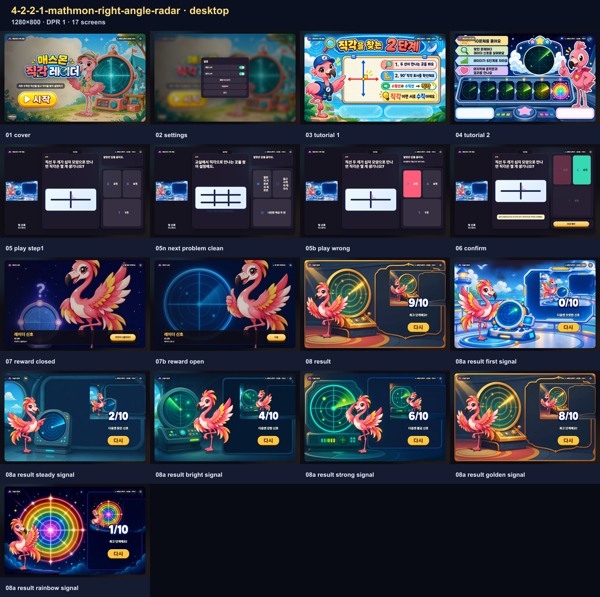
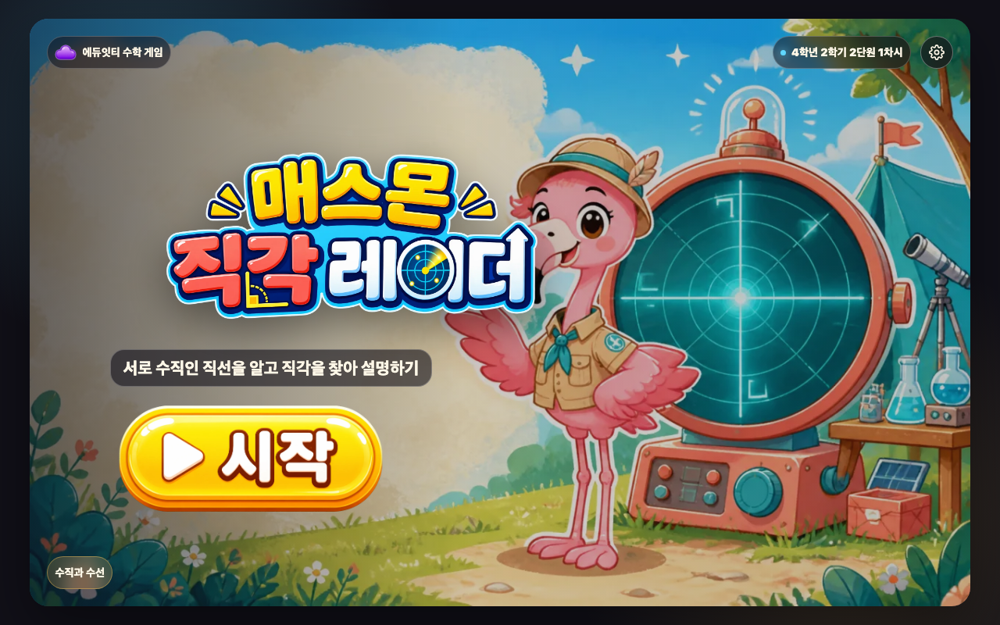
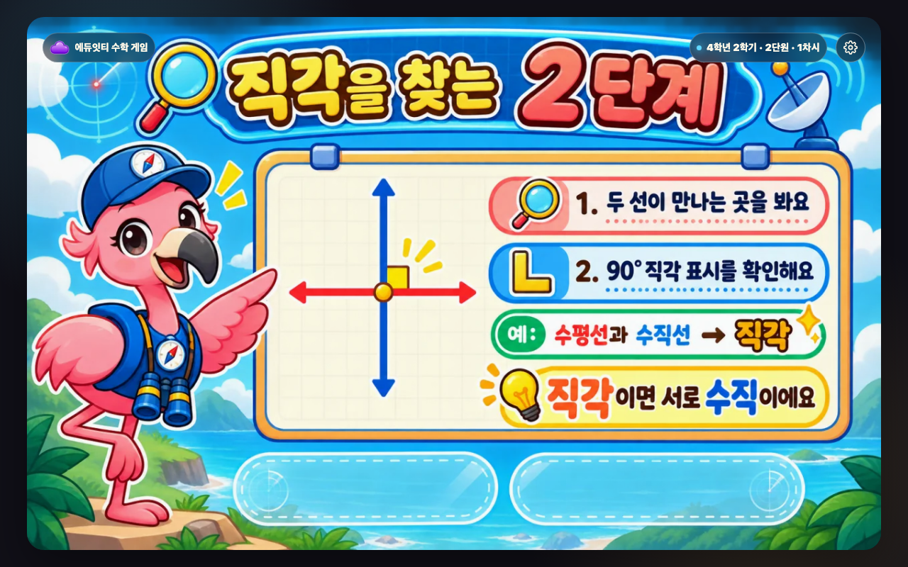
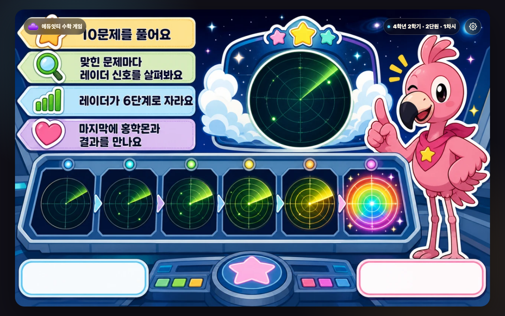
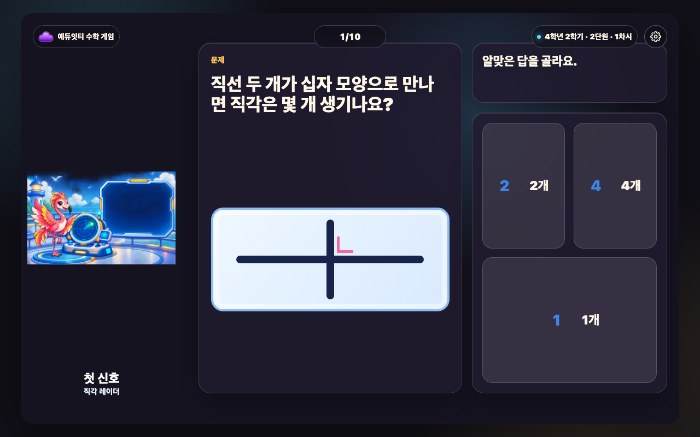
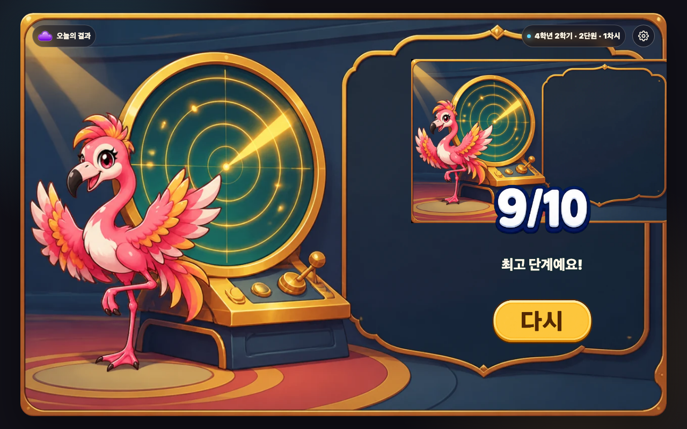
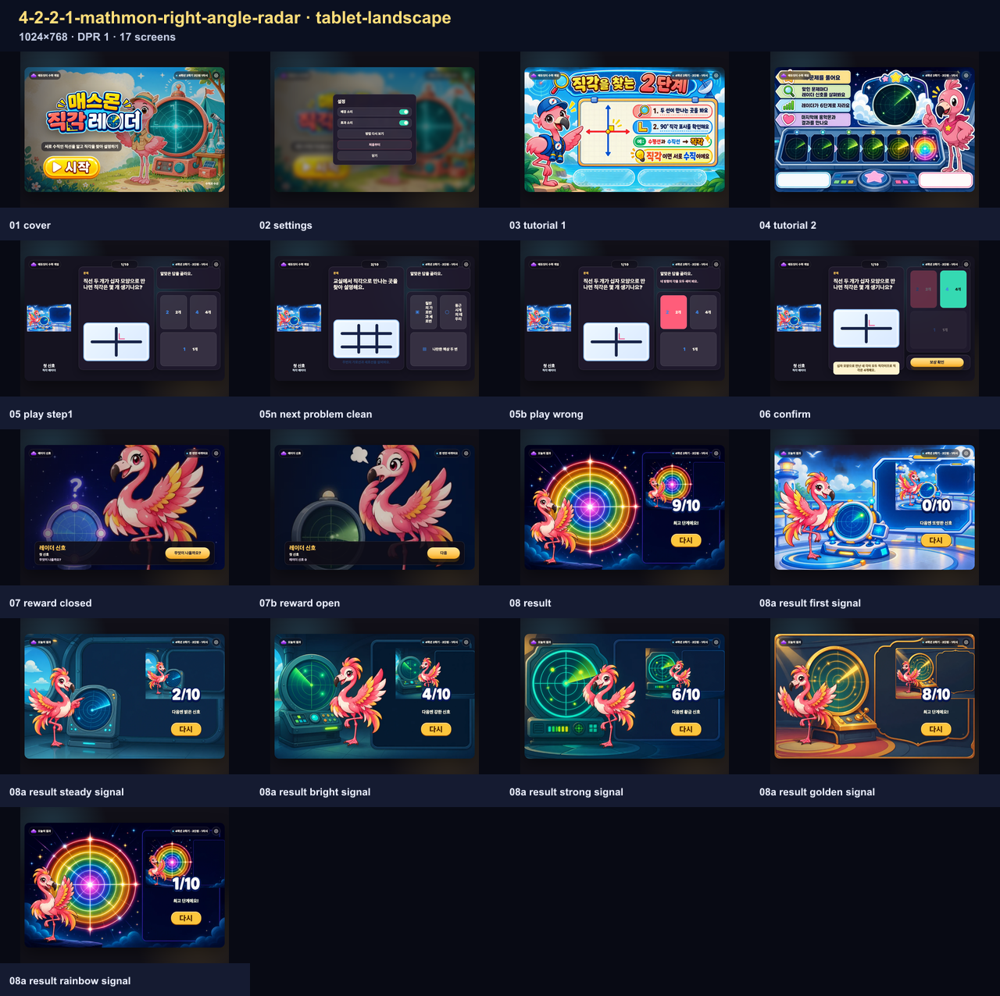
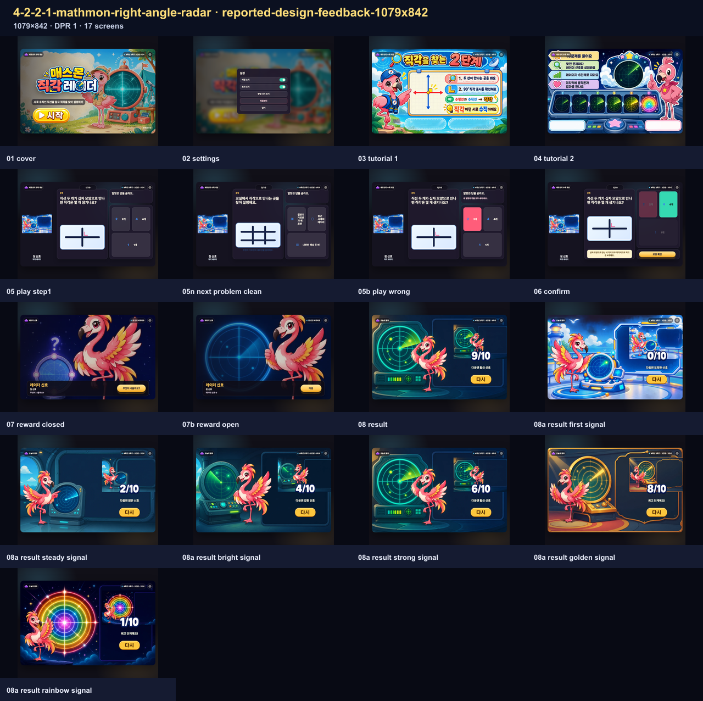

# 매스몬 직각 레이더 — 제작·검증 보고서

<!-- PUBLIC-EVIDENCE-RETENTION:ai-mart-github-evidence-selection-v1 -->
> 공개 보관본은 전체 브라우저 QA를 통과한 뒤 화면 크기별 접촉 시트와 데스크톱 핵심 장면만 남깁니다. 전체 상태의 해시와 검사 결과는 QA 영수증에 보존됩니다.

## 범위

- 차시: `4-2-2-1` · 4학년 2학기 2단원 1차시
- 목표: 서로 수직인 직선을 알고 직각을 찾아 설명하기
- 성취기준: `[4수03-03, 4수03-10]`
- 캐릭터: `mathmon-grade4-05-flamingo` · 홍학몬 · `mathmon-grade4-official-pack-v1`
- 실행: 10문항, 1280×800, 16:10, 오프라인, 순위 기능 없음

## 교과서 근거

비상교육 교사용 교과서 Unit 2(인쇄 30–51쪽) 중 인쇄 32쪽(PDF 62쪽)은 직각을 이루는 두 직선을 서로 수직이라고 정의하고, 인쇄 33쪽(PDF 63쪽)은 한 직선에 수직으로 만나는 선인 수선과 직각 확인을 다룹니다. 이 차시는 해당 개념을 직각 표시·90°·수선·생활 속 모서리 문항으로 구조화했습니다.

## 구현·자산

표지, 제목 아트, 튜토리얼 포스터 2장, 보상 7상태, 결과·진행 6상태는 실제 imagegen 결과에서 출발했습니다. 원본 PNG와 실행 WebP, generation ID, 출력 경로, 해시는 `assets/generation-lineage.json`에 남겼습니다. 생성 이미지는 맥락용이고 정답 판정은 HTML 문항 모델과 설명 데이터가 담당합니다.

보상은 `mathmon-unified-reward-v2`의 `stage-reveal`을 적용했으며, 오답은 50% 확률 제한 감점 또는 유지입니다. 결과는 첫 신호·또렷한 신호·밝은 신호·강한 신호·황금 신호·무지개 신호 6단계입니다.

## QA

- `node scripts/build-lesson.mjs 4-2-2-1-mathmon-right-angle-radar`: PASS
- `node scripts/check-lesson-contract.mjs 4-2-2-1-mathmon-right-angle-radar`: PASS
- `node scripts/qa-lesson-flow.mjs 4-2-2-1-mathmon-right-angle-radar`: PASS (3개 뷰포트, 51장 캡처)
- `node scripts/build-lesson-report-sheets.mjs 4-2-2-1-mathmon-right-angle-radar`: PASS

학생 문구는 Humanizer 기준으로 검토했고, ‘조각/공방’ 표현을 제거하여 ‘레이더 신호/직각/서로 수직’ 중심의 자연스러운 4학년 문장으로 정리했습니다.

컨택시트 경로: `result-states-contact-sheet.png`, `play-progress-states-contact-sheet.png`, `reward-states-contact-sheet.png`.

상단 조작은 `stage-top-controls-v2` 실제 측정 기준으로 확인했습니다(배지 글자 14px, 문제 번호 16px, 배지와 설정 버튼의 상·하단 및 중심 정렬 오차 허용 1px, 최소 간격 8px).

## 화면 크기

브라우저 QA는 데스크톱 1280×800, 태블릿 가로 1024×768, 보고된 피드백 조건 1079×842에서 실행했습니다.

<!-- REPORT-EVIDENCE-ALL:START -->

## 2026-08-31 최신 원본 스크린샷 전수

- 실행본 SHA-256: `a1aec187021cb2799c19aa01580fc7f349e398bd8e257f08e1a2cdd3a570cbfb`
- 생성 시각: `2026-08-31T05:51:48.093Z`
- 등록 회귀 이름: `3개`
- 실제 실행 화면 조건: `3개`
- 동일 조건 별칭 통합: `0개`
- 아래에 직접 삽입한 원본 캡처: `51장`
- 같은 width×height×DPR과 같은 fixture 조건은 한 번만 실행하고, 과거 오류 이름은 별칭으로 보존했습니다.
- manifest에 기록된 실제 실행 원본 캡처를 한 장씩 연결했습니다.

### desktop · 1280×800 · DPR 1 · 17장

- 같은 실행으로 보존한 회귀 이름: 없음
- 캡처 범위: `full-flow`

#### 시작 화면 · `engine-flow-desktop-01-cover.png`

- 학생이 보는 것: 직각 레이더 제목과 한 줄 목표, 시작 버튼을 봅니다.
- 판단하거나 누르는 것: 게임을 시작할 준비가 되면 시작을 누릅니다.
- 화면에서 확인되는 수학 관계: 수직과 수선을 배우는 차시임을 확인합니다.
- 다음 상태로 넘어가는 이유: 문제를 푸는 방법을 보는 설명 화면으로 이동합니다.

#### 설정 화면 · `engine-flow-desktop-02-settings.png`

- 학생이 보는 것: 배경 소리·효과 소리와 방법 다시 보기, 처음부터, 닫기를 봅니다.
- 판단하거나 누르는 것: 필요한 소리나 이동 행동 하나를 고릅니다.
- 화면에서 확인되는 수학 관계: 수학 문제는 바꾸지 않고 게임 조작만 설정합니다.
- 다음 상태로 넘어가는 이유: 설정을 마치면 열기 전 화면으로 돌아갑니다.

#### 설명 1 · 풀이 방법 · `engine-flow-desktop-03-tutorial-1.png`

- 학생이 보는 것: 수직과 수선 문제를 푸는 방법과 게임 흐름을 그림으로 봅니다.
- 판단하거나 누르는 것: 그림 속 순서와 누를 곳을 확인한 뒤 다음 행동 버튼을 누릅니다.
- 화면에서 확인되는 수학 관계: 수직과 수선에서 무엇을 비교하거나 계산하는지 확인합니다.
- 다음 상태로 넘어가는 이유: 다음 설명으로 이동합니다.

#### 설명 2 · 보상과 목표 · `engine-flow-desktop-04-tutorial-2.png`

- 학생이 보는 것: 수직과 수선 문제를 푸는 방법과 게임 흐름을 그림으로 봅니다.
- 판단하거나 누르는 것: 그림 속 순서와 누를 곳을 확인한 뒤 다음 행동 버튼을 누릅니다.
- 화면에서 확인되는 수학 관계: 수직과 수선에서 무엇을 비교하거나 계산하는지 확인합니다.
- 다음 상태로 넘어가는 이유: 첫 문제로 이동합니다.

#### 문제 상태 · 05-play-step1 · `engine-flow-desktop-05-play-step1.png`

- 학생이 보는 것: 현재 문제, 핵심 계산판이나 물건, 고를 수 있는 답을 봅니다.
- 판단하거나 누르는 것: 문제에서 묻는 값이나 관계에 맞는 답 하나를 고릅니다.
- 화면에서 확인되는 수학 관계: 수직과 수선을 이용해 선택지를 판단합니다.
- 다음 상태로 넘어가는 이유: 고른 답에 따라 오답 또는 정답 확인 상태로 이동합니다.

#### 문제 상태 · 05n-next-problem-clean · `engine-flow-desktop-05n-next-problem-clean.png`

- 학생이 보는 것: 현재 문제, 핵심 계산판이나 물건, 고를 수 있는 답을 봅니다.
- 판단하거나 누르는 것: 문제에서 묻는 값이나 관계에 맞는 답 하나를 고릅니다.
- 화면에서 확인되는 수학 관계: 수직과 수선을 이용해 선택지를 판단합니다.
- 다음 상태로 넘어가는 이유: 고른 답에 따라 오답 또는 정답 확인 상태로 이동합니다.

#### 오답 확인 · 05b-play-wrong · `engine-flow-desktop-05b-play-wrong.png`

- 학생이 보는 것: 고른 답이 계산판이나 물건에 들어간 모습과 짧은 오답 피드백을 봅니다.
- 판단하거나 누르는 것: 어디가 맞지 않는지 확인하고 같은 문제에서 다른 답을 고릅니다.
- 화면에서 확인되는 수학 관계: 수직과 수선의 관계와 고른 답이 왜 맞지 않는지 확인합니다.
- 다음 상태로 넘어가는 이유: 같은 문제에서 다시 판단할 수 있는 상태로 돌아갑니다.

#### 마지막 확인 · 06-confirm · `engine-flow-desktop-06-confirm.png`

- 학생이 보는 것: 마지막으로 완성된 계산이나 값과 보상으로 가는 행동 버튼을 봅니다.
- 판단하거나 누르는 것: 완성된 관계를 읽은 뒤 보상 확인 버튼을 누릅니다.
- 화면에서 확인되는 수학 관계: 수직과 수선의 완성값을 보상 화면 전에 다시 확인합니다.
- 다음 상태로 넘어가는 이유: 수학 관계를 확인한 뒤 보상 상태로 이동합니다.

#### 닫힌 보상 · `engine-flow-desktop-07-reward-closed.png`

- 학생이 보는 것: 결과가 아직 드러나지 않은 보상 그림과 열기 버튼을 봅니다.
- 판단하거나 누르는 것: 이번 레이더 단계 변화를 확인하기 위해 열기를 누릅니다.
- 화면에서 확인되는 수학 관계: 뒤 문제 화면에는 방금 완성한 계산이나 관계가 그대로 남습니다.
- 다음 상태로 넘어가는 이유: 학생이 직접 연 뒤에만 이번 보상 사건이 공개됩니다.

#### 열린 보상 · `engine-flow-desktop-07b-reward-open.png`

- 학생이 보는 것: 보상 사건 그림과 이번 레이더 단계 변화, 다음 행동 버튼을 봅니다.
- 판단하거나 누르는 것: 이번 변화를 확인하고 다음을 누릅니다.
- 화면에서 확인되는 수학 관계: 수학 정답과 무작위 보상 변화가 서로 분리되어 있음을 확인합니다.
- 다음 상태로 넘어가는 이유: 현재 진행 장면의 변화를 본 뒤 다음 문제나 결과로 이동합니다.

#### 실제 결과 · `engine-flow-desktop-08-result.png`

- 학생이 보는 것: 완성 장면과 결과 이름, 정답 수, 다음 목표, 다시 버튼을 봅니다.
- 판단하거나 누르는 것: 현재 결과와 다음 목표를 비교하고 다시 도전할지 결정합니다.
- 화면에서 확인되는 수학 관계: 한 판의 정답과 레이더 단계 변화가 하나의 결과 단계로 정리됩니다.
- 다음 상태로 넘어가는 이유: 다시를 누르면 새 문제 순서와 새 보상 흐름으로 시작합니다.

#### 결과 단계 · first-signal · `engine-flow-desktop-08a-result-first-signal.png`

- 학생이 보는 것: 완성 장면과 결과 이름, 정답 수, 다음 목표, 다시 버튼을 봅니다.
- 판단하거나 누르는 것: 현재 결과와 다음 목표를 비교하고 다시 도전할지 결정합니다.
- 화면에서 확인되는 수학 관계: 한 판의 정답과 레이더 단계 변화가 하나의 결과 단계로 정리됩니다.
- 다음 상태로 넘어가는 이유: 다시를 누르면 새 문제 순서와 새 보상 흐름으로 시작합니다.

#### 결과 단계 · steady-signal · `engine-flow-desktop-08a-result-steady-signal.png`

- 학생이 보는 것: 완성 장면과 결과 이름, 정답 수, 다음 목표, 다시 버튼을 봅니다.
- 판단하거나 누르는 것: 현재 결과와 다음 목표를 비교하고 다시 도전할지 결정합니다.
- 화면에서 확인되는 수학 관계: 한 판의 정답과 레이더 단계 변화가 하나의 결과 단계로 정리됩니다.
- 다음 상태로 넘어가는 이유: 다시를 누르면 새 문제 순서와 새 보상 흐름으로 시작합니다.

#### 결과 단계 · bright-signal · `engine-flow-desktop-08a-result-bright-signal.png`

- 학생이 보는 것: 완성 장면과 결과 이름, 정답 수, 다음 목표, 다시 버튼을 봅니다.
- 판단하거나 누르는 것: 현재 결과와 다음 목표를 비교하고 다시 도전할지 결정합니다.
- 화면에서 확인되는 수학 관계: 한 판의 정답과 레이더 단계 변화가 하나의 결과 단계로 정리됩니다.
- 다음 상태로 넘어가는 이유: 다시를 누르면 새 문제 순서와 새 보상 흐름으로 시작합니다.

#### 결과 단계 · strong-signal · `engine-flow-desktop-08a-result-strong-signal.png`

- 학생이 보는 것: 완성 장면과 결과 이름, 정답 수, 다음 목표, 다시 버튼을 봅니다.
- 판단하거나 누르는 것: 현재 결과와 다음 목표를 비교하고 다시 도전할지 결정합니다.
- 화면에서 확인되는 수학 관계: 한 판의 정답과 레이더 단계 변화가 하나의 결과 단계로 정리됩니다.
- 다음 상태로 넘어가는 이유: 다시를 누르면 새 문제 순서와 새 보상 흐름으로 시작합니다.

#### 결과 단계 · golden-signal · `engine-flow-desktop-08a-result-golden-signal.png`

- 학생이 보는 것: 완성 장면과 결과 이름, 정답 수, 다음 목표, 다시 버튼을 봅니다.
- 판단하거나 누르는 것: 현재 결과와 다음 목표를 비교하고 다시 도전할지 결정합니다.
- 화면에서 확인되는 수학 관계: 한 판의 정답과 레이더 단계 변화가 하나의 결과 단계로 정리됩니다.
- 다음 상태로 넘어가는 이유: 다시를 누르면 새 문제 순서와 새 보상 흐름으로 시작합니다.

#### 결과 단계 · rainbow-signal · `engine-flow-desktop-08a-result-rainbow-signal.png`

- 학생이 보는 것: 완성 장면과 결과 이름, 정답 수, 다음 목표, 다시 버튼을 봅니다.
- 판단하거나 누르는 것: 현재 결과와 다음 목표를 비교하고 다시 도전할지 결정합니다.
- 화면에서 확인되는 수학 관계: 한 판의 정답과 레이더 단계 변화가 하나의 결과 단계로 정리됩니다.
- 다음 상태로 넘어가는 이유: 다시를 누르면 새 문제 순서와 새 보상 흐름으로 시작합니다.

### tablet-landscape · 1024×768 · DPR 1 · 17장

- 같은 실행으로 보존한 회귀 이름: 없음
- 캡처 범위: `full-flow`

#### 시작 화면 · `engine-flow-tablet-landscape-01-cover.png`

- 학생이 보는 것: 직각 레이더 제목과 한 줄 목표, 시작 버튼을 봅니다.
- 판단하거나 누르는 것: 게임을 시작할 준비가 되면 시작을 누릅니다.
- 화면에서 확인되는 수학 관계: 수직과 수선을 배우는 차시임을 확인합니다.
- 다음 상태로 넘어가는 이유: 문제를 푸는 방법을 보는 설명 화면으로 이동합니다.

#### 설정 화면 · `engine-flow-tablet-landscape-02-settings.png`

- 학생이 보는 것: 배경 소리·효과 소리와 방법 다시 보기, 처음부터, 닫기를 봅니다.
- 판단하거나 누르는 것: 필요한 소리나 이동 행동 하나를 고릅니다.
- 화면에서 확인되는 수학 관계: 수학 문제는 바꾸지 않고 게임 조작만 설정합니다.
- 다음 상태로 넘어가는 이유: 설정을 마치면 열기 전 화면으로 돌아갑니다.

#### 설명 1 · 풀이 방법 · `engine-flow-tablet-landscape-03-tutorial-1.png`

- 학생이 보는 것: 수직과 수선 문제를 푸는 방법과 게임 흐름을 그림으로 봅니다.
- 판단하거나 누르는 것: 그림 속 순서와 누를 곳을 확인한 뒤 다음 행동 버튼을 누릅니다.
- 화면에서 확인되는 수학 관계: 수직과 수선에서 무엇을 비교하거나 계산하는지 확인합니다.
- 다음 상태로 넘어가는 이유: 다음 설명으로 이동합니다.

#### 설명 2 · 보상과 목표 · `engine-flow-tablet-landscape-04-tutorial-2.png`

- 학생이 보는 것: 수직과 수선 문제를 푸는 방법과 게임 흐름을 그림으로 봅니다.
- 판단하거나 누르는 것: 그림 속 순서와 누를 곳을 확인한 뒤 다음 행동 버튼을 누릅니다.
- 화면에서 확인되는 수학 관계: 수직과 수선에서 무엇을 비교하거나 계산하는지 확인합니다.
- 다음 상태로 넘어가는 이유: 첫 문제로 이동합니다.

#### 문제 상태 · 05-play-step1 · `engine-flow-tablet-landscape-05-play-step1.png`

- 학생이 보는 것: 현재 문제, 핵심 계산판이나 물건, 고를 수 있는 답을 봅니다.
- 판단하거나 누르는 것: 문제에서 묻는 값이나 관계에 맞는 답 하나를 고릅니다.
- 화면에서 확인되는 수학 관계: 수직과 수선을 이용해 선택지를 판단합니다.
- 다음 상태로 넘어가는 이유: 고른 답에 따라 오답 또는 정답 확인 상태로 이동합니다.

#### 문제 상태 · 05n-next-problem-clean · `engine-flow-tablet-landscape-05n-next-problem-clean.png`

- 학생이 보는 것: 현재 문제, 핵심 계산판이나 물건, 고를 수 있는 답을 봅니다.
- 판단하거나 누르는 것: 문제에서 묻는 값이나 관계에 맞는 답 하나를 고릅니다.
- 화면에서 확인되는 수학 관계: 수직과 수선을 이용해 선택지를 판단합니다.
- 다음 상태로 넘어가는 이유: 고른 답에 따라 오답 또는 정답 확인 상태로 이동합니다.

#### 오답 확인 · 05b-play-wrong · `engine-flow-tablet-landscape-05b-play-wrong.png`

- 학생이 보는 것: 고른 답이 계산판이나 물건에 들어간 모습과 짧은 오답 피드백을 봅니다.
- 판단하거나 누르는 것: 어디가 맞지 않는지 확인하고 같은 문제에서 다른 답을 고릅니다.
- 화면에서 확인되는 수학 관계: 수직과 수선의 관계와 고른 답이 왜 맞지 않는지 확인합니다.
- 다음 상태로 넘어가는 이유: 같은 문제에서 다시 판단할 수 있는 상태로 돌아갑니다.

#### 마지막 확인 · 06-confirm · `engine-flow-tablet-landscape-06-confirm.png`

- 학생이 보는 것: 마지막으로 완성된 계산이나 값과 보상으로 가는 행동 버튼을 봅니다.
- 판단하거나 누르는 것: 완성된 관계를 읽은 뒤 보상 확인 버튼을 누릅니다.
- 화면에서 확인되는 수학 관계: 수직과 수선의 완성값을 보상 화면 전에 다시 확인합니다.
- 다음 상태로 넘어가는 이유: 수학 관계를 확인한 뒤 보상 상태로 이동합니다.

#### 닫힌 보상 · `engine-flow-tablet-landscape-07-reward-closed.png`

- 학생이 보는 것: 결과가 아직 드러나지 않은 보상 그림과 열기 버튼을 봅니다.
- 판단하거나 누르는 것: 이번 레이더 단계 변화를 확인하기 위해 열기를 누릅니다.
- 화면에서 확인되는 수학 관계: 뒤 문제 화면에는 방금 완성한 계산이나 관계가 그대로 남습니다.
- 다음 상태로 넘어가는 이유: 학생이 직접 연 뒤에만 이번 보상 사건이 공개됩니다.

#### 열린 보상 · `engine-flow-tablet-landscape-07b-reward-open.png`

- 학생이 보는 것: 보상 사건 그림과 이번 레이더 단계 변화, 다음 행동 버튼을 봅니다.
- 판단하거나 누르는 것: 이번 변화를 확인하고 다음을 누릅니다.
- 화면에서 확인되는 수학 관계: 수학 정답과 무작위 보상 변화가 서로 분리되어 있음을 확인합니다.
- 다음 상태로 넘어가는 이유: 현재 진행 장면의 변화를 본 뒤 다음 문제나 결과로 이동합니다.

#### 실제 결과 · `engine-flow-tablet-landscape-08-result.png`

- 학생이 보는 것: 완성 장면과 결과 이름, 정답 수, 다음 목표, 다시 버튼을 봅니다.
- 판단하거나 누르는 것: 현재 결과와 다음 목표를 비교하고 다시 도전할지 결정합니다.
- 화면에서 확인되는 수학 관계: 한 판의 정답과 레이더 단계 변화가 하나의 결과 단계로 정리됩니다.
- 다음 상태로 넘어가는 이유: 다시를 누르면 새 문제 순서와 새 보상 흐름으로 시작합니다.

#### 결과 단계 · first-signal · `engine-flow-tablet-landscape-08a-result-first-signal.png`

- 학생이 보는 것: 완성 장면과 결과 이름, 정답 수, 다음 목표, 다시 버튼을 봅니다.
- 판단하거나 누르는 것: 현재 결과와 다음 목표를 비교하고 다시 도전할지 결정합니다.
- 화면에서 확인되는 수학 관계: 한 판의 정답과 레이더 단계 변화가 하나의 결과 단계로 정리됩니다.
- 다음 상태로 넘어가는 이유: 다시를 누르면 새 문제 순서와 새 보상 흐름으로 시작합니다.

#### 결과 단계 · steady-signal · `engine-flow-tablet-landscape-08a-result-steady-signal.png`

- 학생이 보는 것: 완성 장면과 결과 이름, 정답 수, 다음 목표, 다시 버튼을 봅니다.
- 판단하거나 누르는 것: 현재 결과와 다음 목표를 비교하고 다시 도전할지 결정합니다.
- 화면에서 확인되는 수학 관계: 한 판의 정답과 레이더 단계 변화가 하나의 결과 단계로 정리됩니다.
- 다음 상태로 넘어가는 이유: 다시를 누르면 새 문제 순서와 새 보상 흐름으로 시작합니다.

#### 결과 단계 · bright-signal · `engine-flow-tablet-landscape-08a-result-bright-signal.png`

- 학생이 보는 것: 완성 장면과 결과 이름, 정답 수, 다음 목표, 다시 버튼을 봅니다.
- 판단하거나 누르는 것: 현재 결과와 다음 목표를 비교하고 다시 도전할지 결정합니다.
- 화면에서 확인되는 수학 관계: 한 판의 정답과 레이더 단계 변화가 하나의 결과 단계로 정리됩니다.
- 다음 상태로 넘어가는 이유: 다시를 누르면 새 문제 순서와 새 보상 흐름으로 시작합니다.

#### 결과 단계 · strong-signal · `engine-flow-tablet-landscape-08a-result-strong-signal.png`

- 학생이 보는 것: 완성 장면과 결과 이름, 정답 수, 다음 목표, 다시 버튼을 봅니다.
- 판단하거나 누르는 것: 현재 결과와 다음 목표를 비교하고 다시 도전할지 결정합니다.
- 화면에서 확인되는 수학 관계: 한 판의 정답과 레이더 단계 변화가 하나의 결과 단계로 정리됩니다.
- 다음 상태로 넘어가는 이유: 다시를 누르면 새 문제 순서와 새 보상 흐름으로 시작합니다.

#### 결과 단계 · golden-signal · `engine-flow-tablet-landscape-08a-result-golden-signal.png`

- 학생이 보는 것: 완성 장면과 결과 이름, 정답 수, 다음 목표, 다시 버튼을 봅니다.
- 판단하거나 누르는 것: 현재 결과와 다음 목표를 비교하고 다시 도전할지 결정합니다.
- 화면에서 확인되는 수학 관계: 한 판의 정답과 레이더 단계 변화가 하나의 결과 단계로 정리됩니다.
- 다음 상태로 넘어가는 이유: 다시를 누르면 새 문제 순서와 새 보상 흐름으로 시작합니다.

#### 결과 단계 · rainbow-signal · `engine-flow-tablet-landscape-08a-result-rainbow-signal.png`

- 학생이 보는 것: 완성 장면과 결과 이름, 정답 수, 다음 목표, 다시 버튼을 봅니다.
- 판단하거나 누르는 것: 현재 결과와 다음 목표를 비교하고 다시 도전할지 결정합니다.
- 화면에서 확인되는 수학 관계: 한 판의 정답과 레이더 단계 변화가 하나의 결과 단계로 정리됩니다.
- 다음 상태로 넘어가는 이유: 다시를 누르면 새 문제 순서와 새 보상 흐름으로 시작합니다.

### reported-design-feedback-1079x842 · 1079×842 · DPR 1 · 17장

- 같은 실행으로 보존한 회귀 이름: 없음
- 캡처 범위: `full-flow`

#### 시작 화면 · `engine-flow-reported-design-feedback-1079x842-01-cover.png`

- 학생이 보는 것: 직각 레이더 제목과 한 줄 목표, 시작 버튼을 봅니다.
- 판단하거나 누르는 것: 게임을 시작할 준비가 되면 시작을 누릅니다.
- 화면에서 확인되는 수학 관계: 수직과 수선을 배우는 차시임을 확인합니다.
- 다음 상태로 넘어가는 이유: 문제를 푸는 방법을 보는 설명 화면으로 이동합니다.

#### 설정 화면 · `engine-flow-reported-design-feedback-1079x842-02-settings.png`

- 학생이 보는 것: 배경 소리·효과 소리와 방법 다시 보기, 처음부터, 닫기를 봅니다.
- 판단하거나 누르는 것: 필요한 소리나 이동 행동 하나를 고릅니다.
- 화면에서 확인되는 수학 관계: 수학 문제는 바꾸지 않고 게임 조작만 설정합니다.
- 다음 상태로 넘어가는 이유: 설정을 마치면 열기 전 화면으로 돌아갑니다.

#### 설명 1 · 풀이 방법 · `engine-flow-reported-design-feedback-1079x842-03-tutorial-1.png`

- 학생이 보는 것: 수직과 수선 문제를 푸는 방법과 게임 흐름을 그림으로 봅니다.
- 판단하거나 누르는 것: 그림 속 순서와 누를 곳을 확인한 뒤 다음 행동 버튼을 누릅니다.
- 화면에서 확인되는 수학 관계: 수직과 수선에서 무엇을 비교하거나 계산하는지 확인합니다.
- 다음 상태로 넘어가는 이유: 다음 설명으로 이동합니다.

#### 설명 2 · 보상과 목표 · `engine-flow-reported-design-feedback-1079x842-04-tutorial-2.png`

- 학생이 보는 것: 수직과 수선 문제를 푸는 방법과 게임 흐름을 그림으로 봅니다.
- 판단하거나 누르는 것: 그림 속 순서와 누를 곳을 확인한 뒤 다음 행동 버튼을 누릅니다.
- 화면에서 확인되는 수학 관계: 수직과 수선에서 무엇을 비교하거나 계산하는지 확인합니다.
- 다음 상태로 넘어가는 이유: 첫 문제로 이동합니다.

#### 문제 상태 · 05-play-step1 · `engine-flow-reported-design-feedback-1079x842-05-play-step1.png`

- 학생이 보는 것: 현재 문제, 핵심 계산판이나 물건, 고를 수 있는 답을 봅니다.
- 판단하거나 누르는 것: 문제에서 묻는 값이나 관계에 맞는 답 하나를 고릅니다.
- 화면에서 확인되는 수학 관계: 수직과 수선을 이용해 선택지를 판단합니다.
- 다음 상태로 넘어가는 이유: 고른 답에 따라 오답 또는 정답 확인 상태로 이동합니다.

#### 문제 상태 · 05n-next-problem-clean · `engine-flow-reported-design-feedback-1079x842-05n-next-problem-clean.png`

- 학생이 보는 것: 현재 문제, 핵심 계산판이나 물건, 고를 수 있는 답을 봅니다.
- 판단하거나 누르는 것: 문제에서 묻는 값이나 관계에 맞는 답 하나를 고릅니다.
- 화면에서 확인되는 수학 관계: 수직과 수선을 이용해 선택지를 판단합니다.
- 다음 상태로 넘어가는 이유: 고른 답에 따라 오답 또는 정답 확인 상태로 이동합니다.

#### 오답 확인 · 05b-play-wrong · `engine-flow-reported-design-feedback-1079x842-05b-play-wrong.png`

- 학생이 보는 것: 고른 답이 계산판이나 물건에 들어간 모습과 짧은 오답 피드백을 봅니다.
- 판단하거나 누르는 것: 어디가 맞지 않는지 확인하고 같은 문제에서 다른 답을 고릅니다.
- 화면에서 확인되는 수학 관계: 수직과 수선의 관계와 고른 답이 왜 맞지 않는지 확인합니다.
- 다음 상태로 넘어가는 이유: 같은 문제에서 다시 판단할 수 있는 상태로 돌아갑니다.

#### 마지막 확인 · 06-confirm · `engine-flow-reported-design-feedback-1079x842-06-confirm.png`

- 학생이 보는 것: 마지막으로 완성된 계산이나 값과 보상으로 가는 행동 버튼을 봅니다.
- 판단하거나 누르는 것: 완성된 관계를 읽은 뒤 보상 확인 버튼을 누릅니다.
- 화면에서 확인되는 수학 관계: 수직과 수선의 완성값을 보상 화면 전에 다시 확인합니다.
- 다음 상태로 넘어가는 이유: 수학 관계를 확인한 뒤 보상 상태로 이동합니다.

#### 닫힌 보상 · `engine-flow-reported-design-feedback-1079x842-07-reward-closed.png`

- 학생이 보는 것: 결과가 아직 드러나지 않은 보상 그림과 열기 버튼을 봅니다.
- 판단하거나 누르는 것: 이번 레이더 단계 변화를 확인하기 위해 열기를 누릅니다.
- 화면에서 확인되는 수학 관계: 뒤 문제 화면에는 방금 완성한 계산이나 관계가 그대로 남습니다.
- 다음 상태로 넘어가는 이유: 학생이 직접 연 뒤에만 이번 보상 사건이 공개됩니다.

#### 열린 보상 · `engine-flow-reported-design-feedback-1079x842-07b-reward-open.png`

- 학생이 보는 것: 보상 사건 그림과 이번 레이더 단계 변화, 다음 행동 버튼을 봅니다.
- 판단하거나 누르는 것: 이번 변화를 확인하고 다음을 누릅니다.
- 화면에서 확인되는 수학 관계: 수학 정답과 무작위 보상 변화가 서로 분리되어 있음을 확인합니다.
- 다음 상태로 넘어가는 이유: 현재 진행 장면의 변화를 본 뒤 다음 문제나 결과로 이동합니다.

#### 실제 결과 · `engine-flow-reported-design-feedback-1079x842-08-result.png`

- 학생이 보는 것: 완성 장면과 결과 이름, 정답 수, 다음 목표, 다시 버튼을 봅니다.
- 판단하거나 누르는 것: 현재 결과와 다음 목표를 비교하고 다시 도전할지 결정합니다.
- 화면에서 확인되는 수학 관계: 한 판의 정답과 레이더 단계 변화가 하나의 결과 단계로 정리됩니다.
- 다음 상태로 넘어가는 이유: 다시를 누르면 새 문제 순서와 새 보상 흐름으로 시작합니다.

#### 결과 단계 · first-signal · `engine-flow-reported-design-feedback-1079x842-08a-result-first-signal.png`

- 학생이 보는 것: 완성 장면과 결과 이름, 정답 수, 다음 목표, 다시 버튼을 봅니다.
- 판단하거나 누르는 것: 현재 결과와 다음 목표를 비교하고 다시 도전할지 결정합니다.
- 화면에서 확인되는 수학 관계: 한 판의 정답과 레이더 단계 변화가 하나의 결과 단계로 정리됩니다.
- 다음 상태로 넘어가는 이유: 다시를 누르면 새 문제 순서와 새 보상 흐름으로 시작합니다.

#### 결과 단계 · steady-signal · `engine-flow-reported-design-feedback-1079x842-08a-result-steady-signal.png`

- 학생이 보는 것: 완성 장면과 결과 이름, 정답 수, 다음 목표, 다시 버튼을 봅니다.
- 판단하거나 누르는 것: 현재 결과와 다음 목표를 비교하고 다시 도전할지 결정합니다.
- 화면에서 확인되는 수학 관계: 한 판의 정답과 레이더 단계 변화가 하나의 결과 단계로 정리됩니다.
- 다음 상태로 넘어가는 이유: 다시를 누르면 새 문제 순서와 새 보상 흐름으로 시작합니다.

#### 결과 단계 · bright-signal · `engine-flow-reported-design-feedback-1079x842-08a-result-bright-signal.png`

- 학생이 보는 것: 완성 장면과 결과 이름, 정답 수, 다음 목표, 다시 버튼을 봅니다.
- 판단하거나 누르는 것: 현재 결과와 다음 목표를 비교하고 다시 도전할지 결정합니다.
- 화면에서 확인되는 수학 관계: 한 판의 정답과 레이더 단계 변화가 하나의 결과 단계로 정리됩니다.
- 다음 상태로 넘어가는 이유: 다시를 누르면 새 문제 순서와 새 보상 흐름으로 시작합니다.

#### 결과 단계 · strong-signal · `engine-flow-reported-design-feedback-1079x842-08a-result-strong-signal.png`

- 학생이 보는 것: 완성 장면과 결과 이름, 정답 수, 다음 목표, 다시 버튼을 봅니다.
- 판단하거나 누르는 것: 현재 결과와 다음 목표를 비교하고 다시 도전할지 결정합니다.
- 화면에서 확인되는 수학 관계: 한 판의 정답과 레이더 단계 변화가 하나의 결과 단계로 정리됩니다.
- 다음 상태로 넘어가는 이유: 다시를 누르면 새 문제 순서와 새 보상 흐름으로 시작합니다.

#### 결과 단계 · golden-signal · `engine-flow-reported-design-feedback-1079x842-08a-result-golden-signal.png`

- 학생이 보는 것: 완성 장면과 결과 이름, 정답 수, 다음 목표, 다시 버튼을 봅니다.
- 판단하거나 누르는 것: 현재 결과와 다음 목표를 비교하고 다시 도전할지 결정합니다.
- 화면에서 확인되는 수학 관계: 한 판의 정답과 레이더 단계 변화가 하나의 결과 단계로 정리됩니다.
- 다음 상태로 넘어가는 이유: 다시를 누르면 새 문제 순서와 새 보상 흐름으로 시작합니다.

#### 결과 단계 · rainbow-signal · `engine-flow-reported-design-feedback-1079x842-08a-result-rainbow-signal.png`

- 학생이 보는 것: 완성 장면과 결과 이름, 정답 수, 다음 목표, 다시 버튼을 봅니다.
- 판단하거나 누르는 것: 현재 결과와 다음 목표를 비교하고 다시 도전할지 결정합니다.
- 화면에서 확인되는 수학 관계: 한 판의 정답과 레이더 단계 변화가 하나의 결과 단계로 정리됩니다.
- 다음 상태로 넘어가는 이유: 다시를 누르면 새 문제 순서와 새 보상 흐름으로 시작합니다.

<!-- REPORT-EVIDENCE-ALL:END -->

## 남은 게이트

strict generated-runtime provider registry의 독립 감사 승인이 아직 없어 strict 최종 승인은 차단됩니다. 이를 우회하거나 로컬 정책·하네스를 수정하지 않았고, 현재 보고는 정직한 non-strict lineage만 나타냅니다.
