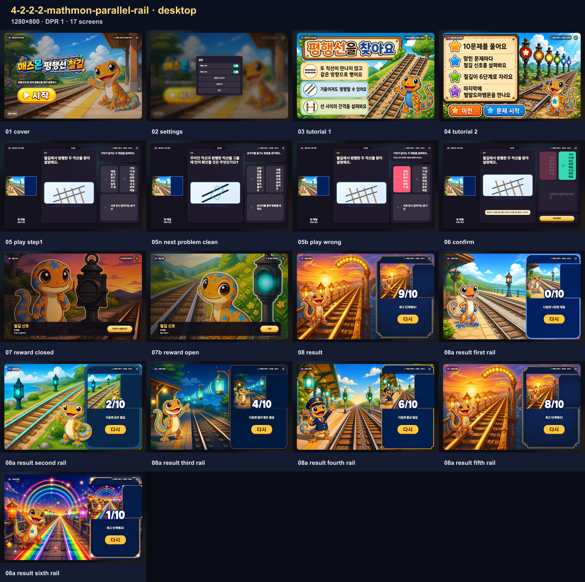
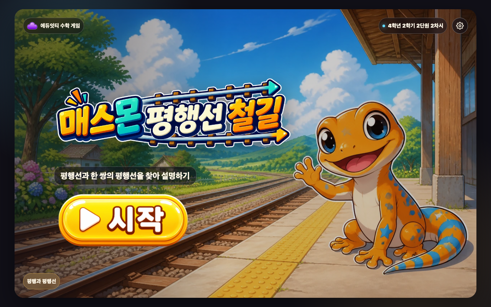
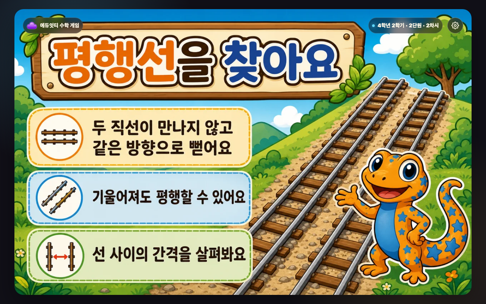
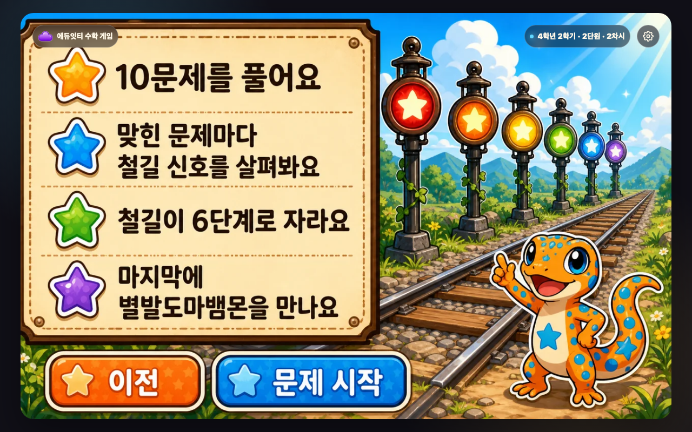
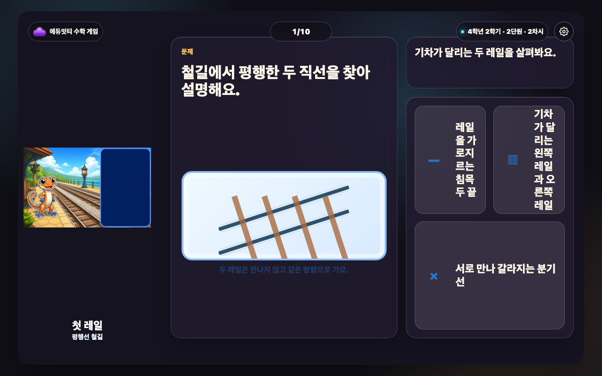
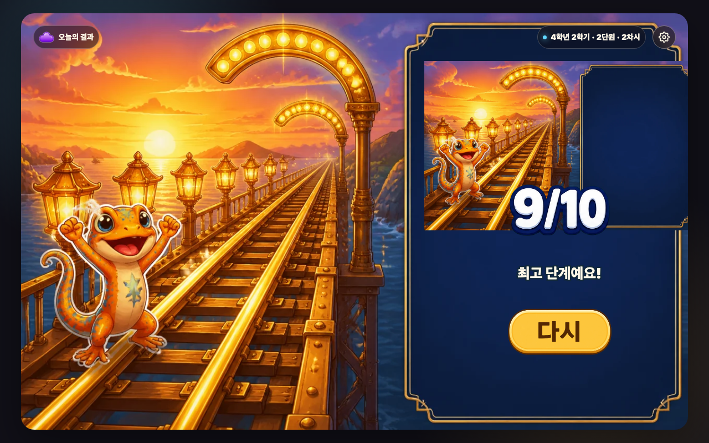
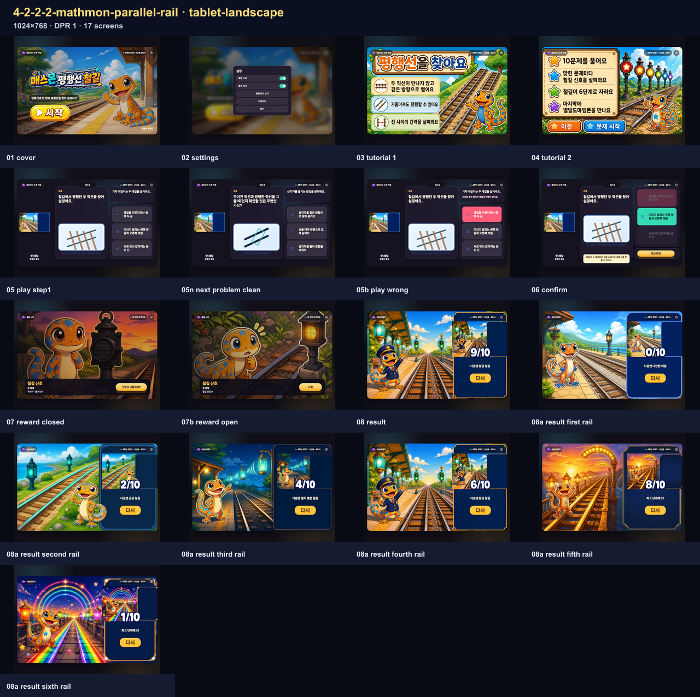
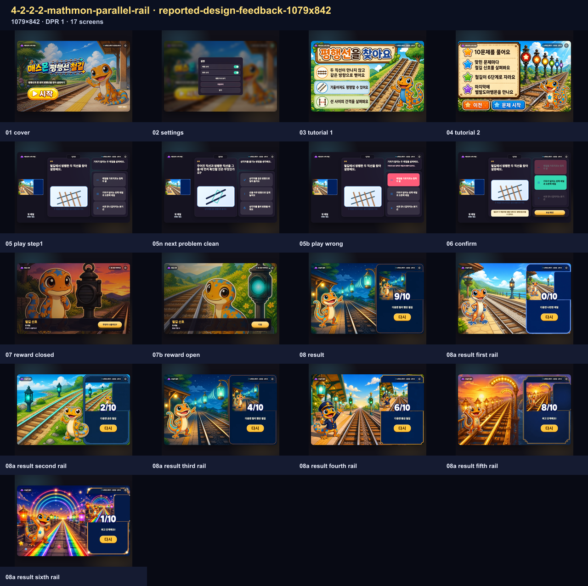

# 매스몬 평행선 철길 제작 보고서

<!-- PUBLIC-EVIDENCE-RETENTION:ai-mart-github-evidence-selection-v1 -->
> 공개 보관본은 전체 브라우저 QA를 통과한 뒤 화면 크기별 접촉 시트와 데스크톱 핵심 장면만 남깁니다. 전체 상태의 해시와 검사 결과는 QA 영수증에 보존됩니다.

## 범위

U2-2 `4-2-2-2-mathmon-parallel-rail`만 제작했다. 학생 목표는 `평행선과 한 쌍의 평행선을 찾아 설명하기`, 성취기준은 `[4수03-03]`이며 승인 캐릭터는 `mathmon-grade4-06-gecko` / 별발도마뱀몬, 팩은 `mathmon-grade4-official-pack-v1`이다.

## 교과서 근거

비상교육 4-2 교사용 교과서 PDF 66쪽(인쇄 34쪽)의 평행·평행선 정의와 서로 만나지 않는 두 직선 찾기, PDF 67쪽(인쇄 35쪽)의 평행선 긋기와 생활 속 평행선 활동을 반영했다.

## 실제 생성 자산

실제 생성 raster는 17종(표지 1, 제목 1, 튜토리얼 포스터 2, 보상 상태 7, 결과 장면 6)이다. 별도 플레이 자산은 만들지 않고 결과 장면 6종을 진행 슬롯에 재사용한다. 표지는 제목·목표·시작 버튼이 굽히지 않은 새 장면으로 교체했고, 처음 생성된 굽힌 표지는 runtime에서 제외한 사실을 lineage에 남겼다. 원본 imagegen 출력은 `_lessons/4-2-2-2-mathmon-parallel-rail/assets/*-source.png`와 provider 출력 경로에 보존하고, runtime WebP는 변환본이다. 상세 ID·경로·prompt SHA-256·source/runtime SHA-256·관찰 시각은 `assets/generation-lineage.json`에 기록했다.

시각 검토용 컨택시트: `result-states-contact-sheet.png`, `reward-states-contact-sheet.png`.

## 검증 기록

빌드·계약·시각 계약·Stage 비율·Humanizer·3개 viewport 전체 흐름 QA·증거 동기화·legacy verifier를 모두 완료했다.

- `node scripts/build-lesson.mjs 4-2-2-2-mathmon-parallel-rail`: PASS
- `node scripts/check-lesson-contract.mjs 4-2-2-2-mathmon-parallel-rail`: PASS
- `node scripts/check-lesson-visual-contract.mjs 4-2-2-2-mathmon-parallel-rail`: PASS
- `node scripts/check-stage-ratio.mjs --lesson=4-2-2-2-mathmon-parallel-rail`: PASS
- `node scripts/qa-lesson-flow.mjs 4-2-2-2-mathmon-parallel-rail`: PASS (3개 뷰포트, 51장 캡처)
- `node scripts/build-lesson-report-sheets.mjs 4-2-2-2-mathmon-parallel-rail`: PASS
- `node scripts/sync-lesson-report-evidence.mjs 4-2-2-2-mathmon-parallel-rail`: PASS
- `node scripts/check-lesson-report-evidence.mjs 4-2-2-2-mathmon-parallel-rail --require-current-gates`: PASS
- `node scripts/verify-mathmon-delivery.mjs --lesson=4-2-2-2-mathmon-parallel-rail`: PASS (legacy gate)

학생 문구는 Humanizer 기준으로 검토했다. ‘평행 여부는 … 만나지 않는지와 방향이 같은지’처럼 정의를 짧게 나누고, 4학년이 읽기 어려운 추상어·번역투·과한 연결어는 사용하지 않았다. 자연도 등급 A, 의미 보존 6항 모두 통과로 기록한다.

상단 조작은 `stage-top-controls-v2` 실제 측정 기준으로 확인한다(배지 글자 14px, 문제 번호 16px, 배지와 설정 버튼의 상·하단 및 중심 정렬 오차 허용 1px, 최소 간격 8px).

## 화면 크기

브라우저 QA는 데스크톱 1280×800, 태블릿 가로 1024×768, 보고된 피드백 조건 1079×842에서 실행했다. 각 조건의 현재 캡처와 화면별 설명은 아래 증거 묶음에 연결했다.

## strict 상태

독립 audited generated-runtime provider promotion이 없어 strict 최종 승인은 fail-closed다. 이를 우회하거나 strict PASS로 표시하지 않고 honest non-strict lineage로 유지한다.

<!-- REPORT-EVIDENCE-ALL:START -->

## 2026-08-31 최신 원본 스크린샷 전수

- 실행본 SHA-256: `5ede7e8c80c199f8b6d1caecf704cf6c18a3de12f14b4dc6b07f960abf6090ba`
- 생성 시각: `2026-08-31T05:52:07.939Z`
- 등록 회귀 이름: `3개`
- 실제 실행 화면 조건: `3개`
- 동일 조건 별칭 통합: `0개`
- 아래에 직접 삽입한 원본 캡처: `51장`
- 같은 width×height×DPR과 같은 fixture 조건은 한 번만 실행하고, 과거 오류 이름은 별칭으로 보존했습니다.
- manifest에 기록된 실제 실행 원본 캡처를 한 장씩 연결했습니다.

### desktop · 1280×800 · DPR 1 · 17장

- 같은 실행으로 보존한 회귀 이름: 없음
- 캡처 범위: `full-flow`

#### 시작 화면 · `engine-flow-desktop-01-cover.png`

- 학생이 보는 것: 평행선 철길 제목과 한 줄 목표, 시작 버튼을 봅니다.
- 판단하거나 누르는 것: 게임을 시작할 준비가 되면 시작을 누릅니다.
- 화면에서 확인되는 수학 관계: 평행과 평행선을 배우는 차시임을 확인합니다.
- 다음 상태로 넘어가는 이유: 문제를 푸는 방법을 보는 설명 화면으로 이동합니다.

#### 설정 화면 · `engine-flow-desktop-02-settings.png`

- 학생이 보는 것: 배경 소리·효과 소리와 방법 다시 보기, 처음부터, 닫기를 봅니다.
- 판단하거나 누르는 것: 필요한 소리나 이동 행동 하나를 고릅니다.
- 화면에서 확인되는 수학 관계: 수학 문제는 바꾸지 않고 게임 조작만 설정합니다.
- 다음 상태로 넘어가는 이유: 설정을 마치면 열기 전 화면으로 돌아갑니다.

#### 설명 1 · 풀이 방법 · `engine-flow-desktop-03-tutorial-1.png`

- 학생이 보는 것: 평행과 평행선 문제를 푸는 방법과 게임 흐름을 그림으로 봅니다.
- 판단하거나 누르는 것: 그림 속 순서와 누를 곳을 확인한 뒤 다음 행동 버튼을 누릅니다.
- 화면에서 확인되는 수학 관계: 평행과 평행선에서 무엇을 비교하거나 계산하는지 확인합니다.
- 다음 상태로 넘어가는 이유: 다음 설명으로 이동합니다.

#### 설명 2 · 보상과 목표 · `engine-flow-desktop-04-tutorial-2.png`

- 학생이 보는 것: 평행과 평행선 문제를 푸는 방법과 게임 흐름을 그림으로 봅니다.
- 판단하거나 누르는 것: 그림 속 순서와 누를 곳을 확인한 뒤 다음 행동 버튼을 누릅니다.
- 화면에서 확인되는 수학 관계: 평행과 평행선에서 무엇을 비교하거나 계산하는지 확인합니다.
- 다음 상태로 넘어가는 이유: 첫 문제로 이동합니다.

#### 문제 상태 · 05-play-step1 · `engine-flow-desktop-05-play-step1.png`

- 학생이 보는 것: 현재 문제, 핵심 계산판이나 물건, 고를 수 있는 답을 봅니다.
- 판단하거나 누르는 것: 문제에서 묻는 값이나 관계에 맞는 답 하나를 고릅니다.
- 화면에서 확인되는 수학 관계: 평행과 평행선을 이용해 선택지를 판단합니다.
- 다음 상태로 넘어가는 이유: 고른 답에 따라 오답 또는 정답 확인 상태로 이동합니다.

#### 문제 상태 · 05n-next-problem-clean · `engine-flow-desktop-05n-next-problem-clean.png`

- 학생이 보는 것: 현재 문제, 핵심 계산판이나 물건, 고를 수 있는 답을 봅니다.
- 판단하거나 누르는 것: 문제에서 묻는 값이나 관계에 맞는 답 하나를 고릅니다.
- 화면에서 확인되는 수학 관계: 평행과 평행선을 이용해 선택지를 판단합니다.
- 다음 상태로 넘어가는 이유: 고른 답에 따라 오답 또는 정답 확인 상태로 이동합니다.

#### 오답 확인 · 05b-play-wrong · `engine-flow-desktop-05b-play-wrong.png`

- 학생이 보는 것: 고른 답이 계산판이나 물건에 들어간 모습과 짧은 오답 피드백을 봅니다.
- 판단하거나 누르는 것: 어디가 맞지 않는지 확인하고 같은 문제에서 다른 답을 고릅니다.
- 화면에서 확인되는 수학 관계: 평행과 평행선의 관계와 고른 답이 왜 맞지 않는지 확인합니다.
- 다음 상태로 넘어가는 이유: 같은 문제에서 다시 판단할 수 있는 상태로 돌아갑니다.

#### 마지막 확인 · 06-confirm · `engine-flow-desktop-06-confirm.png`

- 학생이 보는 것: 마지막으로 완성된 계산이나 값과 보상으로 가는 행동 버튼을 봅니다.
- 판단하거나 누르는 것: 완성된 관계를 읽은 뒤 보상 확인 버튼을 누릅니다.
- 화면에서 확인되는 수학 관계: 평행과 평행선의 완성값을 보상 화면 전에 다시 확인합니다.
- 다음 상태로 넘어가는 이유: 수학 관계를 확인한 뒤 보상 상태로 이동합니다.

#### 닫힌 보상 · `engine-flow-desktop-07-reward-closed.png`

- 학생이 보는 것: 결과가 아직 드러나지 않은 보상 그림과 열기 버튼을 봅니다.
- 판단하거나 누르는 것: 이번 철길 단계 변화를 확인하기 위해 열기를 누릅니다.
- 화면에서 확인되는 수학 관계: 뒤 문제 화면에는 방금 완성한 계산이나 관계가 그대로 남습니다.
- 다음 상태로 넘어가는 이유: 학생이 직접 연 뒤에만 이번 보상 사건이 공개됩니다.

#### 열린 보상 · `engine-flow-desktop-07b-reward-open.png`

- 학생이 보는 것: 보상 사건 그림과 이번 철길 단계 변화, 다음 행동 버튼을 봅니다.
- 판단하거나 누르는 것: 이번 변화를 확인하고 다음을 누릅니다.
- 화면에서 확인되는 수학 관계: 수학 정답과 무작위 보상 변화가 서로 분리되어 있음을 확인합니다.
- 다음 상태로 넘어가는 이유: 현재 진행 장면의 변화를 본 뒤 다음 문제나 결과로 이동합니다.

#### 실제 결과 · `engine-flow-desktop-08-result.png`

- 학생이 보는 것: 완성 장면과 결과 이름, 정답 수, 다음 목표, 다시 버튼을 봅니다.
- 판단하거나 누르는 것: 현재 결과와 다음 목표를 비교하고 다시 도전할지 결정합니다.
- 화면에서 확인되는 수학 관계: 한 판의 정답과 철길 단계 변화가 하나의 결과 단계로 정리됩니다.
- 다음 상태로 넘어가는 이유: 다시를 누르면 새 문제 순서와 새 보상 흐름으로 시작합니다.

#### 결과 단계 · first-rail · `engine-flow-desktop-08a-result-first-rail.png`

- 학생이 보는 것: 완성 장면과 결과 이름, 정답 수, 다음 목표, 다시 버튼을 봅니다.
- 판단하거나 누르는 것: 현재 결과와 다음 목표를 비교하고 다시 도전할지 결정합니다.
- 화면에서 확인되는 수학 관계: 한 판의 정답과 철길 단계 변화가 하나의 결과 단계로 정리됩니다.
- 다음 상태로 넘어가는 이유: 다시를 누르면 새 문제 순서와 새 보상 흐름으로 시작합니다.

#### 결과 단계 · second-rail · `engine-flow-desktop-08a-result-second-rail.png`

- 학생이 보는 것: 완성 장면과 결과 이름, 정답 수, 다음 목표, 다시 버튼을 봅니다.
- 판단하거나 누르는 것: 현재 결과와 다음 목표를 비교하고 다시 도전할지 결정합니다.
- 화면에서 확인되는 수학 관계: 한 판의 정답과 철길 단계 변화가 하나의 결과 단계로 정리됩니다.
- 다음 상태로 넘어가는 이유: 다시를 누르면 새 문제 순서와 새 보상 흐름으로 시작합니다.

#### 결과 단계 · third-rail · `engine-flow-desktop-08a-result-third-rail.png`

- 학생이 보는 것: 완성 장면과 결과 이름, 정답 수, 다음 목표, 다시 버튼을 봅니다.
- 판단하거나 누르는 것: 현재 결과와 다음 목표를 비교하고 다시 도전할지 결정합니다.
- 화면에서 확인되는 수학 관계: 한 판의 정답과 철길 단계 변화가 하나의 결과 단계로 정리됩니다.
- 다음 상태로 넘어가는 이유: 다시를 누르면 새 문제 순서와 새 보상 흐름으로 시작합니다.

#### 결과 단계 · fourth-rail · `engine-flow-desktop-08a-result-fourth-rail.png`

- 학생이 보는 것: 완성 장면과 결과 이름, 정답 수, 다음 목표, 다시 버튼을 봅니다.
- 판단하거나 누르는 것: 현재 결과와 다음 목표를 비교하고 다시 도전할지 결정합니다.
- 화면에서 확인되는 수학 관계: 한 판의 정답과 철길 단계 변화가 하나의 결과 단계로 정리됩니다.
- 다음 상태로 넘어가는 이유: 다시를 누르면 새 문제 순서와 새 보상 흐름으로 시작합니다.

#### 결과 단계 · fifth-rail · `engine-flow-desktop-08a-result-fifth-rail.png`

- 학생이 보는 것: 완성 장면과 결과 이름, 정답 수, 다음 목표, 다시 버튼을 봅니다.
- 판단하거나 누르는 것: 현재 결과와 다음 목표를 비교하고 다시 도전할지 결정합니다.
- 화면에서 확인되는 수학 관계: 한 판의 정답과 철길 단계 변화가 하나의 결과 단계로 정리됩니다.
- 다음 상태로 넘어가는 이유: 다시를 누르면 새 문제 순서와 새 보상 흐름으로 시작합니다.

#### 결과 단계 · sixth-rail · `engine-flow-desktop-08a-result-sixth-rail.png`

- 학생이 보는 것: 완성 장면과 결과 이름, 정답 수, 다음 목표, 다시 버튼을 봅니다.
- 판단하거나 누르는 것: 현재 결과와 다음 목표를 비교하고 다시 도전할지 결정합니다.
- 화면에서 확인되는 수학 관계: 한 판의 정답과 철길 단계 변화가 하나의 결과 단계로 정리됩니다.
- 다음 상태로 넘어가는 이유: 다시를 누르면 새 문제 순서와 새 보상 흐름으로 시작합니다.

### tablet-landscape · 1024×768 · DPR 1 · 17장

- 같은 실행으로 보존한 회귀 이름: 없음
- 캡처 범위: `full-flow`

#### 시작 화면 · `engine-flow-tablet-landscape-01-cover.png`

- 학생이 보는 것: 평행선 철길 제목과 한 줄 목표, 시작 버튼을 봅니다.
- 판단하거나 누르는 것: 게임을 시작할 준비가 되면 시작을 누릅니다.
- 화면에서 확인되는 수학 관계: 평행과 평행선을 배우는 차시임을 확인합니다.
- 다음 상태로 넘어가는 이유: 문제를 푸는 방법을 보는 설명 화면으로 이동합니다.

#### 설정 화면 · `engine-flow-tablet-landscape-02-settings.png`

- 학생이 보는 것: 배경 소리·효과 소리와 방법 다시 보기, 처음부터, 닫기를 봅니다.
- 판단하거나 누르는 것: 필요한 소리나 이동 행동 하나를 고릅니다.
- 화면에서 확인되는 수학 관계: 수학 문제는 바꾸지 않고 게임 조작만 설정합니다.
- 다음 상태로 넘어가는 이유: 설정을 마치면 열기 전 화면으로 돌아갑니다.

#### 설명 1 · 풀이 방법 · `engine-flow-tablet-landscape-03-tutorial-1.png`

- 학생이 보는 것: 평행과 평행선 문제를 푸는 방법과 게임 흐름을 그림으로 봅니다.
- 판단하거나 누르는 것: 그림 속 순서와 누를 곳을 확인한 뒤 다음 행동 버튼을 누릅니다.
- 화면에서 확인되는 수학 관계: 평행과 평행선에서 무엇을 비교하거나 계산하는지 확인합니다.
- 다음 상태로 넘어가는 이유: 다음 설명으로 이동합니다.

#### 설명 2 · 보상과 목표 · `engine-flow-tablet-landscape-04-tutorial-2.png`

- 학생이 보는 것: 평행과 평행선 문제를 푸는 방법과 게임 흐름을 그림으로 봅니다.
- 판단하거나 누르는 것: 그림 속 순서와 누를 곳을 확인한 뒤 다음 행동 버튼을 누릅니다.
- 화면에서 확인되는 수학 관계: 평행과 평행선에서 무엇을 비교하거나 계산하는지 확인합니다.
- 다음 상태로 넘어가는 이유: 첫 문제로 이동합니다.

#### 문제 상태 · 05-play-step1 · `engine-flow-tablet-landscape-05-play-step1.png`

- 학생이 보는 것: 현재 문제, 핵심 계산판이나 물건, 고를 수 있는 답을 봅니다.
- 판단하거나 누르는 것: 문제에서 묻는 값이나 관계에 맞는 답 하나를 고릅니다.
- 화면에서 확인되는 수학 관계: 평행과 평행선을 이용해 선택지를 판단합니다.
- 다음 상태로 넘어가는 이유: 고른 답에 따라 오답 또는 정답 확인 상태로 이동합니다.

#### 문제 상태 · 05n-next-problem-clean · `engine-flow-tablet-landscape-05n-next-problem-clean.png`

- 학생이 보는 것: 현재 문제, 핵심 계산판이나 물건, 고를 수 있는 답을 봅니다.
- 판단하거나 누르는 것: 문제에서 묻는 값이나 관계에 맞는 답 하나를 고릅니다.
- 화면에서 확인되는 수학 관계: 평행과 평행선을 이용해 선택지를 판단합니다.
- 다음 상태로 넘어가는 이유: 고른 답에 따라 오답 또는 정답 확인 상태로 이동합니다.

#### 오답 확인 · 05b-play-wrong · `engine-flow-tablet-landscape-05b-play-wrong.png`

- 학생이 보는 것: 고른 답이 계산판이나 물건에 들어간 모습과 짧은 오답 피드백을 봅니다.
- 판단하거나 누르는 것: 어디가 맞지 않는지 확인하고 같은 문제에서 다른 답을 고릅니다.
- 화면에서 확인되는 수학 관계: 평행과 평행선의 관계와 고른 답이 왜 맞지 않는지 확인합니다.
- 다음 상태로 넘어가는 이유: 같은 문제에서 다시 판단할 수 있는 상태로 돌아갑니다.

#### 마지막 확인 · 06-confirm · `engine-flow-tablet-landscape-06-confirm.png`

- 학생이 보는 것: 마지막으로 완성된 계산이나 값과 보상으로 가는 행동 버튼을 봅니다.
- 판단하거나 누르는 것: 완성된 관계를 읽은 뒤 보상 확인 버튼을 누릅니다.
- 화면에서 확인되는 수학 관계: 평행과 평행선의 완성값을 보상 화면 전에 다시 확인합니다.
- 다음 상태로 넘어가는 이유: 수학 관계를 확인한 뒤 보상 상태로 이동합니다.

#### 닫힌 보상 · `engine-flow-tablet-landscape-07-reward-closed.png`

- 학생이 보는 것: 결과가 아직 드러나지 않은 보상 그림과 열기 버튼을 봅니다.
- 판단하거나 누르는 것: 이번 철길 단계 변화를 확인하기 위해 열기를 누릅니다.
- 화면에서 확인되는 수학 관계: 뒤 문제 화면에는 방금 완성한 계산이나 관계가 그대로 남습니다.
- 다음 상태로 넘어가는 이유: 학생이 직접 연 뒤에만 이번 보상 사건이 공개됩니다.

#### 열린 보상 · `engine-flow-tablet-landscape-07b-reward-open.png`

- 학생이 보는 것: 보상 사건 그림과 이번 철길 단계 변화, 다음 행동 버튼을 봅니다.
- 판단하거나 누르는 것: 이번 변화를 확인하고 다음을 누릅니다.
- 화면에서 확인되는 수학 관계: 수학 정답과 무작위 보상 변화가 서로 분리되어 있음을 확인합니다.
- 다음 상태로 넘어가는 이유: 현재 진행 장면의 변화를 본 뒤 다음 문제나 결과로 이동합니다.

#### 실제 결과 · `engine-flow-tablet-landscape-08-result.png`

- 학생이 보는 것: 완성 장면과 결과 이름, 정답 수, 다음 목표, 다시 버튼을 봅니다.
- 판단하거나 누르는 것: 현재 결과와 다음 목표를 비교하고 다시 도전할지 결정합니다.
- 화면에서 확인되는 수학 관계: 한 판의 정답과 철길 단계 변화가 하나의 결과 단계로 정리됩니다.
- 다음 상태로 넘어가는 이유: 다시를 누르면 새 문제 순서와 새 보상 흐름으로 시작합니다.

#### 결과 단계 · first-rail · `engine-flow-tablet-landscape-08a-result-first-rail.png`

- 학생이 보는 것: 완성 장면과 결과 이름, 정답 수, 다음 목표, 다시 버튼을 봅니다.
- 판단하거나 누르는 것: 현재 결과와 다음 목표를 비교하고 다시 도전할지 결정합니다.
- 화면에서 확인되는 수학 관계: 한 판의 정답과 철길 단계 변화가 하나의 결과 단계로 정리됩니다.
- 다음 상태로 넘어가는 이유: 다시를 누르면 새 문제 순서와 새 보상 흐름으로 시작합니다.

#### 결과 단계 · second-rail · `engine-flow-tablet-landscape-08a-result-second-rail.png`

- 학생이 보는 것: 완성 장면과 결과 이름, 정답 수, 다음 목표, 다시 버튼을 봅니다.
- 판단하거나 누르는 것: 현재 결과와 다음 목표를 비교하고 다시 도전할지 결정합니다.
- 화면에서 확인되는 수학 관계: 한 판의 정답과 철길 단계 변화가 하나의 결과 단계로 정리됩니다.
- 다음 상태로 넘어가는 이유: 다시를 누르면 새 문제 순서와 새 보상 흐름으로 시작합니다.

#### 결과 단계 · third-rail · `engine-flow-tablet-landscape-08a-result-third-rail.png`

- 학생이 보는 것: 완성 장면과 결과 이름, 정답 수, 다음 목표, 다시 버튼을 봅니다.
- 판단하거나 누르는 것: 현재 결과와 다음 목표를 비교하고 다시 도전할지 결정합니다.
- 화면에서 확인되는 수학 관계: 한 판의 정답과 철길 단계 변화가 하나의 결과 단계로 정리됩니다.
- 다음 상태로 넘어가는 이유: 다시를 누르면 새 문제 순서와 새 보상 흐름으로 시작합니다.

#### 결과 단계 · fourth-rail · `engine-flow-tablet-landscape-08a-result-fourth-rail.png`

- 학생이 보는 것: 완성 장면과 결과 이름, 정답 수, 다음 목표, 다시 버튼을 봅니다.
- 판단하거나 누르는 것: 현재 결과와 다음 목표를 비교하고 다시 도전할지 결정합니다.
- 화면에서 확인되는 수학 관계: 한 판의 정답과 철길 단계 변화가 하나의 결과 단계로 정리됩니다.
- 다음 상태로 넘어가는 이유: 다시를 누르면 새 문제 순서와 새 보상 흐름으로 시작합니다.

#### 결과 단계 · fifth-rail · `engine-flow-tablet-landscape-08a-result-fifth-rail.png`

- 학생이 보는 것: 완성 장면과 결과 이름, 정답 수, 다음 목표, 다시 버튼을 봅니다.
- 판단하거나 누르는 것: 현재 결과와 다음 목표를 비교하고 다시 도전할지 결정합니다.
- 화면에서 확인되는 수학 관계: 한 판의 정답과 철길 단계 변화가 하나의 결과 단계로 정리됩니다.
- 다음 상태로 넘어가는 이유: 다시를 누르면 새 문제 순서와 새 보상 흐름으로 시작합니다.

#### 결과 단계 · sixth-rail · `engine-flow-tablet-landscape-08a-result-sixth-rail.png`

- 학생이 보는 것: 완성 장면과 결과 이름, 정답 수, 다음 목표, 다시 버튼을 봅니다.
- 판단하거나 누르는 것: 현재 결과와 다음 목표를 비교하고 다시 도전할지 결정합니다.
- 화면에서 확인되는 수학 관계: 한 판의 정답과 철길 단계 변화가 하나의 결과 단계로 정리됩니다.
- 다음 상태로 넘어가는 이유: 다시를 누르면 새 문제 순서와 새 보상 흐름으로 시작합니다.

### reported-design-feedback-1079x842 · 1079×842 · DPR 1 · 17장

- 같은 실행으로 보존한 회귀 이름: 없음
- 캡처 범위: `full-flow`

#### 시작 화면 · `engine-flow-reported-design-feedback-1079x842-01-cover.png`

- 학생이 보는 것: 평행선 철길 제목과 한 줄 목표, 시작 버튼을 봅니다.
- 판단하거나 누르는 것: 게임을 시작할 준비가 되면 시작을 누릅니다.
- 화면에서 확인되는 수학 관계: 평행과 평행선을 배우는 차시임을 확인합니다.
- 다음 상태로 넘어가는 이유: 문제를 푸는 방법을 보는 설명 화면으로 이동합니다.

#### 설정 화면 · `engine-flow-reported-design-feedback-1079x842-02-settings.png`

- 학생이 보는 것: 배경 소리·효과 소리와 방법 다시 보기, 처음부터, 닫기를 봅니다.
- 판단하거나 누르는 것: 필요한 소리나 이동 행동 하나를 고릅니다.
- 화면에서 확인되는 수학 관계: 수학 문제는 바꾸지 않고 게임 조작만 설정합니다.
- 다음 상태로 넘어가는 이유: 설정을 마치면 열기 전 화면으로 돌아갑니다.

#### 설명 1 · 풀이 방법 · `engine-flow-reported-design-feedback-1079x842-03-tutorial-1.png`

- 학생이 보는 것: 평행과 평행선 문제를 푸는 방법과 게임 흐름을 그림으로 봅니다.
- 판단하거나 누르는 것: 그림 속 순서와 누를 곳을 확인한 뒤 다음 행동 버튼을 누릅니다.
- 화면에서 확인되는 수학 관계: 평행과 평행선에서 무엇을 비교하거나 계산하는지 확인합니다.
- 다음 상태로 넘어가는 이유: 다음 설명으로 이동합니다.

#### 설명 2 · 보상과 목표 · `engine-flow-reported-design-feedback-1079x842-04-tutorial-2.png`

- 학생이 보는 것: 평행과 평행선 문제를 푸는 방법과 게임 흐름을 그림으로 봅니다.
- 판단하거나 누르는 것: 그림 속 순서와 누를 곳을 확인한 뒤 다음 행동 버튼을 누릅니다.
- 화면에서 확인되는 수학 관계: 평행과 평행선에서 무엇을 비교하거나 계산하는지 확인합니다.
- 다음 상태로 넘어가는 이유: 첫 문제로 이동합니다.

#### 문제 상태 · 05-play-step1 · `engine-flow-reported-design-feedback-1079x842-05-play-step1.png`

- 학생이 보는 것: 현재 문제, 핵심 계산판이나 물건, 고를 수 있는 답을 봅니다.
- 판단하거나 누르는 것: 문제에서 묻는 값이나 관계에 맞는 답 하나를 고릅니다.
- 화면에서 확인되는 수학 관계: 평행과 평행선을 이용해 선택지를 판단합니다.
- 다음 상태로 넘어가는 이유: 고른 답에 따라 오답 또는 정답 확인 상태로 이동합니다.

#### 문제 상태 · 05n-next-problem-clean · `engine-flow-reported-design-feedback-1079x842-05n-next-problem-clean.png`

- 학생이 보는 것: 현재 문제, 핵심 계산판이나 물건, 고를 수 있는 답을 봅니다.
- 판단하거나 누르는 것: 문제에서 묻는 값이나 관계에 맞는 답 하나를 고릅니다.
- 화면에서 확인되는 수학 관계: 평행과 평행선을 이용해 선택지를 판단합니다.
- 다음 상태로 넘어가는 이유: 고른 답에 따라 오답 또는 정답 확인 상태로 이동합니다.

#### 오답 확인 · 05b-play-wrong · `engine-flow-reported-design-feedback-1079x842-05b-play-wrong.png`

- 학생이 보는 것: 고른 답이 계산판이나 물건에 들어간 모습과 짧은 오답 피드백을 봅니다.
- 판단하거나 누르는 것: 어디가 맞지 않는지 확인하고 같은 문제에서 다른 답을 고릅니다.
- 화면에서 확인되는 수학 관계: 평행과 평행선의 관계와 고른 답이 왜 맞지 않는지 확인합니다.
- 다음 상태로 넘어가는 이유: 같은 문제에서 다시 판단할 수 있는 상태로 돌아갑니다.

#### 마지막 확인 · 06-confirm · `engine-flow-reported-design-feedback-1079x842-06-confirm.png`

- 학생이 보는 것: 마지막으로 완성된 계산이나 값과 보상으로 가는 행동 버튼을 봅니다.
- 판단하거나 누르는 것: 완성된 관계를 읽은 뒤 보상 확인 버튼을 누릅니다.
- 화면에서 확인되는 수학 관계: 평행과 평행선의 완성값을 보상 화면 전에 다시 확인합니다.
- 다음 상태로 넘어가는 이유: 수학 관계를 확인한 뒤 보상 상태로 이동합니다.

#### 닫힌 보상 · `engine-flow-reported-design-feedback-1079x842-07-reward-closed.png`

- 학생이 보는 것: 결과가 아직 드러나지 않은 보상 그림과 열기 버튼을 봅니다.
- 판단하거나 누르는 것: 이번 철길 단계 변화를 확인하기 위해 열기를 누릅니다.
- 화면에서 확인되는 수학 관계: 뒤 문제 화면에는 방금 완성한 계산이나 관계가 그대로 남습니다.
- 다음 상태로 넘어가는 이유: 학생이 직접 연 뒤에만 이번 보상 사건이 공개됩니다.

#### 열린 보상 · `engine-flow-reported-design-feedback-1079x842-07b-reward-open.png`

- 학생이 보는 것: 보상 사건 그림과 이번 철길 단계 변화, 다음 행동 버튼을 봅니다.
- 판단하거나 누르는 것: 이번 변화를 확인하고 다음을 누릅니다.
- 화면에서 확인되는 수학 관계: 수학 정답과 무작위 보상 변화가 서로 분리되어 있음을 확인합니다.
- 다음 상태로 넘어가는 이유: 현재 진행 장면의 변화를 본 뒤 다음 문제나 결과로 이동합니다.

#### 실제 결과 · `engine-flow-reported-design-feedback-1079x842-08-result.png`

- 학생이 보는 것: 완성 장면과 결과 이름, 정답 수, 다음 목표, 다시 버튼을 봅니다.
- 판단하거나 누르는 것: 현재 결과와 다음 목표를 비교하고 다시 도전할지 결정합니다.
- 화면에서 확인되는 수학 관계: 한 판의 정답과 철길 단계 변화가 하나의 결과 단계로 정리됩니다.
- 다음 상태로 넘어가는 이유: 다시를 누르면 새 문제 순서와 새 보상 흐름으로 시작합니다.

#### 결과 단계 · first-rail · `engine-flow-reported-design-feedback-1079x842-08a-result-first-rail.png`

- 학생이 보는 것: 완성 장면과 결과 이름, 정답 수, 다음 목표, 다시 버튼을 봅니다.
- 판단하거나 누르는 것: 현재 결과와 다음 목표를 비교하고 다시 도전할지 결정합니다.
- 화면에서 확인되는 수학 관계: 한 판의 정답과 철길 단계 변화가 하나의 결과 단계로 정리됩니다.
- 다음 상태로 넘어가는 이유: 다시를 누르면 새 문제 순서와 새 보상 흐름으로 시작합니다.

#### 결과 단계 · second-rail · `engine-flow-reported-design-feedback-1079x842-08a-result-second-rail.png`

- 학생이 보는 것: 완성 장면과 결과 이름, 정답 수, 다음 목표, 다시 버튼을 봅니다.
- 판단하거나 누르는 것: 현재 결과와 다음 목표를 비교하고 다시 도전할지 결정합니다.
- 화면에서 확인되는 수학 관계: 한 판의 정답과 철길 단계 변화가 하나의 결과 단계로 정리됩니다.
- 다음 상태로 넘어가는 이유: 다시를 누르면 새 문제 순서와 새 보상 흐름으로 시작합니다.

#### 결과 단계 · third-rail · `engine-flow-reported-design-feedback-1079x842-08a-result-third-rail.png`

- 학생이 보는 것: 완성 장면과 결과 이름, 정답 수, 다음 목표, 다시 버튼을 봅니다.
- 판단하거나 누르는 것: 현재 결과와 다음 목표를 비교하고 다시 도전할지 결정합니다.
- 화면에서 확인되는 수학 관계: 한 판의 정답과 철길 단계 변화가 하나의 결과 단계로 정리됩니다.
- 다음 상태로 넘어가는 이유: 다시를 누르면 새 문제 순서와 새 보상 흐름으로 시작합니다.

#### 결과 단계 · fourth-rail · `engine-flow-reported-design-feedback-1079x842-08a-result-fourth-rail.png`

- 학생이 보는 것: 완성 장면과 결과 이름, 정답 수, 다음 목표, 다시 버튼을 봅니다.
- 판단하거나 누르는 것: 현재 결과와 다음 목표를 비교하고 다시 도전할지 결정합니다.
- 화면에서 확인되는 수학 관계: 한 판의 정답과 철길 단계 변화가 하나의 결과 단계로 정리됩니다.
- 다음 상태로 넘어가는 이유: 다시를 누르면 새 문제 순서와 새 보상 흐름으로 시작합니다.

#### 결과 단계 · fifth-rail · `engine-flow-reported-design-feedback-1079x842-08a-result-fifth-rail.png`

- 학생이 보는 것: 완성 장면과 결과 이름, 정답 수, 다음 목표, 다시 버튼을 봅니다.
- 판단하거나 누르는 것: 현재 결과와 다음 목표를 비교하고 다시 도전할지 결정합니다.
- 화면에서 확인되는 수학 관계: 한 판의 정답과 철길 단계 변화가 하나의 결과 단계로 정리됩니다.
- 다음 상태로 넘어가는 이유: 다시를 누르면 새 문제 순서와 새 보상 흐름으로 시작합니다.

#### 결과 단계 · sixth-rail · `engine-flow-reported-design-feedback-1079x842-08a-result-sixth-rail.png`

- 학생이 보는 것: 완성 장면과 결과 이름, 정답 수, 다음 목표, 다시 버튼을 봅니다.
- 판단하거나 누르는 것: 현재 결과와 다음 목표를 비교하고 다시 도전할지 결정합니다.
- 화면에서 확인되는 수학 관계: 한 판의 정답과 철길 단계 변화가 하나의 결과 단계로 정리됩니다.
- 다음 상태로 넘어가는 이유: 다시를 누르면 새 문제 순서와 새 보상 흐름으로 시작합니다.

<!-- REPORT-EVIDENCE-ALL:END -->
